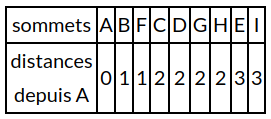

## 1) algorithmes de parcours d'un graphe


Nous allons commencer par nous intéresser aux algorithmes de parcours d'un graphe. L'idée du "parcours" est de "visiter" tous les sommets d'un graphe en partant d'un sommet quelconque. Ces algorithmes de parcours d'un graphe sont à la base de nombreux algorithmes très utilisés : routage des paquets de données dans un réseau, découverte du chemin le plus court pour aller d'une ville à une autre...

Il existe 2 méthodes pour parcourir un graphe :

- le parcours en largeur d'abord
- le parcours en profondeur d'abord

### a) préalable

Nous allons travailler sur un graphe G(V,E) avec V l'ensemble des sommets de ce graphe et E l'ensemble des arêtes de ce graphe. Un sommet u sera adjacent avec un sommet v si u et v sont reliés par une arête (on pourra aussi dire que u et v sont voisins) À chaque sommet u de ce graphe nous allons associer une couleur : blanc ou noir. Autrement dit, chaque sommet u possède un attribut couleur que l'on notera u.couleur, nous aurons u.couleur = blanc ou u.couleur = noir. Quelle est la signification de ces couleurs ?

- si u.couleur = blanc => u n'a pas encore été "découvert"
- si u.couleur = noir => u a été "découvert"

### b) le parcours en largeur d'abord

L'algorithme ci-dessous permet de parcourir un graphe en largeur d'abord :

```
VARIABLE
G : un graphe
s : noeud (origine)
u : noeud
v : noeud
f : file (initialement vide)

//On part du principe que pour tout sommet u du graphe G, u.couleur = blanc à l'origine
DEBUT
s.couleur ← noir
enfiler (s,f)
tant que f non vide :
  u ← defiler(f)
  pour chaque sommet v adjacent au sommet u :
    si v.couleur n'est pas noir :
      v.couleur ← noir
      enfiler(v,f)
    fin si
  fin pour
fin tant que
FIN
```

Si on applique cet algorithme sur le graphe G ci-dessous : 


si on part du sommet A (sommet s dans l'algorithme) la "découverte" peut se faire dans l'ordre suivant :  A, B, F, C, D, G, H, E et I (ATTENTION ce n'est pas la seule solution possible, par exemple A, F, B, D, C, G, H, I et E est aussi possible (il y a bien d'autres possibilités)).

Vous avez sans doute remarqué que dans le cas d'un parcours en largeur d'abord, on "découvre" d'abord tous les sommets situés à une distance k du sommet "origine" (sommet s) avant de commencer la découverte des sommets situés à une distance k+1 (on définit la distance comme étant le nombre d'arêtes à parcourir depuis A pour arriver à destination):

En effet, pour l'exemple ci-dessus, nous avons bien : 



### c) le parcours en profondeur d'abord

L'algorithme ci-dessous permet de parcourir un graphe en profondeur d'abord :

```
VARIABLE
G : un graphe
u : noeud
v : noeud
//On part du principe que pour tout sommet u du graphe G, u.couleur = blanc à l'origine
DEBUT
PARCOURS-PROFONDEUR(G,u) :
  u.couleur ← noir
  pour chaque sommet v adjacent au sommet u :
    si v.couleur n'est pas noir :
      PARCOURS-PROFONDEUR(G,v)
    fin si
  fin pour
FIN
```
Vous avez dû remarquer que le parcours en profondeur utilise une fonction récursive. J'attire votre attention sur l'extrême simplicité de cet algorithme (au niveau de sa conception), c'est souvent le cas avec les algorithmes récursifs.

Si on applique cet algorithme sur le graphe G ci-dessous : 


en partant du sommet A la "découverte" peut se faire dans l'ordre suivant :  A, B, C, E, I, D, G, F et H (ATTENTION, ici aussi, ce n'est pas la seule solution possible : A, F, H, I, E, C, B, D et G est aussi une solution possible (il y a bien d'autres possibilités)).

Dans le cas du parcours en largeur d'abord on "découvrait" tous les sommets situés à une distance k de l'origine avant de s'intéresser aux sommets situés à une distance k+1 de l'origine. Dans le cas du parcours en profondeur, on va chercher à aller "le plus loin possible" dans le graphe : A -> B -> C -> E -> I -> D, quand on tombe sur "un cul-de-sac" (dans notre exemple, D est un "cul-de-sac", car une fois en D, on peut uniquement aller en B, or, B a déjà été découvert...), on revient "en arrière" (dans notre exemple, on repart de B pour aller explorer une autre branche : G -> F -> H)

À noter que l'utilisation d'un algorithme récursif n'est pas une obligation pour le parcours en profondeur :

```
VARIABLE
s : noeud (origine)
G : un graphe
u : noeud
v : noeud
p : pile (pile vide au départ)
//On part du principe que pour tout sommet u du graphe G, u.couleur = blanc à l'origine
DEBUT
s.couleur ← noir
piler(s,p)
tant que p n'est pas vide :
  u ← depiler(p)
  pour chaque sommet v adjacent au sommet u :
    si v.couleur n'est pas noir :
      v.couleur ← noir
      piler(v,p)
    fin si
  fin pour
fin tant que
FIN
```
Vous avez sans doute remarqué que la version "non récursive" (on dit "itérative") de l'algorithme du parcours en profondeur ressemble beaucoup à l'algorithme du parcours en largeur, on a juste remplacé la file par une pile.

## 2) cycle dans  les graphes

Voici un rappel de 2 définitions vues précédemment :

- une chaine est une suite d'arêtes consécutives dans un graphe, un peu comme si on se promenait sur le graphe. On la désigne par les lettres des sommets qu'elle comporte. On utilise le terme de chaine pour les graphes non orientés et le terme de chemin pour les graphes orientés.
- un cycle est une chaine qui commence et se termine au même sommet.

Pour différentes raisons, il peut être intéressant de détecter la présence d'un ou plusieurs cycles dans un graphe (par exemple pour savoir s'il est possible d'effectuer un parcours qui revient à son point de départ sans être obligé de faire demi-tour).

Voici ci-dessous un algorithme qui permet de "détecter" la présence d'au moins un cycle dans un graphe :

```
VARIABLE
s : noeud (noeud quelconque)
G : un graphe
u : noeud
v : noeud
p : pile (vide au départ)
//On part du principe que pour tout sommet u du graphe G, u.couleur = blanc à l'origine
DEBUT
CYCLE():
  piler(s,p)
  tant que p n'est pas vide :
    u ← depiler(p)
    pour chaque sommet v adjacent au sommet u :
      si v.couleur n'est pas noir :
        piler(v,p)
      fin si
    fin pour
    si u est noir :
      renvoie Vrai
    sinon :
      u.couleur ← noir
    fin si
  fin tant que
  renvoie Faux
FIN
```
## 3) Chercher une chaine dans un graphe

Nous allons maintenant nous intéresser à un algorithme qui permet de trouver une chaine entre 2 sommets (sommet de départ et sommet d'arrivée). Les algorithmes de ce type ont une grande importance et sont très souvent utilisés).

```
VARIABLE
G : un graphe
start : noeud (noeud de départ)
end : noeud (noeud d'arrivé)
u : noeud
chaine : ensemble de noeuds (initialement vide)

DEBUT
TROUVE-CHAINE(G, start, end, chaine):
  chaine = chaine ⋃ start //le symbol ⋃ signifie union, il permet d'ajouter le noeud start à l'ensemble chaine
  si start est identique à end :
    renvoie chaine
  fin si
  pour chaque sommet u adjacent au sommet start :
    si u n'appartient pas à chaine :
	  nchemin = TROUVE-CHAINE(G, u, end, chaine)
      si nchemin non vide :
        renvoie nchemin
      fin si
    fin si
  fin pour
renvoie NIL
FIN
```

Vous noterez que l'algorithme ci-dessus est basé sur un parcours en profondeur d'abord.

## 4) pour aller plus  loin...

Il est important de noter que dans la plupart des cas, les algorithmes de recherche de chaine (ou de chemin), travaillent sur des graphes pondérés (par exemple pour rechercher la route entre un point de départ et un point d'arrivée dans un logiciel de cartographie). Ces algorithmes recherchent aussi souvent les chemins les plus courts (logiciels de cartographie). On peut citer l'algorithme de Dijkstra ou encore l'algorithme de Bellman-Ford qui recherchent le chemin le plus court entre un noeud de départ et un noeud d'arrivée dans un graphe pondéré. Si ce sujet vous intéresse, vous pouvez visionner cette [vidéo](https://www.youtube.com/watch?v=JPeCmKFrKio) qui explique le principe de fonctionnement de l'algorithme de Dijkstra.