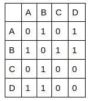

### exercice 10.1

Vous avez décidé de développer un réseau social à l’échelle du lycée. Afin d’effectuer des tests, vous décidez de limiter votre réseau à social à 6 utilisateurs que vous décidez de nommer : A, B, C, D, E et F. À un instant t, voici l’état de votre réseau social :

- A et B sont amis
- A et C sont amis
- A et D sont amis
- B et E sont amis
- B et F sont amis
- E et F sont amis

1) Vous décidez de représenter l’état de votre réseau social à l’instant t par un graphe non orienté G. Les personnes (A, B, C,…) seront les sommets du graphe G. Une relation « x et y sont amis » sera une arête de G. Représentez graphiquement le graphe G.

2) Représentez la matrice d’adjacence du graphe G (A est associé à l’indice 1 de la matrice, B à l’indice 2, C à l’indice 3, etc.)

3) Le parcours [A, B, C, D, E, F] est-il un parcours « en profondeur d’abord » ou un parcours « en largeur d’abord » ? Justifiez votre réponse

4) On donne ci-dessous l’algorithme permettant d’obtenir le parcours en « largeur d’abord » d’un graphe G. Complétez cet algorithme (si possible sans vous aider du cours)

```
VARIABLE
G : un graphe
s : noeud (origine)
u : noeud
v : noeud
f : file (initialement vide)

DEBUT
s.couleur ← noir
enfiler (s,f)
tant que f non vide :
  u ← ………….
  pour chaque sommet v adjacent au sommet ……… :
    si v.couleur n'est pas ……… :
      v.couleur ← noir
      enfiler(...,f)
    fin si
  fin pour
fin tant que
FIN
``` 
### exercice 10.2

Soit la matrice d'adjacence suivante qui représente un graphe G :



1) Faites un schéma du graphe G

2) Implémentez le graphe G en Python à l’aide d’un dictionnaire et des listes (tableaux).


3) Soit le programme Python suivant :

```python
g1 = {'A':['B','C'], 'B':['A'], 'C':['A','D'], 'D':['C']}

def myst(G,s):
    noir=[]
    p = []
    l = []
    noir.append(s)
    p.append(s)
    while len(p)>0:
        u = p.pop()
        l.append(u)
        for v in G[u]:
            if v not in noir:
                noir.append(v)
                p.append(v)
    return l

L = myst(g1,'A')
```

Que vaut L après l'exécution de ce programme

4) Complétez le programme Python suivant (la fonction cycle prend en paramètre un graphe G et retourne True si le graphe G possède un cycle et False dans le cas contraire), si possible sans vous aider du cours.

```python 
def cycle(G):
    s = random.choice(list(G.keys()))
    p = []
    p.append(s)
    noir=[]
    while len(p)>0:
        u = p.pop()
        for v in ………:
            if v not in noir:
                p.append(....)   
        if u in ……….:
            return True
        else :
            noir.append(u)
    return …………
```
