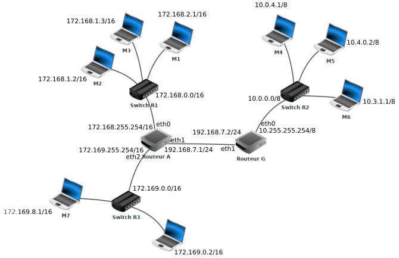
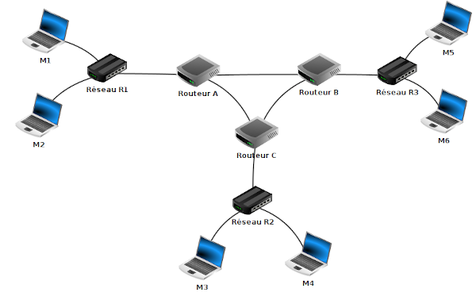

### activité 11.1

Soit le réseau suivant :

Déterminer un chemin possible permettant d’établir une connexion entre la machine M4 et M14.

### activité 11.2

Soit le réseau suivant :

Déterminez la table de routage du routeur G (vous utiliserez les adresses IP pour établir votre table de routage).

### activité 11.3

Soit le réseau suivant : 

Routeur B :

- eth0 est relié au switch du réseau R3
- eth1 est relié au routeur A
- eth2 est relié au routeur C

On donne la table de routage (simplifiée) du routeur B :

| réseau | moyen de l'atteindre | métrique |
| --- | --- | --- |
|R3|eth0|0|
|Réseau Routeur A|eth1|0|
|Réseau Routeur C|eth2|0|
|R1|Routeur A||
|R1|Routeur C||
|R2|Routeur A||
|R2|Routeur C||

Complétez la colonne métrique de la table de routage du routeur B en partant du principe que l'on utilise le protocole RIP.

On cherche à transmettre des données de M5 à M3, donnez le chemin qui sera suivi par ces données.

### activité 11.4

Soit le réseau suivant : 

Routeur B :

- eth0 est relié au switch du réseau R3
- eth1 est relié au routeur A
- eth2 est relié au routeur C

On donne la table de routage (simplifiée) du routeur B :

| réseau | moyen de l'atteindre | métrique |
| --- | --- | --- |
|R3|eth0|0|
|Réseau Routeur A|eth1|0|
|Réseau Routeur C|eth2|0|
|R1|Routeur A||
|R1|Routeur C||
|R2|Routeur A||
|R2|Routeur C||

On donne les débits des liaisons inter-routeur :

- Routeur A - Routeur B : 100 Mbps
- Routeur A - Routeur C : 10 Mbps
- Routeur B - Routeur C : 1 Gbps

Complétez la colonne métrique de la table de routage du routeur B en partant du principe que l'on utilise le protocole OSPF.

On cherche à transmettre des données de M5 à M3, donnez le chemin qui sera suivi par ces données.

### activité 11.5

Soit le réseau suivant : 

Routeur C :

- eth0 est relié au switch du réseau R2
- eth1 est relié au routeur A
- eth2 est relié au routeur B

Partant du principe que l'on utilise le protocole RIP, donnez la table de routage du routeur C

### activité 11.6

Soit le réseau suivant : 

Routeur C :

- eth0 est relié au switch du réseau R2
- eth1 est relié au routeur A
- eth2 est relié au routeur B

débits des liaisons inter-routeur :

- Routeur A - Routeur B : 50 Mbps
- Routeur A - Routeur C : 1 Mbps
- Routeur B - Routeur C : 800 Kbps

Partant du principe que l'on utilise le protocole OSPF, donnez la table de routage du routeur C.