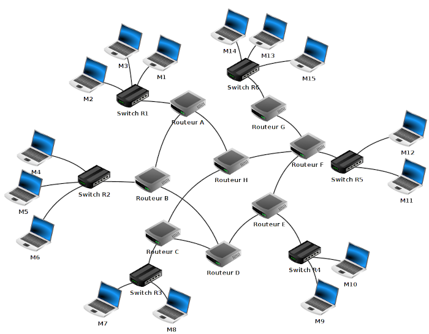

## 1) routage des paquets

Pour bien suivre ce cours, il est nécessaire de maitriser les bases sur les réseaux (réseau local, adresse IP, adresse réseau...) N'hésitez pas à vous replonger dans le cours de première si nécessaire.

Les réseaux locaux peuvent être reliés entre eux par l'intermédiaire de routeurs. Il ne faut jamais perdre de vue qu'Internet résulte de l'interconnexion de réseaux par des routeurs.

Nous avons sur ce schéma les éléments suivants :

- 15 ordinateurs : M1 à M15
- 6 switchs : R1 à R6
- 8 routeurs : A, B, C, D, E, F, G et H

Comme nous l'avons déjà dit ci-dessus, un routeur permet de relier ensemble plusieurs réseaux locaux. Un routeur est composé d’un nombre plus ou moins important d’interfaces réseau (cartes réseau). Les routeurs les plus simples que l’on puisse rencontrer permettent de relier ensemble deux réseaux (ils possèdent alors 2 interfaces réseau), mais il existe des routeurs capables de relier ensemble une dizaine de réseaux. N'importe quel ordinateur peut jouer le rôle de routeur (à partir du moment où il possède au moins 2 interfaces réseau), mais on rencontre souvent des "machines" dédiées (par exemple de marque CISCO)

Revenons maintenant à l’analyse de notre schéma :

Nous avons 6 réseaux locaux, chaque réseau local possède son propre switch.

Les ordinateurs M1, M2 et M3 appartiennent au réseau local 1. Les ordinateurs M4, M5 et M6 appartiennent au réseau local 2. Nous pouvons synthétiser tout cela comme suit :

réseau local 1 : M1, M2 et M3
réseau local 2 : M4, M5 et M6
réseau local 3 : M7 et M8
réseau local 4 : M9 et M10
réseau local 5 : M11 et M12
réseau local 6 : M13, M14 et M15

Voici quelques exemples de communications entre 2 ordinateurs :

### cas n°1 : M1 veut communiquer avec M3
Le paquet est envoyé de M1 vers le switch R1, R1 "constate" que M3 se trouve bien dans le réseau local 1, le paquet est donc envoyé directement vers M3. On peut résumer le trajet du paquet par :

M1→R1→M3

### cas n°2 : M1 veut communiquer avec M6
Le paquet est envoyé de M1 vers le switch R1, R1 « constate » que M6 n’est pas sur le réseau local 1, R1 envoie donc le paquet vers le routeur A. Le routeur A n'est pas connecté directement au réseau localR2 (réseau local de la machine M6), mais il "sait" que le routeur B est connecté au réseau local 2. Le routeur A envoie le paquet vers le routeur B. Le routeur B est connecté au réseau local 2, il envoie le paquet au Switch R2. Le Switch R2 envoie le paquet à la machine M6.

M1 → R1→ Routeur A → Routeur B → R2 → M6

### cas n°3 : M1 veut communiquer avec M9
M1 → R1 → Routeur A → Routeur B → Routeur D → Routeur E → R4 → M9

Restons sur ce cas n°3 : comme vous l’avez peut-être constaté, le chemin donné ci-dessus n’est pas l’unique possibilité, en effet on aurait pu aussi avoir :

M1 → R1 → Routeur A → Routeur H → Routeur F → Routeur E → R4 → M9

Il est très important de bien comprendre qu’il existe souvent plusieurs chemins possibles pour relier 2 ordinateurs :

### cas n°4 : M13 veut communiquer avec M9
Nous pouvons avoir : M13 → R6 → Routeur G → Routeur F → Routeur E → R4 → M9

ou encore : M13 → R6 → Routeur G → Routeur F → Routeur H → Routeur C → Routeur D → Routeur E → R4 → M9

On pourrait penser que le chemin "Routeur F → Routeur E" est plus rapide et donc préférable au chemin "Routeur F → Routeur H", cela est sans doute vrai, mais imaginez qu’il y ait un problème technique entre le Routeur F et le Routeur E, l’existence du chemin "Routeur F → Routeur H" permettra tout de même d’établir une communication entre M13 et M9.

On peut se poser la question : comment les switchs ou les routeurs procèdent pour amener les paquets à bon port.

Nous avons vu l'année dernière que 2 machines appartenant au même réseau local doivent avoir la même adresse réseau (encore une fois, n'hésitez pas à relire le cours de première). Dans le schéma ci-dessus M1 et M4 n'ont pas la même adresse réseau (car elles n'appartiennent pas au même réseau local), si M1 cherche à entrer en communication avec M4, le switch R1 va constater que M4 n'appartient pas au réseau local (grâce à son adresse IP), R1 va donc envoyer le paquet de données vers le routeur A. Cela sera donc au routeur A de gérer le "problème" : comment atteindre M4 ?

Chaque routeur possède une table de routage. Une table de routage peut être vue comme un tableau qui va contenir des informations permettant au routeur d'envoyer le paquet de données dans la "bonne direction".

Soit le schéma suivant :

Sur le schéma ci-dessus, le choix des adresses IP des machines a été fait au "hasard" (ne cherchez pas une signification là où il n'y en a pas). En revanche, vous pouvez vérifier que tout est cohérent : adresses machines avec adresses réseaux (les adresses réseaux sont notées à côté des différents switchs (par exemple le switch R1 est utilisé dans le réseau d'adresse 172.168.0.0/16)). 

Vous avez sans doute remarqué que nous avons 2 routeurs :

- le routeur A qui possède 3 interfaces réseau que l'on nomme eth0, eth1 et eth2. Les adresses IP liées à ces interfaces réseau sont : 172.168.255.254/16 (eth0), 172.169.255.254/16 (eth2) et 192.168.7.1/24 (eth1)
- le routeur G qui possède 2 interfaces réseau que l'on nomme eth0 et eth1. Les adresses IP liées à ces interfaces réseau sont : 10.255.255.254/8 (eth0) et 192.168.7.2/24 (eth1)

Voici les informations présentes dans la table de routage de A :

- le routeur A est directement relié au réseau 172.168.0.0/16 par l'intermédiaire de son interface eth0
- le routeur A est directement relié au réseau 172.169.0.0/16 par l'intermédiaire de son interface eth2
- le routeur A est directement relié au réseau 192.168.7.0/24 par l'intermédiaire de son interface eth1 (le réseau 192.168.7.0/24 est un peu particulier car il est uniquement composé des routeurs A et G)
- le routeur A n'est pas directement relié au réseau 10.0.0.0/8 mais par contre il "sait" que les paquets à destination de ce réseau doivent être envoyé à la machine d'adresse IP 192.168.7.2/24 (c'est à dire le routeur G qui lui est directement relié au réseau 10.0.0.0/8)

On peut résumer tout cela avec le tableau suivant (table de routage simplifiée de A) :

| réseau | moyen de l'atteindre | métrique |
| --- | --- | --- |
|172.168.0.0/16|eth0|0|
|192.168.7.0/24|eth1|0|
|172.169.0.0/16|eth2|0|
|10.0.0.0/8|192.168.7.2/24|1|

Même si dans les véritables tables de routage on utilise exclusivement les adresses IP, on pourra, dans le cadre de ce cours, utiliser les noms à la place des adresses IP (On dira pour le schéma ci-dessus que M1, M2 et M3 appartiennent au réseau R1, M4, M5 et M6 appartiennent au réseau R2 et que M7 et M8 appartiennent au réseau R3).

On aura alors la table de routage écrit de cette façon :

| réseau | moyen de l'atteindre | métrique |
| --- | --- | --- |
|réseau R1|eth0|0|
|réseau routeur G|eth1|0|
|réseau R3|eth2|0|
|réseau  R2|routeur G|1|

On peut traduire ce tableau par :

- pour atteindre le réseau R1, on doit "sortir" du routeur par eth0 (le réseau R1 est directement relié au routeur A)
- pour atteindre le routeur G, on doit "sortir" du routeur par eth1 (le routeur G est directement relié au routeur A)
- pour atteindre le réseau R3, on doit "sortir" du routeur par eth2 (le réseau R3 est directement relié au routeur A)
- pour atteindre le réseau R2, on doit "envoyer" le paquet de données vers le routeur G qui "saura quoi faire avec" (le réseau R2 n'est pas directement relié au routeur A)

Dans des réseaux très complexes, chaque routeur aura une table de routage qui comportera de très nombreuses lignes (des dizaines voir des centaines...). En effet chaque routeur devra savoir vers quelle interface réseau il faudra envoyer un paquet afin qu'il puisse atteindre sa destination. On peut trouver dans une table de routage plusieurs lignes pour une même destination, il peut en effet, à partir d'un routeur donné, exister plusieurs chemins possibles pour atteindre la destination. Dans le cas où il existe plusieurs chemins possibles pour atteindre la même destination, le routeur va choisir le "chemin le plus court". Pour choisir ce chemin le plus court, le routeur va utiliser la métrique : plus la valeur de la métrique est petite, plus le chemin pour atteindre le réseau est "court". Un réseau directement lié à un routeur aura une métrique de 0.

Comment un routeur arrive à remplir sa table de routage ?

La réponse est simple pour les réseaux qui sont directement reliés au routeur (métrique = 0), mais comment cela se passe-t-il pour les autres réseaux (métrique supérieure à zéro) ?

Il existe 2 méthodes :

- le routage statique : chaque ligne doit être renseignée "à la main". Cette solution est seulement envisageable pour des très petits réseaux de réseaux
- le routage dynamique : tout se fait "automatiquement", on utilise des protocoles qui vont permettre de "découvrir" les différentes routes automatiquement afin de pouvoir remplir la table de routage tout aussi automatiquement.

## 2) protocoles de routage

Un réseau de réseaux comportant des routeurs peut être modélisé par un graphe (si nécessaire revoir le cours sur les graphes): chaque routeur est un sommet et chaque liaison entre les routeurs ou entre un routeur et un switch est une arête. Les algorithmes utilisés par les protocoles de routages sont donc des algorithmes issus de la théorie de graphes.

On trouve plusieurs protocoles de routage, nous allons en étudier deux : RIP (Routing Information Protocol) et OSPF (Open Shortest Path First).

### a) le protocole RIP

Au départ, les tables de routage contiennent uniquement les réseaux qui sont directement reliés au routeur (dans notre exemple ci-dessus, à l'origine, la table de routage de A contient uniquement les réseaux 172.168.0.0/16, 192.168.7.0/24 et 172.169.0.0/16). Chaque routeur envoie périodiquement (toutes les 30 secondes) à tous ses voisins (routeurs adjacents) un message. Ce message contient la liste de tous les réseaux qu'il connait (dans l'exemple ci-dessus, le routeur A envoie un message au routeur G avec les informations suivantes : "je connais les réseaux 172.168.0.0/16, 192.168.7.0/24 et 172.169.0.0/16". De la même manière G envoie un message à A avec les informations suivantes : "je connais les réseaux 192.168.7.0/24 et 10.0.0.0/8"). À la fin de cet échange, les routeurs mettent à jour leur table de routage avec les informations reçues (dans l'exemple ci-dessus, le routeur A va pouvoir ajouter le réseau 10.0.0.0/8 à sa table de routage. Le routeur A "sait" maintenant qu'un paquet à destination du réseau 10.0.0.0/8 devra transiter par le routeur G). Pour renseigner la colonne "métrique", le protocole utilise le nombre de sauts, autrement dit, le nombre de routeurs qui doivent être traversés pour atteindre le réseau cible (dans la table de routage de A, on aura donc une métrique de 1 pour le réseau 10.0.0.0/8 car depuis A il est nécessaire de traverser le routeur G pour atteindre le réseau 10.0.0.0/8)

Le protocole RIP s'appuie sur l'algorithme de Bellman-Ford (algorithme qui permet de calculer les plus courts chemins dans un graphe, revoir si nécessaire le cours Algorithmes sur les graphes).

Prenons un exemple avec le réseau suivant :

Établissons la table de routage du routeur A en nous basant sur le protocole RIP :

- le routeur A est directement relié au réseau R1 (adresse réseau 172.18.0.0/16) par eth0.
- le routeur A est directement relié au routeur B (réseau 192.168.1.0/24) par eth1
- le routeur A est directement relié au routeur C (réseau 192.168.2.0/24) par eth2
- le routeur A n'est pas directement relié au réseau R2 (adresse réseau 172.17.0.0/16) mais par contre il "sait" qu'il peut l'atteindre soit en passant par le routeur C (adresse 192.168.2.2/24) en une étape ou soit en passant par le routeur B (adresse 192.168.1.2/24) en deux étapes (B et C)
- le routeur A n'est pas directement relié au réseau R3 (adresse réseau 172.16.0.0/16) mais  il "sait" qu'il peut l'atteindre soit en passant par le routeur B (192.168.1.2/24) en une étape ou soit en passant par le routeur C (192.168.2.2/24) en deux étapes (C et B)

Ce qui nous donne donc la table de routage suivante :

| réseau | moyen de l'atteindre | métrique |
| --- | --- | --- |
|172.18.0.0/16|eth0|0|
|192.168.1.0/24|eth1|0|
|192.168.2.0/24|eth2|0|
|172.17.0.0/16|192.168.2.2/24|1|
|172.17.0.0/16|192.168.1.2/24|2|
|172.16.0.0/16|192.168.1.2/24|1|
|172.16.0.0/16|192.168.2.2/24|2|

Comme déjà vu plus haut, on peut aussi donner la table de routage de manière simplifiée, en utilisant les noms des éléments à la place des adresses IP (mais c'est aussi moins "réaliste") :

| réseau | moyen de l'atteindre | métrique |
| --- | --- | --- |
|R1|eth0|0|
|Réseau Routeur B|eth1|0|
|Réseau Routeur C|eth2|0|
|R2|Routeur C|1|
|R2|Routeur B|2|
|R3|Routeur B|1|
|R3|Routeur C|2|

pour un paquet de données allant de R1 à R2, la route privilégiée sera donc : R1 -> Routeur A -> Routeur C -> R2. Mais en cas de problème (panne notamment) la route R1 -> Routeur A -> Routeur B -> Routeur C -> R2 sera possible.

pour un paquet de données allant de R1 à R3, la route privilégiée sera donc : R1 -> Routeur A -> Routeur B -> R3. Mais en cas de problème la route R1 -> Routeur A -> Routeur C -> Routeur B -> R3 sera possible.

Dans certains exercices, pour le calcul de la métrique, on compte le nombre total de routeurs traversés (y compris, dans notre exemple le routeur A), cela nous donne donc un décalage de un, et on obtient alors :

| réseau | moyen de l'atteindre | métrique |
| --- | --- | --- |
|R1|eth0|0|
|Réseau Routeur B|eth1|0|
|Réseau Routeur C|eth2|0|
|R2|Routeur C|2|
|R2|Routeur B|3|
|R3|Routeur B|2|
|R3|Routeur C|3|

Comme c'est juste une histoire de convention, il suffit de se mettre d'accord au départ sur la convention utilisée.

Le protocole RIP est aujourd'hui très rarement utilisé dans les grandes infrastructures. En effet, il génère, du fait de l'envoi périodique de message, un trafic réseau important (surtout si les tables de routages contiennent beaucoup d'entrées). De plus, le protocole RIP est limité à 15 sauts (on traverse au maximum 15 routeurs pour atteindre sa destination). On lui préfère donc souvent le protocole OSPF.

### b) le protocole OSPF
Comme dans le cas du protocole RIP, nous allons retrouver des échanges d'informations entre les routeurs (ces échanges sont plus "intelligents" dans le cas d'OSPF, ils permettent donc de réduire l'occupation du réseau). Nous n'allons pas rentrer dans les détails de ces échanges et nous allons principalement insister sur la métrique produite par OSPF. Le protocole OSPF, au contraire de RIP, n'utilise pas le "nombre de sauts nécessaire" pour établir la métrique, mais la notion de "coût des routes". Dans les messages échangés par les routeurs on trouve le coût de chaque liaison (plus le coût est grand et moins la liaison est intéressante). Quand on parle de "liaison" on parle simplement du câble qui relie un routeur à un autre routeur. Le protocole OSPF permet de connaitre le coût de chaque liaison entre routeurs, et donc, de connaitre le coût d'une route (en ajoutant le coût de chaque liaison traversée). On notera que pour effectuer ces calculs, le protocole OSPF s'appuie sur l'algorithme de Dijkstra (revoir si nécessaire le cours Algorithmes sur les graphes) .

Mais sur quoi repose cette notion de coût ?

La notion de coût est directement liée au débit des liaisons entre les routeurs. Le débit correspond au nombre de bits de données qu'il est possible de faire passer dans un réseau par seconde. Le débit est donc donné en bits par seconde (bps), mais on trouve souvent des kilo bits par seconde (kbps) ou encore des méga bits par seconde (Mbps) => 1 kbps = 1000 bps et 1 Mbps = 1000 kbps. Connaissant le débit d'une liaison, il est possible de calculer le coût d'une liaison à l'aide de la formule suivante :

$coût = \frac{10^8}{débit}$

dans la formule ci-dessus le débit est en bits par seconde

Pour obtenir la métrique d'une route, il suffit d'additionner les coûts de chaque liaison (par exemple si pour aller d'un réseau 1 à un réseau 2 on doit traverser une liaison de coût 1, puis une liaison de coût 10 et enfin une liaison de coût 1, la métrique de cette route sera de 1 + 10 + 1 = 12)

Évidemment, comme dans le cas de RIP, les routes ayant les métriques les plus faibles sont privilégiées.

Reprenons l'exemple ci-dessus :

Prenons un exemple avec les débits suivants :

- liaison routeur A - routeur B : 1 Mbps
- liaison routeur A - routeur C : 10 Mbps
- liaison routeur C - routeur B : 10 Mbps

Commençons par calculer les coûts des liaisons inter-routeurs

- liaison routeur A - routeur B : 108/106 = 100
- liaison routeur A - routeur C : 108/107 = 10
- liaison routeur C - routeur B : 108/107 = 10

pour faire :

- Routeur A -> Routeur C le coût est de 10
- Routeur A -> Routeur B le coût est de 100
- Routeur A -> Routeur C -> Routeur B le coût est 10+10=20
- Routeur A -> Routeur B -> Routeur C le coût est 100+10=110

Ce qui nous donne la table de routage suivante :

| réseau | moyen de l'atteindre | métrique |
| --- | --- | --- |
|172.18.0.0/16|eth0|0|
|192.168.1.0/24|eth1|0|
|192.168.2.0/24|eth2|0|
|172.17.0.0/16|192.168.2.2/24|10|
|172.17.0.0/16|192.168.1.2/24|110|
|172.16.0.0/16|192.168.1.2/24|100|
|172.16.0.0/16|192.168.2.2/24|20|

ou encore en se passant des adresses IP : 

| réseau | moyen de l'atteindre | métrique |
| --- | --- | --- |
|R1|eth0|0|
|Réseau Routeur B|eth1|0|
|Réseau Routeur C|eth2|0|
|R2|Routeur C|10|
|R2|Routeur B|110|
|R3|Routeur B|100|
|R3|Routeur C|20|

pour un paquet de données allant de R1 à R2, la route privilégiée sera donc : R1 -> Routeur A -> Routeur C -> R2.

pour un paquet de données allant de R1 à R3, la route privilégiée sera donc : R1 -> Routeur A -> Routeur C -> Routeur B -> R3 (on constate une différence avec ce que nous avions trouvé avec le protocole RIP).