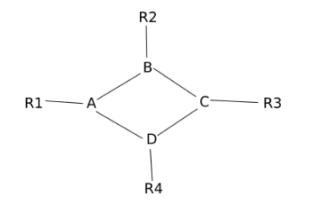

### exercice 11.1

Le réseau schématisé ci-dessous est constitué de 4 réseaux locaux (switch+ordinateurs) : R1, R2, R3 et R4, et de 4 routeurs A, B, C et D.

On donne les débits (bandes passantes) de la connexion entre chaque routeur :
A-B : 100 Mbps
A-D : 1000 Mbps
B-C : 10 Mbps
C-D : 10 Mbps
On propose ci-dessous une table de routage pour le routeur A :

1) Complétez la colonne “métrique RIP” du tableau ci-dessus.

2) Complétez la colonne “métrique OSPF” du tableau ci-dessus. 

3) Un ordinateur appartenant au réseau local R1 envoie un paquet de données à un ordinateur appartenant au réseau local R2.

a) Donnez le chemin suivi par ce paquet de données si le routeur A utilise le protocole de routage RIP. Justifiez votre réponse.
	
b) Donnez le chemin suivi par ce paquet de données si le routeur A utilise le protocole de routage OSPF. Justifiez votre réponse.
	
4) Le routeur D est en panne. Un ordinateur appartenant au réseau local R1 envoie un paquet de données à un ordinateur appartenant au réseau local R3. Donnez le chemin suivi par ce paquet de données si le routeur A utilise le protocole de routage OSPF. Justifiez votre réponse.

5) La liaison entre 2 routeurs a un coût de 0,2, calculez le débit de cette liaison en bps puis en Mbps.

### exercices du bac

- [Sujet 1 2021 Exercice 5](https://pixees.fr/informatiquelycee/term/suj_bac/2021/sujet_1.pdf)
- [Sujet 2 2021 Exercice 5](https://pixees.fr/informatiquelycee/term/suj_bac/2021/sujet_2.pdf)
- [Sujet 3 2021 Exercice 3](https://pixees.fr/informatiquelycee/term/suj_bac/2021/sujet_3.pdf)
- [Sujet 6 2021 Exercice 4](https://pixees.fr/informatiquelycee/term/suj_bac/2021/sujet_6.pdf)
- [Sujet 10 2021 Exercice 1](https://pixees.fr/informatiquelycee/term/suj_bac/2021/sujet_10.pdf)
- [Sujet 2 2022 Exercice 3](https://pixees.fr/informatiquelycee/term/suj_bac/2022/sujet_02.pdf)
- [Sujet 3 2022 Exercice 3](https://pixees.fr/informatiquelycee/term/suj_bac/2022/sujet_03.pdf)
- [Sujet 4 2022 Exercice 2](https://pixees.fr/informatiquelycee/term/suj_bac/2022/sujet_04.pdf)
- [Sujet 6 2022 Exercice 5](https://pixees.fr/informatiquelycee/term/suj_bac/2022/sujet_06.pdf)
- [Sujet 7 2022 Exercice 5](https://pixees.fr/informatiquelycee/term/suj_bac/2022/sujet_07.pdf)
- [Sujet 10 2022 Exercice 5](https://pixees.fr/informatiquelycee/term/suj_bac/2022/sujet_10.pdf)
- [Sujet 12 2022 Exercice 2](https://pixees.fr/informatiquelycee/term/suj_bac/2022/sujet_12.pdf)
- [Sujet 13 2022 Exercice 5](https://pixees.fr/informatiquelycee/term/suj_bac/2022/sujet_13.pdf)
