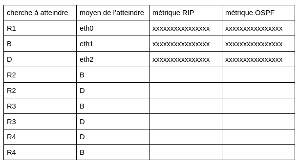
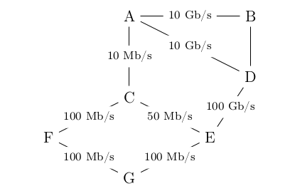
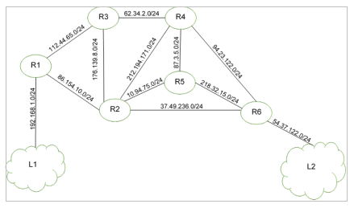

### exercice 11.1

Le réseau schématisé ci-dessous est constitué de 4 réseaux locaux (switch+ordinateurs) : R1, R2, R3 et R4, et de 4 routeurs A, B, C et D.

On donne les débits (bandes passantes) de la connexion entre chaque routeur :
A-B : 100 Mbps
A-D : 1000 Mbps
B-C : 10 Mbps
C-D : 10 Mbps
On propose ci-dessous une table de routage pour le routeur A :

1) Complétez la colonne “métrique RIP” du tableau ci-dessus.

2) Complétez la colonne “métrique OSPF” du tableau ci-dessus. 

3) Un ordinateur appartenant au réseau local R1 envoie un paquet de données à un ordinateur appartenant au réseau local R2.

a) Donnez le chemin suivi par ce paquet de données si le routeur A utilise le protocole de routage RIP. Justifiez votre réponse.
	
b) Donnez le chemin suivi par ce paquet de données si le routeur A utilise le protocole de routage OSPF. Justifiez votre réponse.
	
4) Le routeur D est en panne. Un ordinateur appartenant au réseau local R1 envoie un paquet de données à un ordinateur appartenant au réseau local R3. Donnez le chemin suivi par ce paquet de données si le routeur A utilise le protocole de routage OSPF. Justifiez votre réponse.

5) La liaison entre 2 routeurs a un coût de 0,2, calculez le débit de cette liaison en bps puis en Mbps.

### exercice 11.2
Cet exercice est tiré du sujet 0 du bac NSI.

On considère un réseau composé de plusieurs routeurs reliés de la façon suivante :

#### Le protocole RIP

Le protocole RIP permet de construire les tables de routage des différents routeurs, en indiquant pour chaque
routeur la distance, en nombre de sauts, qui le sépare d’un autre routeur. Pour le réseau ci-dessus, on dispose
des tables de routage suivantes :

Question 1

1) Le routeur A doit transmettre un message au routeur G, en effectuant un nombre minimal de
sauts. Déterminer le trajet parcouru.

2) Déterminer une table de routage possible pour le routeur G obtenu à l’aide du protocole RIP.

Question 2

Le routeur C tombe en panne. Reconstruire la table de routage du routeur A en suivant le
protocole RIP.

#### Le protocole OSPF

Contrairement au protocole RIP, l’objectif n’est plus de minimiser le nombre de routeurs traversés par un
paquet. La notion de distance utilisée dans le protocole OSPF est uniquement liée aux coûts des liaisons.
L’objectif est alors de minimiser la somme des coûts des liaisons traversées.

On a rajouté sur le graphe représentant le réseau précédent les différents débits des liaisons.
On rappelle que 1 Gb/s = 1 000 Mb/s = 10 9 bits/s.

Question 3

1) Vérifier que le coût de la liaison entre les routeurs A et B est 0,01.

2) La liaison entre le routeur B et D a un coût de 5. Quel est le débit de cette liaison ?

Question 4 

Le routeur A doit transmettre un message au routeur G, en empruntant le chemin dont la somme
des coûts sera la plus petite possible. Déterminer le chemin parcouru. On indiquera le raisonnement
utilisé.

### exercice 11.3
Cet exercice est tiré du sujet 2021 du bac NSI.

On représente ci-dessous un réseau dans lequel R1, R2, R3, R4, R5 et R6 sont des routeurs. Le réseau local L1 est relié au routeur R1 et le réseau local L2 au routeur R6.

Rappels et notations :

Dans cet exercice, les adresses IP sont composées de 4 octets, soit 32 bits. Elles sont notées X1.X2.X3.X4, où X1, X2, X3 et X4 sont les valeurs des 4 octets, convertis en notation décimale.

La notation X1.X2.X3.X4/n signifie que les n premiers bits de poids forts de l’adresse IP représentent la partie « réseau », les bits suivants représentent la partie « hôte ».
Toutes les adresses des hôtes connectés à un réseau local ont la même partie réseau et peuvent donc communiquer directement. L’adresse IP dont tous les bits de la partie « hôte » sont à 0 est appelée « adresse du réseau ».

On donne également des extraits de la table de routage des routeurs R1 à R5 dans le tableau suivant.

1) Un paquet part du réseau local L1 à destination du réseau local L2.

a) En utilisant l’extrait de la table de routage de R1, vers quel routeur R1 envoie-t-il ce paquet : R2 ou R3 ? Justifier.

b) A l’aide des extraits de tables de routage ci-dessus, nommer les routeurs traversés par ce paquet, lorsqu’il va du réseau L1 au réseau L2.

2) La liaison entre R1 et R2 est rompue.

a) Sachant que ce réseau utilise le protocole RIP (distance en nombre de sauts), donner l’un des deux chemins possibles que pourra suivre un paquet allant de L1 vers L2.

b) Dans les extraits de tables de routage ci-dessus, pour le chemin de la question 2.a, quelle(s) ligne(s) sera (seront) modifiée(s) ?

3) On a rétabli la liaison entre R1 et R2.
Par ailleurs, pour tenir compte du débit des liaisons, on décide d’utiliser le protocole OSPF (distance liée au coût minimal des liaisons) pour effectuer le routage. Le coût des liaisons entre les routeurs est donné par le tableau suivant :

a) Sachant que la bande passante (débit) de la liaison R2-R3 est de 10 Mbps, calculer le coût correspondant.

b) Déterminer le chemin parcouru par un paquet partant du réseau L1 et arrivant au réseau L2, en utilisant le protocole OSPF.

c) Indiquer pour quel(s) routeur(s) l’extrait de la table de routage sera modifié pour un paquet à destination de L2, avec la métrique OSPF.