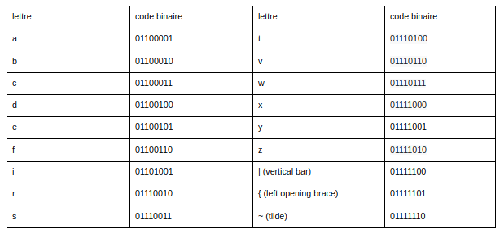
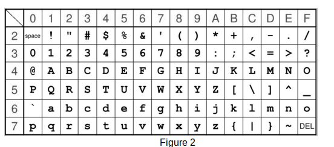

### exercice 12.1

1) Après un chiffrement symétrique on obtient la message suivant : ri. Sachant que la clé de chiffrement est : 00001010 (la clé est directement donnée en binaire), déterminez le message d’origine.

On donne l’extrait de la table ASCII suivant :

      

2) Un utilisateur B souhaite échanger un message chiffré avec un utilisateur A en utilisant un chiffrement asymétrique. A possède une clé publique (AKpub) et une clé privée (AKpriv). B possède une clé publique (BKpub) et une clé privée (BKpriv). B souhaite chiffrer un message m afin de pouvoir l’envoyer à A  :

a) Quelle clé va être utilisée par B pour chiffrer le message m ?

Qb) uelle clé va être utilisée par A pour déchiffrer le message m ?

3) Expliquez en  quelques  lignes le principe du protocole HTTPS (on s’intéressera uniquement à l’aspect Sécurité du protocole)

### exercice 12.2
Exercice tiré du bac 2021

Pour chiffrer un message, une méthode, dite du masque jetable, consiste à le combiner avec une chaîne de caractères de longueur comparable.
Une implémentation possible utilise l’opérateur XOR (ou exclusif).

Dans la suite, les nombres écrits en binaire seront précédés du préfixe 0b.

1) Pour chiffrer un message, on convertit chacun de ses caractères en binaire (à l’aide du format Unicode), et on réalise l’opération XOR bit à bit avec la clé.

Après conversion en binaire, et avant que l’opération XOR bit à bit avec la clé n’ait été effectuée, Alice obtient le message suivant :

m = 0b 0110 0011 0100 0110

a) Le message m correspond à deux caractères codés chacun sur 8 bits : déterminer quels sont ces caractères. On fournit pour cela la table ci-dessous qui associe à l’écriture hexadécimale d’un octet le caractère correspondant (figure 2). Exemple de lecture : le caractère correspondant à l’octet codé 4A en hexadécimal est la lettre J.
	

b) Pour chiffrer le message d’Alice, on réalise l’opération XOR bit à bit avec la clé suivante :
 
k = 0b 1110 1110 1111 0000

Donner l’écriture binaire du message obtenu.

2)

a) Dresser la table de vérité de l’expression booléenne suivante :

(a XOR b) XOR b

b) Bob connaît la chaîne de caractères utilisée par Alice pour chiffrer le message. Quelle opération doit-il réaliser pour déchiffrer son message ?