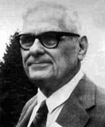

Certains programmes utilisent comme données le code source d'autres programmes. Les compilateurs sont des bons exemples. Nous avons eu l'année dernière l'occasion de travailler sur le langage C, et nous avons vu que ce langage est un langage compilé : une fois le code source terminée, le compilateur (qui est un logiciel comme un autre) "transforme" ce code source en langage machine.

Il existe d'autres exemples de programmes qui utilisent comme données d'autres programmes :

- un système d'exploitation peut être vu comme un programme qui fait "tourner" d'autres programme

- pour télécharger un logiciel on utilise un gestionnaire de téléchargement qui est lui-même un logiciel.

On trouve même des programmes capables de détecter certaines erreurs dans le code source d'autres programmes ou même encore des programmes capables de prouver (mathématiquement parlant) qu'un autre programme est correct (qu'il fait bien ce pour quoi il a été conçu). Le développement de programmes de "détection d'erreurs" ou encore de "preuve de correction" a connu une forte croissance en France, notamment depuis l'accident du vol 501 d'Ariane 5 du 4 juin 1996 ou encore de la mise au point du métro automatique Meteor (ligne 14 à Paris).

Le "cauchemar" d'un programmeur est que son programme, dans certains cas, "tombe" dans une boucle infinie et ne s'arrête jamais. Dans ce cas, le logiciel est incapable de fournir la réponse attendue par l'utilisateur. Un programme qui permettrait de tester si un autre programme va finir par s'arrêter, quel que soit le cas traité, serait d'une grande aide pour tous les développeurs du monde ! Pourtant, depuis 1937 et les travaux d'Alonzo Church et d'Alan Turing, on sait qu'un tel programme ne peut pas exister.

Alonzo Church (1903-1995)

Alan Turing (1912-1954)

Nous allons essayer de démontrer qu'un programme capable de répondre à la question "ce programme va-t-il s'arrêter" (réponse oui/non) ne peut pas exister :

Soit un programme (ou un algorithme, cela revient au même) que l'on va nommer "Arrêt?", ce programme prend en entrée un programme P et des données x (les données x sont les données qui vont être utilisées par le programme P). Le programme "Arrêt?" répond "oui" si le programme P (qui utilise les données x) s'arrête. Le programme "Arrêt?" répond "non" si le programme P (qui utilise les données x) ne s'arrête jamais.

Partons du principe que ce programme "Arrêt?" existe (raisonnement par l'absurde).

Imaginons un autre programme que nous appellerons D. D utilise, entre autres, le programme "Arrêt?" :

D prend en entrée une donnée x (une chaine de caractères). La donnée x est d'abord dupliquée (on obtient (x,x)).

En sortie :

- dans le cas où le programme "Arrêt?" renvoie "OUI", le programme D "tombe" dans une boucle infinie (il ne s'arrête jamais)

- dans le cas où le programme "Arrêt?" renvoie "NON", le programme D s'arrête.

Le programme D possède un code source (une chaine de caractère), il est donc tout à fait possible de "placer" le code source de D à l'entrée du programme D :

Analysons ce qui se passe :

- supposons que D s'arrête quand on lui donne D => "Arrêt?" répond "OUI", donc D tombe dans une boucle infinie, donc D ne s'arrête pas. Donc quand D s'arrête, D ne s'arrête pas... ce qui est une contradiction

- supposons que D ne s'arrête pas quand on lui donne D => "Arrêt?" répond "NON", donc D s'arrête. Donc quand D ne s'arrête pas, D s'arrête...ici aussi nous avons une contradiction !

Dans les 2 cas, nous avons une contradiction, nous pouvons donc en conclure que le programme D ne peut pas exister. Mais du coup, si le programme D ne peut pas exister, cela signifie que le programme "Arrêt?" ne peut pas exister (puisque le programme D se base sur le programme "Arrêt?").

Nous venons donc bien de démontrer que le programme "Arrêt?" ne peut pas exister.

Cette idée d'avoir un problème (problème de l'arrêt) qui ne peut pas être résolu par un algorithme peut être généralisée : il existe en effet une série de problèmes qui ne peuvent pas être résolus par un algorithme. On dit que ces problèmes sont "indécidables". Le problème de l'arrêt est donc indécidable. A contrario, les problèmes qui peuvent être résolus par un algorithme sont dits décidables.

Nous venons de voir qu'un algorithme peut permettre de résoudre des problèmes (par exemple répondre à une question par oui ou non), à condition que le problème soit décidable. Un algorithme peut aussi réaliser des calculs et donner un résultat. Un algorithme peut donc aussi calculer l'image d'une valeur x par une fonction f (si on prend une fonction f telle que f(x)=5x+3, il est aisé de programmer un algorithme qui donnera l'image de x par f quel que soit x). Pourtant Church et Turing ont démontré que pour certaines fonctions il n'existait pas d'algorithme capable de calculer l'image de x. Ces fonctions sont dites non-calculables. Attention, ce n'est pas parce qu'une fonction f n'est pas calculable qu'il n'est possible de trouver l'image de x par f. Cela veut juste dire qu'il n'existe pas d'algorithme capable d'effectuer ce calcul. Au contraire, s'il existe un algorithme capable de calculer l'image de x par une fonction f, alors cette fonction f est dite calculable.

Les notions de décidabilité et de calculabilité sont étroitement liées, mais cela sort du cadre de ce cours.