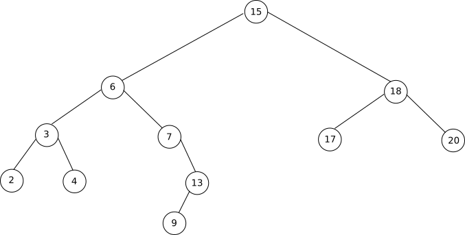

### activité 14.1

Soit la classe *Personnage* suivante :

```py
class Personnage:
    def __init__(self, nbreDeVie):
        self.vie=nbreDeVie
    def donneEtat (self):
        return self.vie
    def perdVie (self,nbPoint):
        self.vie=self.vie-nbPoint
```
Ajoutez une méthode *soigne* qui permettra d'augmenter l'attribut *vie* d'une  valeur *nbr* (*nbr* sera un paramètre de la méthode *soigne*).

Testez cette méthode en saisissant dans la console Python les instructions suivantes (les unes après les autres) :

- toto = Personnage(15)

- toto.donneEtat()

- toto.perdVie(2)

- toto.soigne(3)

- toto.donneEtat()

### activité 14.2

Écrivez une classe *Voiture* qui aura un attribut *vitesse* et 3 méthodes :

- une méthode *accelere* qui permettra d'incrémenter l'attribut vitesse d'une unité
- une méthode *freine* qui permettra de diminuer la vitesse
- une méthode *getVitesse* qui renverra la valeur de la vitesse

### activité 14.3

À partir de la classe créée à l'activité 14.2, écrivez un programme qui permettra d'atteindre la vitesse de 3 km/h, d'afficher cette vitesse dans la console puis de freiner jusqu'à l'arrêt complet du véhicule.

### activité 14.4

Le but de cette longue activité est d'implémenter en Python les algorithmes sur les arbres binaires précédemment étudiés. Il sera donc sans doute nécessaire de reprendre ce qui a été vu sur la structure de données "arbre" et sur "les algorithmes sur les arbres binaires".

Comme nous l'avons déjà dit, Python ne propose pas de structure de données permettant d'implémenter directement les arbres binaires. Il va donc être nécessaire de créer cette structure. Pour programmer ce type de structure, nous allons utiliser le paradigme objet.

Vous trouverez ci-dessous la classe *ArbreBinaire* qui va nous permettre d'implémenter des arbres binaires.

```python
class ArbreBinaire:
    def __init__(self, valeur):
        self.valeur = valeur
        self.enfant_gauche = None
        self.enfant_droit = None
    def insert_gauche(self, valeur):
        if self.enfant_gauche == None:
            self.enfant_gauche = ArbreBinaire(valeur)
        else:
            new_node = ArbreBinaire(valeur)
            new_node.enfant_gauche = self.enfant_gauche
            self.enfant_gauche = new_node
    def insert_droit(self, valeur):
        if self.enfant_droit == None:
            self.enfant_droit = ArbreBinaire(valeur)
        else:
            new_node = ArbreBinaire(valeur)
            new_node.enfant_droit = self.enfant_droit
            self.enfant_droit = new_node
    def get_valeur(self):
        return self.valeur
    def get_gauche(self):
        return self.enfant_gauche
    def get_droit(self):
        return self.enfant_droit
```

##### 1-

Étudiez attentivement la classe *ArbreBinaire* (méthodes et attributs). Vous pouvez, par exemple, vous interroger sur l'utilité de toutes les méthodes de cette classe.

Voici un exemple d'utilisation de cette classe pour construire un arbre binaire :

Soit l'arbre binaire suivant (arbre 1) :


Voici le programme qui va permettre de construire cet arbre à l'aide de la classe *ArbreBinaire* :

```python
class ArbreBinaire:
    def __init__(self, valeur):
        self.valeur = valeur
        self.enfant_gauche = None
        self.enfant_droit = None   
    def insert_gauche(self, valeur):
        if self.enfant_gauche == None:
            self.enfant_gauche = ArbreBinaire(valeur)
        else:
            new_node = ArbreBinaire(valeur)
            new_node.enfant_gauche = self.enfant_gauche
            self.enfant_gauche = new_node
    def insert_droit(self, valeur):
        if self.enfant_droit == None:
            self.enfant_droit = ArbreBinaire(valeur)
        else:
            new_node = ArbreBinaire(valeur)
            new_node.enfant_droit = self.enfant_droit
            self.enfant_droit = new_node
    def get_valeur(self):
        return self.valeur    
    def get_gauche(self):
        return self.enfant_gauche
    def get_droit(self):
        return self.enfant_droit

#######fin de la classe########

######début de la construction de l'arbre binaire###########

racine = ArbreBinaire('A')
racine.insert_gauche('B')
racine.insert_droit('F')

b_node = racine.get_gauche()
b_node.insert_gauche('C')
b_node.insert_droit('D')

f_node = racine.get_droit()
f_node.insert_gauche('G')
f_node.insert_droit('H')

c_node = b_node.get_gauche()
c_node.insert_droit('E')

g_node = f_node.get_gauche()
g_node.insert_gauche('I')

h_node = f_node.get_droit()
h_node.insert_droit('J')

######fin de la construction de l'arbre binaire###########
```

##### 2-

Étudiez attentivement le programme ci-dessus afin de comprendre le principe de "construction d'un arbre binaire"

Il est possible d'afficher un arbre binaire dans la console Python, pour cela, nous allons écrire une fonction "affiche". Cette fonction renvoie une série de tuples de la forme (valeur,arbre_gauche, arbre_droite), comme "arbre_gauche" et "arbre_droite" seront eux-mêmes affichés sous forme de tuples, on aura donc un affichage qui ressemblera à : (valeur,(valeur_gauche,arbre_gauche_gauche,arbre_gauche_droite),(valeur_droite,arbre_droite_gauche,arbre_droite_droite)), mais comme "arbre_gauche_gauche" sera lui-même représenté par un tuple... Nous allons donc avoir des tuples qui contiendront des tuples qui eux-mêmes contiendront des tuples...

Pour l'arbre binaire défini ci-dessus, on aura :

```
('A', ('B', ('C', None, ('E', None, None)), ('D', None, None)), ('F', ('G', ('I', None, None), None), ('H', None, ('J', None, None))))
```

Voici le programme augmenté de la fonction *affiche* :

```python
class ArbreBinaire:
    def __init__(self, valeur):
        self.valeur = valeur
        self.enfant_gauche = None
        self.enfant_droit = None
    def insert_gauche(self, valeur):
        if self.enfant_gauche == None:
            self.enfant_gauche = ArbreBinaire(valeur)
        else:
            new_node = ArbreBinaire(valeur)
            new_node.enfant_gauche = self.enfant_gauche
            self.enfant_gauche = new_node
    def insert_droit(self, valeur):
        if self.enfant_droit == None:
            self.enfant_droit = ArbreBinaire(valeur)
        else:
            new_node = ArbreBinaire(valeur)
            new_node.enfant_droit = self.enfant_droit
            self.enfant_droit = new_node    
    def get_valeur(self):
        return self.valeur    
    def get_gauche(self):
        return self.enfant_gauche    
    def get_droit(self):
        return self.enfant_droit

#######fin de la classe########

######début de la construction de l'arbre binaire###########

racine = ArbreBinaire('A')
racine.insert_gauche('B')
racine.insert_droit('F')

b_node = racine.get_gauche()
b_node.insert_gauche('C')
b_node.insert_droit('D')

f_node = racine.get_droit()
f_node.insert_gauche('G')
f_node.insert_droit('H')

c_node = b_node.get_gauche()
c_node.insert_droit('E')

g_node = f_node.get_gauche()
g_node.insert_gauche('I')

h_node = f_node.get_droit()
h_node.insert_droit('J')

######fin de la construction de l'arbre binaire###########

def affiche(T):
    if T != None:
        return (T.get_valeur(),affiche(T.get_gauche()),affiche(T.get_droit()))
```

##### 3-

Vérifiez que "affiche(racine)" renvoie bien :


```
('A', ('B', ('C', None, ('E', None, None)), ('D', None, None)), ('F', ('G', ('I', None, None), None), ('H', None, ('J', None, None))))
```

N.B : la fonction *affiche* n'a pas une importance fondamentale, elle sert uniquement à vérifier que les arbres programmés sont bien corrects.

##### 4-

Programmez à l'aide de la classe *ArbreBinaire*, l'arbre binaire suivant (arbre 2) :


Vérifiez votre programme à l'aide de la fonction "affiche"

Vous allez maintenant pouvoir commencer à travailler sur l'implémentation des algorithmes sur les arbres binaires :

##### 5-
Programmez la fonction *hauteur* qui prend un arbre binaire T en paramètre et renvoie la hauteur de T

Testez votre fonction en utilisant l'arbre vu plus haut (schéma "arbre 1").

##### 6-
Programmez la fonction *taille* qui prend un arbre binaire T en paramètre et renvoie la taille de T
Testez votre fonction en utilisant l'arbre vu plus haut (schéma "arbre 1").

##### 7-
Programmez la fonction *parcours_infixe* qui prend un arbre binaire T en paramètre et qui permet d'obtenir le parcours infixe de l'arbre T

Testez votre fonction en utilisant l'arbre vu plus haut (schéma "arbre 1").

##### 8-
Programmez la fonction *parcours_prefixe* qui prend un arbre binaire T en paramètre et qui permet d'obtenir le parcours préfixe de l'arbre T

Testez votre fonction en utilisant l'arbre vu plus haut (schéma "arbre 1").

##### 9-
Programmez la fonction *parcours_suffixe* qui prend un arbre binaire T en paramètre et qui permet d'obtenir le parcours suffixe de l'arbre T

Testez votre fonction en utilisant l'arbre vu plus haut (schéma "arbre 1").

##### 10-
Programmez la fonction *parcours_largeur* qui prend un arbre binaire T en paramètre et qui permet d'obtenir le parcours en largeur de l'arbre T

Testez votre fonction en utilisant l'arbre vu plus haut (schéma "arbre 1").

Nous allons maintenant travailler sur les arbres binaires de recherche.

##### 11-
Programmez, à l'aide de la classe *ArbreBinaire*, l'arbre binaire de recherche ci-dessous (arbre 3) :



Vérifiez votre réponse à l'aide de la fonction *affichage*

##### 12-
Afin de vérifier que l'arbre binaire "Arbre 3" est bien un arbre binaire de recherche, utilisez la fonction *parcours_infixe* programmée dans le "projet 3.7".

##### 13-
Programmez la fonction *arbre_recherche* qui prend un arbre binaire T et un entier k en paramètres et qui renvoie True si k appartient à T et False dans le cas contraire
Testez votre fonction en utilisant l'arbre vu plus haut (schéma "arbre 3") avec k = 13 et k = 16.

##### 14-
Programmez la fonction *arbre_recherche_ite* (version itérative de la fonction *arbre_recherche*) qui prend un arbre binaire T et un entier k en paramètres et qui renvoie True si k appartient à T et False dans le cas contraire

Testez votre fonction en utilisant l'arbre vu plus haut (schéma "arbre 3") avec k = 13 et k = 16.

##### 15-
Programmez la fonction "arbre_insertion" qui prend T (un arbre binaire) et y (un objet de type *ArbreBinaire*) en paramètres et qui insert y dans T

Testez votre fonction en utilisant l'arbre vu plus haut (schéma "arbre 3") avec y.valeur = 16.

### activité 14.5

Cette activité porte sur le problème des Tours de Hanoi. Voici un extrait de l'article Wikipédia consacré aux Tours de Hanoi ([https://fr.wikipedia.org/wiki/Tours_de_Hano%C3%AF](https://fr.wikipedia.org/wiki/Tours_de_Hano%C3%AF)) :

Les tours de Hanoï (originellement, la tour d'Hanoïa) sont un jeu de réflexion imaginé par le mathématicien français Édouard Lucas, et consistant à déplacer des disques de diamètres différents d'une tour de « départ » à une tour d'« arrivée » en passant par une tour « intermédiaire », et ceci en un minimum de coups, tout en respectant les règles suivantes :

- on ne peut déplacer plus d'un disque à la fois ;
- on ne peut placer un disque que sur un autre disque plus grand que lui ou sur un emplacement vide.

On suppose que cette dernière règle est également respectée dans la configuration de départ.


Dans la suite de cette activité nous allons utiliser la classe Tour donnée ci-dessous :

```python
class Tour:
    def __init__(self, nom, n = 0):
        self.s=[]
        self.nom = nom
        for i in range (n, 0, -1):
            self.s.append(i)
    def empile(self, d):
        assert len(self.s) == 0 or self.s[-1] > d, 'Mouvement interdit'
        self.s.append(d)
        print(f"Ajout du disque {d} sur la tour ", self.nom)
    
    def depile(self):
        assert len(self.s) != 0, 'Impossible, la tour est vide'
        d = self.s.pop()
        print(f"Retire le disque {d} de la tour ",self.nom)
        return d
    
    def affiche(self):
        if len(self.s)==0:
            print(f"la tour {self.nom} est vide")
        else :
            print (f"Tour {self.nom}")
            for d in reversed(self.s):
                print("| ",d," |")
```
##### 1-
Après avoir étudié attentivement la classe Tour, écrivez les instructions Python permettant de créer 3 instances de la classe Tour (une instance permettant de modéliser une tour du jeu). Une tour sera créée avec 2 disques (cette tour sera nommée "A"), les 2 autres tours seront au départ vide (tour "B" et tour "C"). On notera que chaque disque est identifié par un entier (cet entier représente le diamètre du disque correspondant).  

##### 2-
Écrivez une fonction *mouvement*, cette fonction prendra 2 paramètres *t1* et *t2*, tous les deux de type Tour (instance de Tour). Le but de cette fonction est de permettre le passage d'un disque de la tour *t1* vers la tour *t2*.

##### 3-
Écrivez la suite d'instructions permettant de résoudre le jeu avec 2 disques (la tour "A" sera la  tour de "départ", la tour "B" sera la tour "intermédiaire"  et la tour "C" sera la tour "arrivée"). Vous vérifierez votre réponse en affichant le contenu de la tour "C" après l'exécution de votre programme.

##### 4-
Écrivez une fonction récursive *resoudre* permettant de résoudre le jeu "Tours de Hanoi" dans tous les cas (avec n disques). Cette fonction prendra 4 paramètres :  un entier représentant le nombre de disques et trois instances de la classe Tour (représentant la tour "départ", la tour "arrivée" et la tour "intermédiaire").

Deux conseils :

- réfléchissez bien au cas de base de votre fonction récursive
- inspirez-vous de ce que vous avez fait dans la question 3 

### activité 14.6<sup>*</sup>

Vous avez déjà eu l'occasion de travailler sur les listes dans le <a href="https://pixees.fr/informatiquelycee/term/c5.html" target="_blank">chapitre 5</a>. Dans ce chapitre, nous avons utilisé les tuples pour réaliser l'implémentation de cette structure de données. Le but de cette activité est de réaliser une autre implémentation des listes, non plus cette fois en utilisant des tuples mais des listes chaînées (revoir aussi le chapitre 5 pour les listes chaînées).
 
Rappels sur les listes chaînées :

Dans une liste chaînée, à chaque élément de la liste on associe 2 cases mémoire : la première case contient l'élément et la deuxième contient l'adresse mémoire de l'élément suivant.

 

Pour dans un premier temps implémenter les listes chaînées en Python, nous allons utiliser 2 classes :

- la classe Node
- la classe LinkedList

```python
class Node:
    def __init__(self,value):
        self.value = value
        self.next = None
    def __str__(self):
        return str(self.value)
```

La classe Node permet d'implémenter un élément de la liste chaînée (les 2 cases : celle qui contient la valeur et celle qui pointe vers l'élément suivant). Cette classe Node possède deux attributs : 

- l'attribut self.value qui correspond à la case qui contient la valeur (première case)
- l'attribut self.next  qui correspond à la case qui "pointe" vers la valeur suivante (deuxième case)

Ne vous souciez pas de la méthode \__str__ qui permet juste d'afficher la valeur d'un élément. 

```python
class LinkedList:
    def __init__(self):
        self.head=None
        self.tail=None
    def __iter__(self):
        cur_node = self.head
        while cur_node:
            yield cur_node
            cur_node = cur_node.next
    def copy(self):
        l = LinkedList()
        node = self.head
        while node is not None:
            new_node = Node(node.value)
            if l.head is None:
                l.head = new_node
                l.tail = new_node
            else:
                l.tail.next = new_node
                l.tail = l.tail.next
            node = node.next
        return l    
```

La classe LinkedList permet d'implémenter une liste chaînée. Cette  classe LinkedList possède deux attributs :

- l'attribut self.head correspond au premier élément de la liste chaînée.
- l'attribut self.tail correspond au dernier élément de la liste chaînée.

Ne vous souciez pas de la méthode \__iter__ qui permet de parcourir une liste à l'aide d'une boucle "for"  (vous n'aurez pas à l'utiliser directement) et de la méthode "copy" qui permet de réaliser la copie d'une liste. 


Le but de cette activité est d'écrire les fonctions qui ont déjà été écrites dans le chapitre 5, mais en utilisant les classes Nodes et LinkedList à la place des tuples :

- fonction "newList" : permet d'obtenir une liste vide (la fonction ne prend aucun paramètre et renvoie une liste vide)
- fonction "showList" : permet d'afficher une liste (la fonction prend en  paramètre une liste et renvoie une chaîne de caractères)
- fonction "isEmpty" : permet de tester si une liste est vide (la fonction prend en paramètre une liste et renvoie True si la liste est vide et False dans le cas contraire)
- fonction "car" : permet d'obtenir le dernier élément ajouté à la liste (la fonction prend en paramètre une liste et renvoie un entier)
- fonction "cdr" : permet d'obtenir une liste contenant tous les éléments d'une liste à l'exception du dernier élément ajouté (la fonction prend en paramètre une liste et renvoie une liste)
- fonction "cons" : permet de construire une liste à partir d'un élément et d'un autre liste (la fonction prend en paramètres une valeur et une liste et renvoie une liste)

On donne ci-dessous les fonctions à compléter. Les fonctions "newList", "isEmpty" et "showList" sont fournies.

À noter les lignes "l1 = l.copy()" dans la fonction cons et la fonction cdr. Ces 2 lignes permettent de créer une copie de la liste qui a été passée en paramètre afin d'éviter de modifier cette même liste. Un simple "l1 = l" pour créer la copie ne suffirait pas (une modification de l1 entraînerait une modification de l), il est donc nécessaire d'utiliser la méthode "copy" de la classe LinkedList.

```python
 def newList():
    return LinkedList()    
def showList(l):
    li = [str(x) for x in l]
    return " - ".join(li)
def isEmpty(l):
    return l.head is None
def cons(v,l):
    l1 = l.copy()
    ....    
def car(l):
    ....
def cdr(l):
    l1 = l.copy()
    ....
```

Après avoir complété les fonctions ci-dessus, exécutez le programme ci-dessous :

```python
l = newList()
l1 = cons(15,cons(12,cons(2,l)))
v = car(l1)
l2 = cdr(l1)
l3 = cons(4,cons(5, l2))
```

Ensuite, tapez successivement dans la console :

- v
- showList(l1)
- showList(l2)
- showList(l3)

Voici les résultats que vous devriez obtenir :

```
>>> v
15
>>> showList(l1)
'2 - 12 - 15'
>>> showList(l2)
'2 - 12'
>>> showList(l3)
'2 - 12 - 5 - 4'
```

### activité 14.7<sup>*</sup>

Vous avez déjà eu l'occasion de travailler sur les piles dans le <a href="https://pixees.fr/informatiquelycee/term/c5.html" target="_blank">chapitre 5</a>. Dans ce chapitre, nous avons utilisé les tableaux (listes Python) pour réaliser l'implémentation de cette structure de données. Le but de cette activité est de réaliser une autre implémentation des piles, non plus cette fois en utilisant des tableaux, mais des listes chaînées (revoir aussi le chapitre 5 pour les listes chaînées).

Rappels sur les listes chaînées :

Dans une liste chaînée, à chaque élément de la liste on associe 2 cases mémoire : la première case contient l'élément et la deuxième contient l'adresse mémoire de l'élément suivant.

 

Pour dans un premier temps implémenter les listes chaînées en Python, nous allons utiliser 2 classes :

- la classe Node
- la classe LinkedList

```python
class Node:
    def __init__(self,value):
        self.value = value
        self.next = None
    def __str__(self):
        return str(self.value)
```

La classe Node permet d'implémenter un élément de la liste chaînée (les 2 cases : celle qui contient la valeur et celle qui pointe vers l'élément suivant). Cette classe Node possède deux attributs : 

- l'attribut self.value qui correspond à la case qui contient la valeur (première case)
- l'attribut self.next  qui correspond à la case qui "pointe" vers la valeur suivante (deuxième case)

Ne vous souciez pas de la méthode \__str__ qui permet juste d'afficher la valeur d'un élément. 

```python
class LinkedList:
    def __init__(self):
        self.head=None
        self.tail=None
    def __iter__(self):
        cur_node = self.head
        while cur_node:
            yield cur_node
            cur_node = cur_node.next    
```

La classe LinkedList permet d'implémenter une liste chaînée. Cette  classe LinkedList possède deux attributs :

- l'attribut self.head correspond au premier élément de la liste chaînée.
- l'attribut self.tail correspond au dernier élément de la liste chaînée.

Ne vous souciez pas de la méthode \__iter__ qui permet de parcourir une liste à l'aide d'une boucle "for"  (vous n'aurez pas à l'utiliser directement)

Le but de cette activité est d'écrire une classe "Stack" ("Pile" en français). Cette classe vous permettra d'implémenter la structure de données pile.

La classe "Stack" utilisera les classes "LinkedList" et "Node".

```python
class Stack:
    def __init__(self):
        self.ll = LinkedList()    
    def isEmpty(self):
        return self.ll.head is None        
    def show(self):
        print("")
        if self.isEmpty():
            print("La pile est vide")
        else :
            for n in self.ll:
                print ("|",n.value,"|")
            print("-----")    
    def push(self,v):
        ......                
    def pop(self):
        ......    
```

Comme vous pouvez le constater ci-dessus, les méthodes "\__init__", "isEmpty" (renvoie True si la pile est vide et False dans le cas contraire), "show" (permet d'afficher la pile) sont données. Il vous reste donc à implémenter la  méthode "push" (permet de placer un élément v au sommet de la pile) et la méthode "pop" (permet de "dépiler" la pile, cette méthode renvoie la valeur qui vient d'être "dépilée").

Pour vérifier la correction des méthodes "push" et "pop"  que vous aurez écrites, vous pourrez exécuter le programme suivant :

```python
p = Stack()
p.push(5)
p.push(8)
p.show()
v=p.pop()
print("valeur renvoyée par pop : ",v)
p.show()
v = p.pop()
print("valeur renvoyée par pop : ",v)
p.show()
``` 

Vous devriez alors obtenir le résultat suivant :

```

| 8 |
| 5 |
-----
valeur renvoyée par pop :  8

| 5 |
-----
valeur renvoyée par pop :  5

La pile est vide
```

### activité 14.8<sup>*</sup>

Vous avez déjà eu l'occasion de travailler sur les files dans le <a href="https://pixees.fr/informatiquelycee/term/c5.html" target="_blank">chapitre 5</a>. Dans ce chapitre, nous avons utilisé les tableaux (listes Python) pour réaliser l'implémentation de cette structure de données. Le but de cette activité est de réaliser une autre implémentation des files, non plus cette fois en utilisant des tableaux, mais des listes chaînées (revoir aussi le chapitre 5 pour les listes chaînées).

Rappels sur les listes chaînées :

Dans une liste chaînée, à chaque élément de la liste on associe 2 cases mémoire : la première case contient l'élément et la deuxième contient l'adresse mémoire de l'élément suivant.

 

Pour dans un premier temps implémenter les listes chaînées en Python, nous allons utiliser 2 classes :

- la classe Node
- la classe LinkedList

```python
class Node:
    def __init__(self,value):
        self.value = value
        self.next = None
    def __str__(self):
        return str(self.value)
```

La classe Node permet d'implémenter un élément de la liste chaînée (les 2 cases : celle qui contient la valeur et celle qui pointe vers l'élément suivant). Cette classe Node possède deux attributs : 

- l'attribut self.value qui correspond à la case qui contient la valeur (première case)
- l'attribut self.next  qui correspond à la case qui "pointe" vers la valeur suivante (deuxième case)

Ne vous souciez pas de la méthode \__str__ qui permet juste d'afficher la valeur d'un élément. 

```python
class LinkedList:
    def __init__(self):
        self.head=None
        self.tail=None
    def __iter__(self):
        cur_node = self.head
        while cur_node:
            yield cur_node
            cur_node = cur_node.next    
```

La classe LinkedList permet d'implémenter une liste chaînée. Cette  classe LinkedList possède deux attributs :

- l'attribut self.head correspond au premier élément de la liste chaînée.
- l'attribut self.tail correspond au dernier élément de la liste chaînée.

Ne vous souciez pas de la méthode \__iter__ qui permet de parcourir une liste à l'aide d'une boucle "for"  (vous n'aurez pas à l'utiliser directement)

Le but de cette activité est d'écrire une classe "Queue" ("File" en français). Cette classe vous permettra d'implémenter la structure de données file.

La classe "Queue" utilisera les classes "LinkedList" et "Node".

```python
class Queue:
    def __init__(self):
        self.ll = LinkedList()    
    def isEmpty(self):
        return self.ll.head is None    
    def show(self):
        if self.isEmpty() :
            print("la file est vide")
        else :
            l = [str(x) for x in self.ll]
            print(" - ".join(l))    
    def enQueue(self,v):
        ......    
    def deQueue(self):
        ......    
```
Comme vous pouvez le constater ci-dessus, les méthodes "\__init__", "isEmpty" (renvoie True si la file est vide et False dans le cas contraire), "show" (permet d'afficher la file) sont données. Il vous reste donc à implémenter la  méthode "enQueue" (permet de placer un élément v dans la file) et la méthode "deQueue" (permet de "défiler" la file, cette méthode renvoie la valeur qui vient d'être "défilée").

Pour vérifier la correction des méthodes "enQueue" et "deQueue"  que vous aurez écrites, vous pourrez exécuter le programme suivant :

```python
q = Queue()
q.enQueue(5)
q.enQueue(8)
q.show()
v = q.deQueue()
print("valeur renvoyée par deQueue : ",v)
q.show()
v = q.deQueue()
print("valeur renvoyée par deQueue : ",v)
q.show()
``` 

Vous devriez alors obtenir le résultat suivant :

```
5 - 8
valeur renvoyée par deQueue :  5
8
valeur renvoyée par deQueue :  8
la file est vide
```