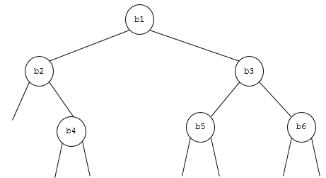

### exercice 14.1
Cet exercice est tiré de la banque de sujet de l'épreuve pratique de terminale

On veut écrire une classe pour gérer une file à l’aide d’une liste chaînée. On dispose d’une
classe Maillon permettant la création d’un maillon de la chaîne, celui-ci étant constitué
d’une valeur et d’une référence au maillon suivant de la chaîne :

```
class Maillon :
	def __init__(self,v) :
		self.valeur = v
		self.suivant = None
```


Compléter la classe File suivante où l’attribut dernier_file contient le maillon correspondant à l’élément arrivé en dernier dans la file :

```
class Maillon :
    def __init__(self,v) :
        self.valeur = v
        self.suivant = None

class File :
    def __init__(self) :
        self.dernier_file = None

    def enfile(self,element) :
        nouveau_maillon = Maillon(...)
        nouveau_maillon.suivant = self.dernier_file
        self.dernier_file = ...

    def est_vide(self) :
        return self.dernier_file == None

    def affiche(self) :
        maillon = self.dernier_file
        while maillon != ... :
            print(maillon.valeur)
            maillon = ...

    def defile(self) :
        if not self.est_vide() :
            if self.dernier_file.suivant == None :
                resultat = self.dernier_file.valeur
                self.dernier_file = None
                return resultat
            maillon = ...
            while maillon.suivant.suivant != None :
                maillon = maillon.suivant
            resultat = ...
            maillon.suivant = None
            return resultat
        return None 
```

### exercice 14.2

Cet exercice est tiré du sujet de bac 2021

Une agence immobilière développe un programme pour gérer les biens immobiliers qu’elle propose à la vente.
Dans ce programme, pour modéliser les données de biens immobiliers, on définit une classe Bim avec les attributs suivants :

- nt de type str représente la nature du bien (appartement, maison, bureau, commerces, … ) ;

- sf de type float est la surface du bien ;

- pm de type float est le prix moyen par m² du bien qui dépend de son emplacement.

La classe Bim possède une méthode estim_prix qui renvoie une estimation du prix du bien. Le code (incomplet) de la classe Bim est donné ci-dessous :

```
class Bim:
    def __init__(self, nature, surface, prix_moy):
        …
    def estim_prix(self):
        return self.sf * self.pm
```

1) Recopier et compléter le code du constructeur de la classe Bim.

2) On exécute l'instruction suivante :

```
b1 = Bim('maison', 70.0, 2000.0)
```

Que renvoie l'instruction b1.estim_prix() ? Préciser le type de la valeur renvoyée.

3) On souhaite affiner l’estimation du prix d’un bien en prenant en compte sa nature :

- pour un bien dont l’attribut nt est  'maison' la nouvelle estimation du prix est le produit de sa surface par le prix moyen par m² multiplié par 1,1 ;

- pour un bien dont l’attribut nt est  'bureau' la nouvelle estimation du prix est le produit de sa surface par le prix moyen par m² multiplié par 0,8 ;

- pour les biens d’autres natures, l’estimation du prix ne change pas.

Modifier le code de la méthode estim_prix  afin de prendre en compte ce changement de calcul.

4) Écrire le code Python d'une fonction nb_maison(lst) qui prend en argument une liste Python de biens immobiliers de type Bim et qui renvoie le nombre d’objets de nature 'maison' contenus dans la liste lst.

5) Pour une recherche efficace des biens immobiliers selon le critère de leur surface, on stocke les objets de type Bim dans un arbre binaire de recherche, nommé abr. Pour tout nœud de cet arbre :

- tous les objets de son sous-arbre gauche ont une surface inférieure ou égale à la surface de l’objet contenue dans ce nœud ;

- tous les objets de son sous-arbre droit ont une surface strictement supérieure à la surface de l’objet contenue dans ce nœud.

L’objet abr dispose des méthodes suivantes :

abr.est_vide() : renvoie True si abr est vide et False sinon.

abr.get_v() : renvoie l’élément (de type Bim) situé à la racine de abr si abr n’est pas vide et None sinon.

abr.get_g() : renvoie le sous-arbre gauche de abr si abr n’est pas vide et None sinon.

abr.get_d() : renvoie le sous-arbre droit de abr si abr n’est pas vide et None sinon.

a) Dans cette question, on suppose que l'arbre binaire abr a la forme ci-dessous :



Donner la liste les biens b1, b2, b3, b4, b5, b6 triée dans l'ordre croissant de leur surface.

b) Recopier et compléter le code de la fonction récursive contient donnée ci-dessous, qui prend en arguments un nombre surface de type float et un arbre binaire de recherche abr contenant des éléments de type Bim ordonnés selon leur attribut de surface sf. La fonction contient(surface, abr) renvoie True s'il existe un bien dans abr d'une surface supérieure ou égale à surface et False sinon.

```
def contient(surface, abr):
    if abr.est_vide():
        return False
    elif abr.get_v().sf >= ……… :
        return True
    else:
        return contient( surface , ……… )
```