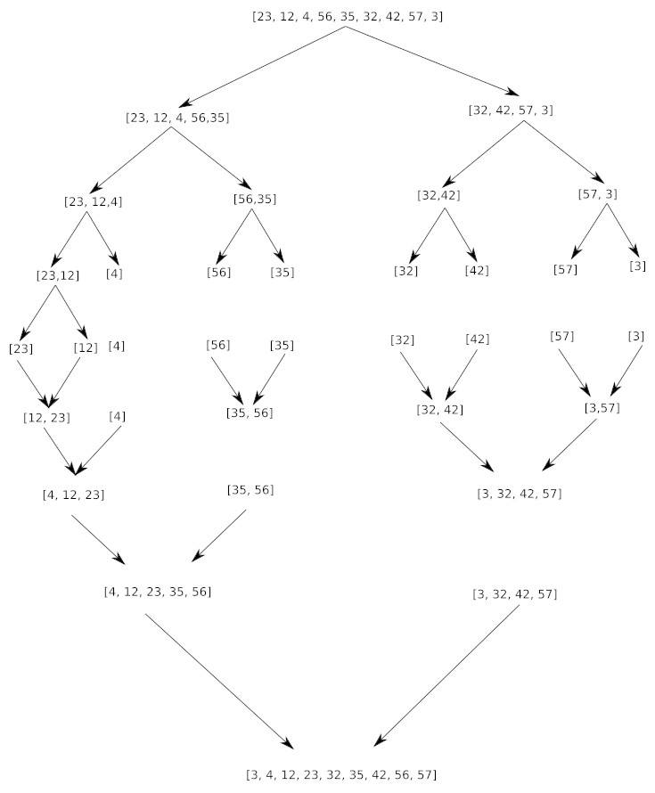

## 1) diviser pour régner

Le diviser pour régner est une méthode algorithmique basée sur le principe suivant :

On prend un problème (généralement complexe à résoudre), on divise ce problème en une multitude de petits problèmes, l'idée étant que les "petits problèmes" seront plus simples à résoudre que le problème original. Une fois les petits problèmes résolus, on recombine les "petits problèmes résolus" afin d'obtenir la solution du problème de départ.

Le paradigme "diviser pour régner" repose donc sur 3 étapes :

- **DIVISER** : le problème d'origine est divisé en un certain nombre de sous-problèmes

- **RÉGNER** : on résout les sous-problèmes (les sous-problèmes sont plus faciles à résoudre que le problème d'origine)

- **COMBINER** : les solutions des sous-problèmes sont combinées afin d'obtenir la solution du problème d'origine.

Les algorithmes basés sur le paradigme "diviser pour régner" sont très souvent des algorithmes récursifs.

Nous allons maintenant étudier un de ces algorithmes basés sur le principe diviser pour régner : le tri-fusion

## 2) Tri-fusion

### a) présentation

Nous avons déjà étudié des algorithmes de tri : le tri par insertion et le tri par sélection. Nous allons maintenant étudier une nouvelle méthode de tri, le tri-fusion. Comme pour les algorithmes déjà étudiés, cet algorithme de tri fusion prend en entrée un tableau non trié et donne en sortie, le même tableau, mais trié.

Soit l'algorithme suivant :

```
VARIABLE
A : tableau d'entiers
L : tableau d'entiers
R : tableau d'entiers
p : entier
q : entier
r : entier
n1 : entier
n2 : entier


DEBUT

FUSION (A, p, q, r):
  n1 ← q - p + 1
  n2 ← r - q
  créer tableau L[1..n1+1] et R[1..n2+1]
  pour i ← 1 à n1:
    L[i] ← A[p+i-1]
  fin pour
  pour j ← 1 à n2:
    R[j] ← A[q+j]
  fin pour
  L[n1+1] ← ∞
  R[n2+1] ← ∞
  i ← 1
  j ← 1
  pour k ← p à r:
    si L[i] ⩽ R[j]:
      A[k] ← L[i]
      i ← i + 1
    sinon:
      A[k] ← R[j]
      j ← j + 1
    fin si
  fin pour
fin FUSION

TRI-FUSION(A, p, r):
  si p < r:
    q = (p + r) / 2
    TRI-FUSION(A, p, q)
    TRI-FUSION(A, q+1, r)
    FUSION(A, p, q, r)
  fin si
fin TRI-FUSION
FIN
```

Pour trier un tableau A, on fait l'appel initial TRI-FUSION(A, 1, A.longueur)

Rappel : Attention, en algorithmique, les indices des tableaux commencent à 1

Cet algorithme est un peu difficile à appréhender, on notera qu'il est composé de deux fonctions FUSION et TRI-FUSION (fonction récursive). La fonction TRI-FUSION assure la phase "DIVISER" et la fonction FUSION assure les phases "RÉGNER" et "COMBINER".

Voici un exemple d'application de cet algorithme sur le tableau A = [23, 12, 4, 56, 35, 32, 42, 57, 3] :



On remarque que dans le cas du tri-fusion, la phase "RÉGNER" se réduit à sa plus simple expression, en effet, à la fin de la phase "DIVISER", nous avons à trier des tableaux qui comportent un seul élément, ce qui est évidemment trivial.

La fusion des 2 tableaux déjà triés est simple, prenons comme exemple la dernière fusion entre le tableau [4, 12, 23, 35, 56] et le tableau [3, 32, 42, 57] (le principe est identique pour toutes les fusions) :

Soit T le tableau issu de la fusion du tableau B = [4, 12, 23, 35, 56] et du tableau C = [3, 32, 42, 57] (on donne des noms aux tableaux uniquement pour essayer de rendre l'explication la plus claire possible).

- On considère le premier élément du tableau B (4) et le premier élément du tableau C (3) : 3 est inférieur à 4, on place 3 dans le tableau T et on le supprime du tableau C. Nous avons donc alors T = [3], B = [4, 12, 23, 35, 56] et C = [32, 42, 57].

- On recommence ensuite à comparer le premier élément du tableau B (4) et le premier élément du tableau C (32) : 4 est inférieur à 32, on place 4 dans le tableau T et on le supprime du tableau B. Nous avons donc alors T = [3, 4], B = [12, 23, 35, 56] et C = [32, 42, 57].

- On compare le premier élément du tableau B (12) et le premier élément du tableau C (32) : 12 est inférieur à 32, on place 12 dans le tableau T et on le supprime du tableau B. Nous avons donc alors T = [3, 4, 12], B = [23, 35, 56] et C = [32, 42, 57].

- On compare le premier élément du tableau B (23) et le premier élément du tableau C (32) : 23 est inférieur à 32, on place 23 dans le tableau T et on le supprime du tableau B. Nous avons donc alors T = [3, 4, 12, 23], B = [35, 56] et C = [32, 42, 57].

- On compare le premier élément du tableau B (35) et le premier élément du tableau C (32) : 32 est inférieur à 35, on place 32 dans le tableau T et on le supprime du tableau C. Nous avons donc alors T = [3, 4, 12, 23, 32], B = [35, 56] et C = [42, 57].

- On compare le premier élément du tableau B (35) et le premier élément du tableau C (42) : 35 est inférieur à 42, on place 35 dans le tableau T et on le supprime du tableau C. Nous avons donc alors T = [3, 4, 12, 23, 32, 35], B = [56] et C = [42, 57].

- On compare le premier élément du tableau B (56) et le premier élément du tableau C (42) : 42 est inférieur à 56, on place 42 dans le tableau T et on le supprime du tableau C. Nous avons donc alors T = [3, 4, 12, 23, 32, 35, 42], B = [56] et C = [57].

- On compare le premier élément du tableau B (56) et le premier élément du tableau C (57) : 56 est inférieur à 57, on place 56 dans le tableau T et on le supprime du tableau B. Nous avons donc alors T = [3, 4, 12, 23, 32, 35, 42, 56], B = [] et C = [57].

- Le tableau B est vide, il nous reste juste à placer le seul élément qui reste dans C (57) dans T : T = [3, 4, 12, 23, 32, 35, 42, 56, 57], B = [] et C = []. La fusion est terminée.

### b) complexité

Nous avons vu que le tri par insertion et tri par sélection ont tous les deux une complexité O(n<sup>2</sup>). Qu'en est-il pour le tri-fusion ?

Le calcul rigoureux de la complexité de cet algorithme sort du cadre de ce cours. Mais, en remarquant que la première phase (DIVISER) consiste à "couper" les tableaux en deux plusieurs fois de suite, intuitivement, on peut dire qu'un logarithme base 2 doit intervenir. La deuxième phase consiste à faire des comparaisons entre les premiers éléments de chaque tableau à fusionner, on peut donc supposer que pour un tableau de n éléments, on aura n comparaisons. En combinant ces 2 constations on peut donc dire que la complexité du tri-fusion est en O(nlog(n)) (encore une fois la "démonstration" proposée ici n'a rien de rigoureux).

La comparaison des courbes de la fonction n<sup>2</sup> (en rouge) et nlog(n) (en bleu) :


nous montre que l'algorithme de tri-fusion est plus "efficace" que l'algorithme de tri par insertion ou que l'algorithme de tri par sélection.