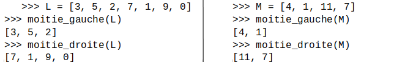

### exercice 15.1
Cet exercice est tiré du sujet du bac NSI 2021

Question 1

a. Quel est l’ordre de grandeur du coût, en nombre de comparaisons, de l’algorithme de tri fusion pour une liste de longueur n ?

b. Citer le nom d’un autre algorithme de tri. Donner l’ordre de grandeur de son coût, en nombre de comparaisons, pour une liste de longueur. Comparer ce coût à celui du tri fusion. Aucune justification n’est attendue.

L’algorithme de tri fusion utilise deux fonctions moitie_gauche et moitie_droite qui prennent en argument une liste L et renvoient respectivement :

- la sous-liste de L formée des éléments d’indice strictement inférieur à len(L)//2 ;

- la sous-liste de L formée des éléments d’indice supérieur ou égal à len(L)//2.
On rappelle que la syntaxe a//b désigne la division entière de a par b.

Par exemple,



L’algorithme utilise aussi une fonction fusion qui prend en argument deux listes triées L1 et L2 et renvoie une liste L triée et composée des éléments de L1 et L2.

On donne ci-dessous le code python d’une fonction récursive tri_fusion qui prend en argument une liste L et renvoie une nouvelle liste triée formée des éléments de L.

```python
def tri_fusion(L):
     	n = len(L)
     	if n<=1 :
         		return L
     	print(L)
     	mg = moitie_gauche(L)
     	md = moitie_droite(L)
     	L1 = tri_fusion(mg)
     	L2 = tri_fusion(md)
     	return fusion(L1, L2)
```

Question 2

    Donner la liste des affichages produits par l’appel suivant : tri_fusion([7, 4, 2, 1, 8, 5, 6, 3]) 
    
Question 3

Écrire la fonction moitie_droite.

Question 4

On donne ci-dessous une version incomplète de la fonction fusion.

```python
1. def fusion(L1, L2):
2.     L = []
3.     n1 = len(L1)
4.     n2 = len(L2)
5.     i1 = 0
6.     i2 = 0
7.     while i1 < n1 or i2 < n2 :
8.          if i1 >= n1:
9.              L.append(L2[i2])
10.             i2 = i2 + 1
11.         elif i2 >= n2:
12.             L.append(L1[i1])
13.             i1 = i1 + 1
14.         else:
15.             e1 = L1[i1]
16.             e2 = L2[i2]
17.			
18.			
19.			
20.
21.
22.			
23.     return L
```
- Si aucun des deux indices n’est valide, la boucle while est interrompue ;

- Si i1 n’est plus un indice valide, on va ajouter à L les éléments de L2 à partir de l’indice i2 ;

- Si i2 n’est plus un indice valide, on va ajouter à L les éléments de L1 à partir de l’indice i1 ;

- Sinon, le plus petit élément non encore traité est ajouté à L et on décale l’indice correspondant.

Écrire sur la copie les instructions manquantes des lignes 17 à 22 permettant d’insérer dans la liste L les éléments des listes L1 et L2 par ordre croissant.