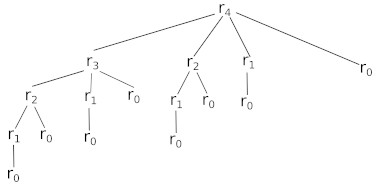

### activité 16.1

Cette activité s'inspire librement du contenu du livre de Cormen, Leiserson, Rivest et Stein "Introduction to Algorithms" (édition The Mit Press) 

L'entreprise sun & steel produit et vend des barres d'acier de différentes longueurs. Voici le prix de vente de ces barres d'acier en fonction de leurs longueurs :

| longueur i en mètre | prix p en euro |
|---------------------|----------------|
| 1                   | 1              |
| 2                   | 5              |
| 3                   | 8              |
| 4                   | 9              |
| 5                   | 10             |
| 6                   | 17             |
| 7                   | 17             |
| 8                   | 20             |
| 9                   | 24             |
| 10                  | 30             |

Quand l'entreprise produit une barre de longueur n, elle a 2 possibilités :

- vendre la barre telle quelle
- découper la barre afin d'obtenir plusieurs barres plus petites

Par exemple pour une barre de 4 m de longueur l'entreprise peut : 

- vendre la barre de 4 m ; gain = 9 euros
- découper la barre en 2 => 4 = 2 + 2 et vendre ces 2 barres ; gain = 5+5 = 10 euros
- découper la barre en 2 => 4 = 1 + 3 et vendre ces 2 barres ; gain = 8+1 = 9 euros
- découper la barre en 3 => 4 = 1+1+2 et vendre ces 3 barres ; gain = 1+1+5 = 7 euros
- ...

1- Continuez la liste ci-dessus afin d'obtenir toutes les possibilités pour une barre de 4 m. Quel est le revenu maximum possible pour la société ?

Partons maintenant du principe qu'au départ, la barre ne fait plus forcement 4 m mais qu'elle fait n mètres (n compris entre 1 et 10).

Pour chaque longueur n on peut déterminer le revenu maximum possible (que l'on notera r<sub>n</sub>). Par exemple :

- pour n = 1 le revenu maximum sera de 1 euro, on aura donc r<sub>1</sub> = 1

- pour n = 2, il y a 2 possibilités : 
	- on ne découpe pas la barre (revenu = 5)
	- on découpe la barre en 2 (revenu = 1+1 = 2)
	
	on obtiendra donc r<sub>2</sub> = 5
	
- pour n = 3, il y a 3 possibilités : 
	- on ne découpe pas la barre (revenu = 8)
	- on découpe la barre en 2 (3 = 1+2 ; revenu = 1+5 = 6)
	- on découpe la barre en 3 (3 = 1+1+1 ; revenu = 1+1+1 = 3)

	on obtiendra donc r<sub>3</sub> = 8

- pour n = 4, il y a 5 possibilités : 
	- on ne découpe pas la barre (revenu = 9)
	- on découpe la barre en 2 (4 = 2+2 ; revenu = 5+5 = 10)
	- on découpe la barre en 2 (4 = 1+3 ; revenu = 1+8 = 9)
	- on découpe la barre en 3 (4 = 1+1+2 ; revenu = 1+1+5 = 7)
	- on découpe la barre en 4 (4 = 1+1+1+1 ; revenu = 1+1+1+1 = 4)
	
	on obtiendra donc r<sub>4</sub> = 10
	
- pour n = 5, il y a 7 possibilités : 
	- on ne découpe pas la barre (revenu = 10)
	- on découpe la barre en 2 (5 = 2+3 ; revenu = 5+8 = 13)
	- on découpe la barre en 2 (5 = 1+4 ; revenu = 1+9 = 10)
	- on découpe la barre en 3 (5 = 1+1+3 ; revenu = 1+1+8 = 10)
	- on découpe la barre en 3 (5 = 1+2+2 ; revenu = 1+5+5 = 11)
	- on découpe la barre en 4 (5 = 1+1+1+2 ; revenu = 1+1+1+5 = 8)
	- on découpe la barre en 5 (5 = 1+1+1+1+1 ; revenu = 1+1+1+1+1 = 5)
	
	on obtiendra donc r<sub>5</sub> = 13
- ...

L'idée de cette activité est d'écrire un programme Python qui permettra d'obtenir tous les r<sub>n</sub> avec n compris entre 1 et 10.

On peut remarquer qu'il est aussi possible de calculer r<sub>5</sub> en appliquant la relation suivante :

r<sub>5</sub> = max(p<sub>5</sub>, r<sub>1</sub> + r<sub>4</sub>, r<sub>2</sub> + r<sub>3</sub>, r<sub>3</sub> + r<sub>2</sub>, r<sub>4</sub> + r<sub>1</sub>)

avec :

- p<sub>5</sub> le prix de la barre de 5 m
- r<sub>1</sub> le meilleur revenu possible pour 1 barre de 1 m (c'est-à-dire 1)
- r<sub>2</sub> le meilleur revenu possible pour 1 barre de 2 m (c'est-à-diree 5)
- r<sub>3</sub> le meilleur revenu possible pour 1 barre de 3 m (c'est-à-dire 8)
- r<sub>4</sub> le meilleur revenu possible pour 1 barre de 4 m (c'est-à-dire 10)

Nous avons donc :

r<sub>5</sub> = max(10, 1+10, 5+8, 8+5, 10+1) = max(10,11,13,13,11) = 13

Il est possible de généraliser cette relation en écrivant :

r<sub>n</sub> = max(p<sub>n</sub>, r<sub>1</sub>+r<sub>n-1</sub>, r<sub>2</sub>+r<sub>n-2</sub>, ..., r<sub>n-1</sub>+r<sub>1</sub>)

2- Retrouvez la valeur de r<sub>4</sub> en utilisant la relation ci-dessus

On remarque que pour calculer r<sub>n</sub>, il faut calculer r<sub>n-1</sub>, r<sub>n-2</sub>, ...

Cela devrait vous rappeler quelque chose : dans le chapitre consacré aux fonctions récursives nous avons vu que pour calculer la factorielle de n , il faut calculer la factorielle de n-1, la factorielle de n-2 ... Nous allons donc pouvoir écrire une fonction récursive afin de pouvoir résoudre notre problème (calculer tous les r<sub>n</sub> pour n compris entre 1 et 10).

Avant d'écrire cette fonction récursive, analysons un peu la relation vue ci-dessus :

r<sub>n</sub> = max(p<sub>n</sub>, r<sub>1</sub>+r<sub>n-1</sub>, r<sub>2</sub>+r<sub>n-2</sub>,..., r<sub>n-1</sub>+r<sub>1</sub>)

Dans cette relation, le premier élément (p<sub>n</sub>) correspond au cas où la barre n'est pas découpée. Les autres éléments correspondent au cas où l'on découpe la barre en 2 morceaux de longueurs i et n-i avec i compris entre 1 et n (avec n inclus).

Il est donc possible de modifier la relation vue ci-dessus et d'écrire :


r<sub>n</sub> = max(p<sub>i</sub>+r<sub>n-i</sub>) avec i compris entre 1 et n (n inclus)

Par exemple, pour n=5, on retrouve :

r<sub>5</sub> = max(p<sub>1</sub>+r<sub>4</sub>, p<sub>2</sub>+r<sub>3</sub>, p<sub>3</sub>+r<sub>2</sub>, p<sub>4</sub>+r<sub>1</sub>, p<sub>5</sub>+r<sub>0</sub>) avec r<sub>0</sub> le revenu maximum pour une barre de longueur nulle (on a donc r<sub>0</sub> = 0)

Pour calculer r<sub>5</sub> il est donc nécessaire de calculer r<sub>4</sub> : 

r<sub>4</sub> = max(p<sub>1</sub>+r<sub>3</sub>, p<sub>2</sub>+r<sub>2</sub>, p<sub>3</sub>+r<sub>1</sub>, p<sub>4</sub>+r<sub>0</sub>)

mais il est aussi nécessaire de calculer r<sub>3</sub>, r<sub>2</sub> et r<sub>1</sub> à la fois pour calculer r<sub>5</sub> mais aussi pour calculer r<sub>4</sub> ... On retrouve bien notre structure récursive.


N.B : Si vous avez du mal à comprendre le pourquoi du comment de la relation vue ci-dessus (r<sub>n</sub> = max(p<sub>i</sub>+r<sub>n-i</sub>) avec i compris entre 1 et n (n inclus)), cela n'a pas une grande importance, contentez-vous de l'utiliser (le but de cette activité est ailleurs).

3- La fonction *revenu_barre* ci-dessous prend en paramètre la taille n de la barre (avant découpe) et renvoie le revenu maximum possible pour cette barre de longueur n :

```python
def revenu_barre(n):
    prix = [0,1,5,8,9,10,17,17,20,24,30]
    if n == 0:
        return ...
    r = float('-inf')
    for i in range(1, n+1):
        r = max(r, prix[i] + ...)
    return r
```
 
Compétez la fonction *revenu_barre*

4- Utilisez la fonction *revenu_barre* pour calculer r<sub>5</sub>, r<sub>6</sub>, r<sub>7</sub>, r<sub>8</sub>, r<sub>9</sub> et r<sub>10</sub>

5- L'entreprise a modifié ces tarifs, nous avons maintenant le tableau suivant :

| longueur i en mètre | prix p en euro |
|---------------------|----------------|
| 1                   | 1              |
| 2                   | 6              |
| 3                   | 9              |
| 4                   | 11             |
| 5                   | 12             |
| 6                   | 19             |
| 7                   | 20             |
| 8                   | 23             |
| 9                   | 24             |
| 10                  | 26             |

Modifiez la fonction *revenu_barre* afin de tenir compte de cette modification tarifaire.

Comme nous avons eu l'occasion de le voir ci-dessus, pour calculer r<sub>n</sub> il est nécessaire de calculer r<sub>n-1</sub>, r<sub>n-2</sub>...mais pour calculer r<sub>n-1</sub>, il sera aussi nécessaire de calculer r<sub>n-2</sub> ! Nous allons donc calculer 2 fois r<sub>n-2</sub>.

Afin de mieux visualiser la situation, voici un arbre qui permet de mieux visualiser les calculs nécessaires afin de déterminer r<sub>4</sub> :



Comme vous pouvez le constater, pour calculer r<sub>4</sub>, il faut calculer :

- 1 fois r<sub>3</sub>
- 2 fois r<sub>2</sub>
- 4 fois r<sub>1</sub>

Dans cet exemple, cela ne pose aucun problème, mais avec un n plus grand (par exemple r<sub>10</sub>), nous aurions à effectuer de nombreuses fois exactement les mêmes calculs. On pourrait même imaginer si nous avions à notre disposition des barres de 100 m de long, un nombre de calculs à effectuer qui arriverait aux limites des capacités de nos ordinateurs (calculs très longs à effectuer).

Nous sommes donc typiquement dans le cas où la programmation dynamique pourrait nous être utile afin d'éviter de refaire un grand nombre de fois exactement les mêmes calculs.

6- En vous inspirant de ce qui a été fait dans le cours (suite de Fibonacci et rendu de monnaie), écrivez une fonction *revenu_barre_dyn_desc(n)* permettant de calculer r<sub>n</sub>. Cette fonction devra utiliser la programmation dynamique (approche descendante)

7- Toujours en utilisant la programmation dynamique, proposez une fonction *revenu_barre_dyn_asc(n)* permettant de calculer r<sub>n</sub> mais cette fois-ci en utilisant une approche ascendante.

### activité 16.2

**Cette activité s'inspire très fortement de l'exercice 1 du sujet 0.B session 2024. Merci beaucoup à l'autrice ou à l'auteur de cet exercice.**

Nolan vient de découvrir un petit jeu amusant dont le but est de trouver un chemin de score maximal dans une pyramide de nombres. Un exemple de pyramide de nombres est représenté ci-dessous. Un chemin dans cette pyramide doit partir du sommet de la pyramide et descendre jusqu’en bas en suivant des flèches, c’est-à-dire en choisissant à chaque niveau de descendre sur la droite ou sur la gauche. Le score d’un chemin est la somme des nombres rencontrés le long de ce chemin. Le chemin gris représenté sur la pyramide de droite a pour score 4 + 2 + 5 + 1 + 3 = 15.


Nolan souhaite utiliser son ordinateur pour chercher à résoudre ce genre de jeux efficacement. Pour cela, on représente chaque niveau par la liste des nombres de ce niveau et une pyramide est une liste de niveaux. La pyramide ci-dessus est donc représentée par la liste de listes `ex1 = [[4],[6,2],[3,5,7],[5,1,6,2],[4,7,3,5,2]]`.

1- Dessiner la pyramide représentée par la liste de listes `ex2 = [[3],[1,2],[4,5,9],[3,6,2,1]]`.

Un chemin dans une pyramide est représenté par la liste des indices des nombres qu’il parcourt à chaque niveau.
Le chemin gris est représenté par la liste `ch1 = [0,1,1,1,2]`. En effet, le 4 est à l’indice 0 du premier niveau, le
2, le 5 et le 1 sont tous à l’indice 1 de leurs niveaux respectifs et le 3 du dernier niveau est à l’indice 2.

2- Dessiner le chemin `ch2 = [0,1,2,2]` dans la pyramide représentée par `ex2`.

3- Calculer le score de `ch2` dans la pyramide représentée par ex2.

Dans un premier temps, Nolan souhaite écrire une fonction qui vérifie qu’une liste donnée représente bien un chemin
et une autre fonction qui calcule le score d’un chemin.

On remarque qu’une liste `ch` représente un chemin dans une pyramide p si elle commence par un 0, si lorsque a et
b sont deux éléments consécutifs dans `ch` alors b = a ou b = a + 1 et `ch` est de la même longueur que p.

4- Écrire une fonction `est_chemin(ch,p)` qui prend en paramètre une liste `ch` et une pyramide `p` et qui renvoie
un booléen indiquant si `ch` représente un chemin de la pyramide `p`. Vérifier que votre fonction est correct en passant à votre fonction le chemin `ch2` et la pyramide `ex2` (votre fonction doit renvoyer `True`). Tester aussi votre fonction à l'aide du chemin `ch3 = [0, 0, 0, 2]`et de la pyramide `ex2` (votre fonction doit renvoyer `False`).

5- Écrire une fonction `score(ch,p)` qui prend en paramètre un chemin `ch` et une pyramide `p` et qui renvoie le
score de `ch` dans `p`. Tester votre fonction à l'aide de la pyramide `ex1`et du chemin `ch1` (vous devez obtenir 15)

Maintenant que Nolan est capable de vérifier des chemins et de calculer leur score, il voudrait être capable de trouver un meilleur chemin, c’est-à-dire un chemin dont le score est maximal. Pour cela, Nolan analyse le problème en le décomposant.

**Première observation** : si on a des chemins maximaux `chm1` et `chm2` (représentés en gris ci-dessous) pour les
deux pyramides obtenues en enlevant le sommet de `ex1`, on obtient un chemin maximal en ajoutant le sommet 4
devant le chemin de plus grand score parmi `chm1` et `chm2`. Ici le score de `chm1` est 6 + 5 + 6 + 5 = 22 et le score de
`chm2` est 2 + 7 + 6 + 5 = 20 donc le chemin optimal dans `ex1` est celui obtenu à partir de `chm1` et dessinée à droite
dans `ex1`.


**Deuxième observation** : si la pyramide n’a qu’un seul niveau, il n’y a que le sommet, dans ce cas, il n’y a pas
de choix à faire, le seul chemin possible est celui qui contient le sommet et le nombre de ce sommet est le score
maximal que l’on peut obtenir.

Avec ces deux observations, on peut calculer le score maximal possible pour un chemin dans une pyramide p par
récurrence. Posons `score_max(i,j)` le score maximal possible depuis le nombre d’indice `j` du niveau `i`, c’est-à-dire
dans la petite pyramide issue de ce nombre. On a alors les relations suivantes :

- `score_max(len(p)-1 , j) = p[len(p)-1][j]`
- `score_max(i,j) = p[i][j] + max(score_max(i+1,j),score_max(i+1,j+1))`

Le score maximal possible pour p toute entière sera alors `score_max(0,0)`.

6- Écrire une fonction `calcule_score_max(p)` qui renvoie le score maximum pour une pyramide `p`.

Si on suit à la lettre la définition de `score_max`, on obtient une résolution dont le coût est exponentiel à cause de
la redondance des calculs. Par exemple `score_max(3,1)` va être calculer pour chaque appel à `score_max(2,0)` et
`score_max(2,1)`. Pour éviter cette redondance, Nolan décide de mettre en place une approche par programmation dynamique. Pour cela, il va construire une pyramide s dont le nombre à l’indice j du niveau i correspond à `score_max(i,j)`, c’est-à-dire au score maximal pour un chemin à partir du nombre correspondant dans `p`.

7- Écrire une fonction `pyramide_nulle(n)` qui prend en paramètre un entier et construit une pyramide remplie de 0. Cette pyramide aura `n` niveaux.

8- Écrire une fonction `prog_dyn(p)` qui prend en paramètre une pyramide `p`, et qui renvoie le score maximal pour un chemin dans `p`. Pour cela, elle construit une pyramide `s` pleine de 0 de la même taille et la remplit avec les valeurs de `score_max` en commençant par le dernier niveau et en appliquant petit à petit les relations données ci-dessus. On pourra utiliser la programmation dynamique avec une approche ascendante.

9- Déterminer l’ordre de grandeur du coût de cette fonction pour une pyramide à n niveaux.