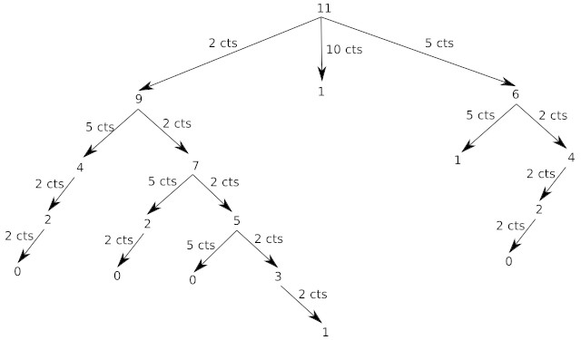

## 1) Suite de Fibonacci

Dans le chapitre sur la récursivité, nous avons étudié la programmation de la suite de Fibonacci :  

```python
def fib(n) :
  if n < 2 :
    return n
  else :
    return fib(n-1) + fib(n-2)
```
			
Pour n=6, il est possible d'illustrer le fonctionnement de ce programme avec le schéma ci-dessous :


Vous pouvez constater que l'on a une structure arborescente (typique dans les algorithmes récursifs), si on additionne toutes les feuilles de cette structure arborescente (fib(1)=1 et fib(0)=0), on retrouve bien 8.

En observant attentivement le schéma ci-dessus, vous avez remarqué que de nombreux calculs sont inutiles, car effectués 2 fois : par exemple, on retrouve le calcul de fib(4) à 2 endroits (en haut à droite et un peu plus bas à gauche) :


On pourrait donc grandement simplifier le calcul en calculant une fois pour toutes fib(4), en "mémorisant" le résultat et en le réutilisant quand nécessaire :

```python
def fib_mem(n):
  mem = [0]*(n+1)  #permet de créer un tableau contenant n+1 zéro
  return fib_mem_c(n,mem)

def fib_mem_c(n,m):
  if n == 0 or n == 1:
    m[n] = n
    return n
  elif m[n] > 0:
    return m[n]
  else:
    m[n]= fib_mem_c(n-1,m) + fib_mem_c(n-2,m)
    return m[n]
```
		
Nous pouvons résumer ce programme comme suit :

- si la valeur de fib(a) n'a jamais  été calculée  (si  la valeur de fib(a) n'est pas encore dans le tableau  *mem*), elle est calculée, puis ensuite elle est stockée dans le tableau *mem*
- si la valeur de fib(a) a déjà été calculée (si  la valeur de fib(a) est déjà dans le tableau  *mem*), nous n'avons aucun calcul à faire, on utilise juste la valeur présente dans le tableau.  

Dans le cas qui nous intéresse, on peut légitimement s'interroger sur le bénéfice de cette opération de "mémorisation", mais pour des valeurs de n beaucoup plus élevées, la question ne se pose même pas, le gain en termes de performance (temps de calcul) est évident. Pour des valeurs n très élevées, dans le cas du programme récursif "classique" (n'utilisant pas la "mémorisation"), on peut même se retrouver avec un programme qui "plante" à cause du trop grand nombre d'appels récursifs.

En réfléchissant un peu sur le cas que nous venons de traiter, nous divisons un problème "complexe" (calcul de fib(6)) en une multitude de petits problèmes faciles à résoudre (fib(0) et fib(1)), puis nous utilisons les résultats obtenus pour les "petits problèmes" pour résoudre le problème "complexe". Cela devrait vous rappeler la méthode "diviser pour régner" !

En fait, ce n'est pas tout à fait cela puisque dans le cas de la méthode "diviser pour régner", la "mémorisation" des calculs n'est pas prévue. La méthode que nous venons d'utiliser se nomme "programmation dynamique".

## 2) Programmation dynamique

### a) introduction

Cette méthode a été introduite au début des années 1950 par Richard Bellman.

Il est important de bien comprendre que "programmation" dans "programmation dynamique", ne doit pas s'entendre comme "utilisation d'un langage de programmation", mais comme synonyme de planification et ordonnancement.

La programmation dynamique s'applique généralement aux problèmes d'optimisation. Nous avons déjà évoqué les problèmes d'optimisation lorsque nous avons étudié les algorithmes gloutons l'année dernière. N'hésitez pas, si nécessaire, à vous replonger dans ce cours.

La programmation dynamique s'applique quand les sous-problèmes se recoupent, c'est-à-dire lorsque les sous-problèmes ont des problèmes communs (dans le cas du calcul de fib(6) on doit calculer 2 fois fib(4). Pour calculer fib(4), on doit calculer 4 fois fib(2)...). Un algorithme de programmation dynamique résout chaque sous-problème une seule fois et mémorise sa réponse dans un tableau, évitant ainsi le recalcule de la solution chaque fois qu'il résout chaque sous-problème.

### b) Approche descendante

#### i) Introduction

Il existe 2 facettes équivalentes de la programmation dynamique :

- la programmation descendante aussi appelée top-down (c'est la méthode que nous avons utilisée ci-dessus pour Fibonacci et que nous allons utiliser immédiatement ci-dessous)
- la programmation ascendante aussi appelée bottom-up (que nous étudierons un peu plus tard)

Poursuivons donc notre étude de l'approche descendante avec le problème du rendu de monnaie :

#### ii) Rendu de monnaie avec l'approche descendante

Nous allons maintenant travailler sur un problème d'optimisation déjà rencontré l'année dernière : le problème du rendu de monnaie.

Petit rappel : vous avez à votre disposition un nombre illimité de pièces de 2 cts, 5 cts, 10 cts, 50 cts et 1 euro (100 cts). Vous devez rendre une certaine somme (rendu de monnaie). Le problème est le suivant : "Quel est le nombre minimum de pièces qui doivent être utilisées pour rendre la monnaie"

La résolution "gloutonne" de ce problème peut être la suivante :

1. on prend la pièce qui a la plus grande valeur (il faut que la valeur de cette pièce soit inférieure ou égale à la somme restant à rendre)
2. on recommence l'opération ci-dessus jusqu'au moment où la somme à rendre est égale à zéro.

Prenons un exemple :

Partons du principe que nous avons 1 euro 77 cts à rendre :

- on utilise une pièce de 1 euro (plus grande valeur de pièce inférieure à 1,77 euro), il reste 77 cts à rendre

- on utilise une pièce de 50 cts (plus grande valeur de pièce inférieure à 0,77 euro), il reste 27 cts à rendre

- on utilise une pièce de 10 cts (plus grande valeur de pièce inférieure à 0,27 euro), il reste 17 cts à rendre

- on utilise une pièce de 10 cts (plus grande valeur de pièce inférieure à 0,17 euro), il reste 7 cts à rendre

- on utilise une pièce de 5 cts (plus grande valeur de pièce inférieure à 0,07 euro), il reste 2 cts à rendre

- on utilise une pièce de 2 cts (plus grande valeur de pièce inférieure à 0,02 euro), il reste 0 cts à rendre

L'algorithme se termine en renvoyant 6 (on a dû rendre 6 pièces)

Que se passe-t-il si nous avons à rendre 11 centimes ?

On utilise une pièce de 10 cts (plus grande valeur de pièce inférieure à 11 centimes), il reste 1 cts à rendre, il n'y a pas de pièce de 1 cts => l'algorithme est "bloqué"

Cet exemple marque une caractéristique importante des algorithmes gloutons : une fois qu'une "décision" a été prise, on ne revient pas "en arrière" (on a choisi la pièce de 10 cts, même si cela nous conduit dans une "impasse").

Rappel : dans certains cas, un algorithme glouton trouvera une solution, mais cette dernière ne sera pas "une des meilleures solutions possible" (une solution optimale).

Évidemment, le fait que notre algorithme glouton ne soit pas "capable" de trouver une solution ne signifie pas qu'il n'existe pas de solution... En effet, il suffit de prendre 1 pièce de 5 cts et 3 pièces de 2 cts pour arriver à 11 cts. Recherchons un algorithme qui nous permettrait de trouver une solution optimale, quelle que soit la situation.

Afin de mettre au point un algorithme, essayons de trouver une relation de récurrence :

Soit X la somme à rendre, on notera Nb(X) le nombre minimum de pièces à rendre. Nous allons nous poser la question suivante : Si je suis capable de rendre X avec Nb(X) pièces, quelle somme suis-je capable de rendre avec 1+Nb(X) pièces ?

Si j'ai à ma disposition la liste de pièces suivante : p<sub>1</sub>, p<sub>2</sub>, p<sub>3</sub>, ..., p<sub>n</sub> et que je suis capable de rendre X cts, je suis donc aussi capable de rendre :

- X−p<sub>1</sub>
- X−p<sub>2</sub>
- X−p<sub>3</sub>
- ...
- X−p<sub>n</sub>

(à condition que p<sub>i</sub> (avec i compris entre 1 et n) soit inférieure ou égale à la somme restant à rendre)

Exemple : si je suis capable de rendre 72 cts et que j'ai à ma disposition des pièces de 2 cts, 5 cts, 10 cts, 50 cts et 1 euro, je peux aussi rendre :

- 72 - 2 = 70 cts
- 72 - 5 = 67 cts
- 72 - 10 = 62 cts
- 72 - 50 = 22 cts

Je ne peux pas utiliser de pièce de 1 euro.

Autrement dit, si Nb(X−p<sub>i</sub>) (avec i compris entre 1 et n) est le nombre minimal de pièces à rendre pour le montant X−p<sub>i</sub>, alors Nb(X)=1+Nb(X−p<sub>i</sub>) est le nombre minimal de pièces à rendre pour un montant X. Nous avons donc la formule de récurrence suivante :

- si X = 0 : Nb(X) = 0
- si X > 0 : Nb(X) = 1 + min(Nb(X−p<sub>i</sub>)) avec 1 ≤ i < n et p<sub>i</sub> ≤ X

Le "min" présent dans la formule de récurrence exprime le fait que le nombre de pièces à rendre pour une somme X−p<sub>i</sub> doit être le plus petit possible.

Étudions le programme suivant :

```python
def rendu_monnaie_rec(P,X):
  if X == 0:
    return 0
  else:
    mini = 1000
  for i in range(len(P)) :
    if P[i] <= X :
      nb = 1 + rendu_monnaie_rec(P,X-P[i])
      if nb < mini:
        mini = nb
  return mini

```

La fonction *rendu_monnaie_rec* prend en paramètre un tableau de pièces (P) et la somme à rendre (X). Elle renvoie le plus petit nombre de pièces possible. On retrouve la relation de récurrence définie juste au-dessus.

Pour être sûr de renvoyer le plus petit nombre de pièces, on attribue dans un premier temps la valeur 1000 à la variable mini (cette valeur 1000 est arbitraire, il faut juste une valeur suffisamment grande : on peut partir du principe que nous ne rencontrerons jamais de cas où il faudra rendre plus de 1000 pièces), ensuite, à chaque appel récursif, on "sauvegarde" le plus petit nombre de pièces dans cette variable mini.

Exemple : si on teste cette fonction en tapant *rendu_monnaie_rec((2,5,10,50,100),11)* dans la  console Python, on obtient 4 (on doit utiliser au minimum 4 pièces pour rendre 11 cts)

Essayons de comprendre plus en détail comment le programme ci-dessous détermine ce résultat.

Étudions cet arbre : 



Plusieurs remarques s'imposent :

- comme vous pouvez le remarquer sur le schéma, tous les cas possibles  sont "traités" (quand un algorithme "traite" tous les cas possibles, on parle souvent de méthode "brute force").

- pour certains cas, on se retrouve dans une "impasse" (cas où on termine par un "1"), dans cette situation, la fonction renvoie "1000" ce qui permet de s'assurer que cette "solution" (qui n'en est pas une) ne sera pas "retenue".

- la profondeur minimum de l'arbre (avec une feuille 0) est de 4, la solution au problème est donc 4 (il existe plusieurs parcours : (5,2,2,2), (2,5,2,2)... qui donne à chaque fois 4)

Si maintenant on tente d'exécuter la même fonction avec une valeur à rendre beaucoup plus grande (par exemple 171 cts), le programme plante ! Pourquoi ? Parce que les appels récursifs sont trop nombreux, on dépasse la capacité de la pile.

La programmation dynamique va nous   permettre de résoudre ce problème.

Comme vous avez peut-être déjà dû le remarquer, même dans le cas simple évoqué ci-dessus (11 cts à rendre), nous faisons plusieurs fois exactement le même calcul. Par exemple on retrouve 2 fois la branche qui part de "4" :


Il va donc être possible d'appliquer la même méthode que pour Fibonacci.

À noter que dans des cas plus "difficiles à traiter" comme 171 cts, on va retrouver de nombreuses fois exactement les mêmes calculs, il est donc potentiellement intéressant d'utiliser la programmation dynamique.

Voici donc notre programme de calcul de rendu de monnaie modifiée :

```python
def rendu_monnaie_mem(P,X):
  mem = [0]*(X+1)
  return rendu_monnaie_mem_c(P,X,mem)

def rendu_monnaie_mem_c(P,X,m):
  if X == 0:
    return 0
  elif m[X] > 0:
    return m[X]
  else:
    mini = 1000
    for i in range(len(P)):
      if P[i] <= X:
        nb = 1 + rendu_monnaie_mem_c(P,X-P[i],m)
        if nb < mini:
          mini = nb
          m[X] = mini
  return mini
```
Ce programme ressemble beaucoup au programme utilisé pour la suite de Fibonacci, il ne devrait donc pas vous poser de problème.
 
Si maintenant nous testons ce programme en tapant dans  la console Python *rendu_monnaie_mem((2,5,10,50,100),171)*, tout fonctionne parfaitement, il suffit d'une fraction de seconde pour obtenir le résultat qui est 7.

### c) L'approche ascendante

#### i) Introduction

Comme nous l'avons déjà vu, l'approche descendante utilise une fonction récursive (en mémorisant les valeurs calculées afin d'éviter d'être obligé de les recalculer plus tard et permettant ainsi d'éviter un grand nombre d'appels récursifs). Dans le cas de l'approche ascendante, nous n'utiliserons pas de fonction récursive (on parle de méthode itérative : on utilisera des boucles à la place des appels récursifs).

#### ii) Fibonacci avec l'approche ascendante

L'idée de base de l'approche ascendante est relativement simple : la relation de récurrence nous montre que pour calculer, par exemple, fib(10), nous avons besoin de calculer fib(9) et fib(8), que pour calculer fib(9) nous avons besoin de calculer fib(8) et fib(7)...

Au lieu de recalculer plusieurs fois la même chose, commençons par calculer fib(2) (puisque par définition fib(0) = 0 et fib(1) = 1), puis calculons fib(3) (nous avons déjà fib(2) et fib(1)), puis calculons fib(4) (nous avons déjà fib(3) et fib(2)), puis calculons fib(5) (nous avons déjà fib(4) et fib(3))... afin, calculons fib(10) (nous avons déjà fib(9) et fib(8)).

Le programme Python permettant de déterminer fib(n) en utilisant la méthode ascendante est relativement simple :

```python
def fib(n):
    tab = [0]*(n+1)
    tab[1] = 1
    for i in range(2, n+1):
        tab[i] = tab[i-1] + tab[i-2]
    return tab[n]
```

Vous pouvez constater que ce programme est simple à comprendre : 
- pour "stocker" les différentes valeurs, on utilise une liste Python que l'on initialise avec n+1 zéro (afin d'avoir un tableau *tab* qui a des indices allant de 0 à n).
- avant le début de la boucle on a le tableau *tab* suivant : *[0,1,0,0,...]*
- la boucle permet de modifier le tableau pour qu'à l'indice *i* on trouve bien la valeur de *fib(i)*

On constate qu'avec cette approche ascendante, comme pour l'approche decendante, le calcul de *fib(i)* n'a été fait qu'une seule fois.

#### iii) Rendu de monnaie avec l'approche ascendante

L'idée est la même que pour Fibonacci, on remplit un tableau *tab*, avec cette fois l'indice *i* qui correspond à la somme à rendre et la valeur située à l'indice *i* qui correspond au nombre minimal de pièces à rendre :

- Pour rendre 0, il faut au minimum 0 pièce : nous aurons donc tab[0] = 0.
- Pour rendre 1, il faut au minimum 1 pièce (1 pièce de 1) : nous aurons donc tab[1] = 1.
- Pour rendre 2, il faut au minimum 1 pièce (1 pièce de 2) : nous aurons donc tab[2] = 1.
- Pour rendre 3, il faut au minimum 2 pièces (1 pièce de 1 et 1 pièce de 2) : nous aurons donc tab[3] = 2.
- ...

Si on désire rendre n, il faudra remplir le tableau jusqu'à l'indice n (tab[n])

Voici une fonction qui permet de remplir le tableau et donc de trouver une solution au rendu de monnaie :

```python
def rendu_monnaie_asc(P,X):
    tab = [1000] * (X+1)
    tab[0] = 0
    for m in range(1, X+1):
        for piece in P:
            if m >= piece:
                tab[m] = min(tab[m], 1 + tab[m-piece])
    if tab[X] != 1000 :
        return tab[X]
```

Quelques remarques sur cette fonction :

- `tab = [1000] * (X+1)` on part du principe qu'il faudra toujours moins de 1000 pièces pour rendre une somme X.
- Nous avons 2 boucles imbriquées : une première boucle qui parcourt le tableau *tab* selon son indice (à chaque indice correspond une somme à rendre : indice 0, on veut rendre 0, indice 1 on veut rendre 1, ...). La deuxième boucle parcourt les pièces disponibles.
- Pour chaque montant, on parcourt toutes les pièces : si la valeur *piece* de la pièce courante est plus petite ou égale au montant courant *m*, *tab[m]* sera égale à  *min(tab[m], 1 + tab[m-piece])*

Prenons un exemple : on désire rendre 6 et nous avons à notre disposition les pièces suivantes : [1, 2, 5, 10, 20, 50, 100]. 

Avant le début de la boucle, nous avons le tableau suivant : *tab = [0, 1000, 1000, 1000, 1000, 1000, 1000]*

Commençons la boucle :

- m = 1 et piece = 1 : *tab[1] = min(tab[1], 1 + tab[0]) = min(1000, 1+0) = 1*
- m = 1 et piece = 2 : on ne fait rien car piece > m, donc *tab[1] = 1*
- m = 2 et piece = 1 : *tab[2] = min(tab[2], 1 + tab[1]) = min(1000, 1+1) = 2*
- m = 2 et piece = 2 : *tab[2] = min(tab[2], 1 + tab[0]) = min(2, 1+0) = 1*
- m = 2 et piece = 5 : on ne fait rien car piece > m, donc *tab[2] = 1*
- m = 3 et piece = 1 : *tab[3] = min(tab[3], 1 + tab[2]) = min(1000, 1+3) = 3*
- m = 3 et piece = 2 : *tab[3] = min(tab[3], 1 + tab[1]) = min(3, 1+1) = 2*
- m = 3 et piece = 5 : on ne fait rien car piece > m, donc *tab[3] = 2*
- m = 4 et piece = 1 : *tab[4] = min(tab[4], 1 + tab[3]) = min(1000, 1+2) = 3*
- m = 4 et piece = 2 : *tab[4] = min(tab[4], 1 + tab[2]) = min(3, 1+1) = 2*
- m = 4 et piece = 5 : on ne fait rien car piece > m, donc *tab[4] = 2*
- m = 5 et piece = 1 : *tab[5] = min(tab[5], 1 + tab[4]) = min(1000, 1+2) = 3*
- m = 5 et piece = 2 : *tab[5] = min(tab[5], 1 + tab[3]) = min(3, 1+2) = 3*
- m = 5 et piece = 5 : *tab[5] = min(tab[5], 1 + tab[0]) = min(3, 1+0) = 1*
- m = 5 et piece = 10 : on ne fait rien car piece > m, donc *tab[5] = 1*
- m = 6 et piece = 1 : *tab[6] = min(tab[6], 1 + tab[5]) = min(1000, 1+1) = 2*
- m = 6 et piece = 2 : *tab[6] = min(tab[6], 1 + tab[4]) = min(2, 1+2) = 2*
- m = 6 et piece = 5 : *tab[6] = min(tab[6], 1 + tab[1]) = min(2, 1+1) = 2*
- m = 6 et piece = 10 : on ne fait rien car piece > m, donc *tab[6] = 2*

La boucle se termine, et la fonction *rendu_monnaie_asc([1, 2, 5, 10, 20, 50, 100],6)* renvoie bien 2

### d) Programmation dynamique et mémoire

Comme nous venons de le voir, la programmation dynamique permet de résoudre des problèmes beaucoup plus rapidement, on améliore donc la complexité en temps d'un algorithme en utilisant la programmation dynamique. Cependant, il y a une contrepartie à cette amélioration : l'utilisation de plus de mémoire. En effet, il nous faudra utiliser plus de mémoire pour stocker les résultats des sous-problèmes. La programmation dynamique permet donc d'échanger de l'efficacité en temps contre de l'utilisation de la mémoire.


