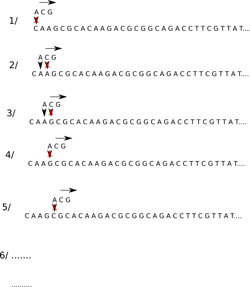

## 1) introduction

Les algorithmes qui permettent de trouver une sous-chaine de caractères dans une chaine de caractères plus grande sont des "grands classiques" de l'algorithmique. On parle aussi de recherche d'un motif (sous-chaine) dans un texte. Voici un exemple :

Soit le texte suivant :

"Les sanglots longs des violons de l'automne blessent mon coeur d'une langueur monotone. Tout suffocant et blême, quand sonne l'heure, je me souviens des jours anciens et je pleure."

Question : le motif "vio" est-il présent dans le texte ci-dessus, si oui, en quelle(s) position(s) ? (la numérotation d'une chaine de caractères commence à zéro et les espaces sont considérés comme des caractères)

Réponse : on trouve le motif "vio" en position 23

Les algorithmes de recherche textuelle sont notamment utilisés en bioinformatique.

## 2) bioinformatique

Comme son nom l'indique, la bioinformatique est issue de la rencontre de l'informatique et de la biologie : la récolte des données en biologie a connu une très forte augmentation ces 30 dernières années. Pour analyser cette grande quantité de données de manière efficace, les scientifiques ont de plus en plus recourt au traitement automatique de l'information, c'est-à-dire à l'informatique.

### a) Analyse de l'ADN

Comme vous le savez déjà, l'information génétique présente dans nos cellules est portée par les molécules d'ADN. Les molécules d'ADN sont, entre autres, composées de bases azotées ayant pour noms : Adénine (représenté par un A), Thymine (représenté par un T), Guanine (représenté par un G) et Cytosine (représenté par un C).

molécule d'ADN


L'information génétique est donc très souvent représentée par de très longues chaines de caractères, composées des caractères A, T, G et C. Exemple : CTATTCAGCAGTC...

Il est souvent nécessaire de détecter la présence de certains enchainements de bases azotées (dans la plupart des cas un triplet de bases azotées code pour 1 acide aminé et la combinaison d'acides aminés forme une protéine). Par exemple, on peut se poser la question suivante : trouve-t-on le triplet ACG dans le brin d'ADN suivant (et si oui, en quelle position ?) :

```
CAAGCGCACAAGACGCGGCAGACCTTCGTTATAGGCGATGATTTCGAACCTACTAGTGGGTCTCTTAGGCCGAGCGGTTCCGAGAGATAGTGAAAGATGGCTGGGCTGTGAAGGGAAGGAGTCGTGAAAGCGCGAACACGAGTGTGCGCAAGCGCAGCGCCTTAGTATGCTCCAGTGTAGAAGCTCCGGCGTCCCGTCTAACCGTACGCTGTCCCCGGTACATGGAGCTAATAGGCTTTACTGCCCAATATGACCCCGCGCCGCGACAAAACAATAACAGTTTGCTGTATGTTCCATGGTGGCCAATCCGTCTCTTTTCGACAGCACGGCCAATTCTCCTAGGAAGCCAGCTCAATTTCAACGAAGTCGGCTGTTGAACAGCGAGGTATGGCGTCGGTGGCTCTATTAGTGGTGAGCGAATTGAAATTCGGTGGCCTTACTTGTACCACAGCGATCCCTTCCCACCATTCTTATGCGTCGTCTGTTACCTGGCTTGGCAT
```
### b) utilisation d'un algorithme naïf

Nous allons commencer par le premier algorithme qui nous vient à l'esprit (on parle souvent d'algorithme "naïf") :




1. on place le motif recherché au même niveau que les 3 premiers caractères de notre chaine, le premier élément du motif ne correspond pas au premier élément de la chaine (A et C), on décale le motif d'un cran vers la droite.

2. le premier élément du motif correspond au premier élément de la chaine (A et A) mais pas le second (C et A), on décale d'un cran vers la droite

3. le premier élément du motif correspond au premier élément de la chaine (A et A) mais pas le second (C et G), on décale d'un cran vers la droite

4. le premier élément du motif ne correspond pas au premier élément de la chaine (A et G), on décale d'un cran vers la droite.

5. le premier élément du motif ne correspond pas au premier élément de la chaine (A et C), on décale d'un cran vers la droite.

6. ... on continue le processus jusqu'au moment où les 3 éléments du motif correspondent avec les 3 éléments de la chaine situés au même niveau.

Cet algorithme naïf peut, selon les situations demander un très grand nombre de comparaisons, ce qui peut entraîner un très long temps de "calcul" avec des chaines très très longues. L'algorithme de Boyer-Moore permet de faire mieux en termes de comparaisons à effectuer

### c) Algoritme de Boyer-Moore

L'algorithme de Boyer-Moore se base sur les caractéristiques suivantes :

- l'algorithme effectue un prétraitement du motif. Cela signifie que l'algorithme "connait" les caractères qui se trouvent dans le motif

- on commence la comparaison motif-chaine par la droite du motif. Par exemple pour le motif CGGCAG, on compare d'abord le G, puis le A, puis C...on parcourt le motif de la droite vers la gauche

- dans la méthode naïve, les décalages du motif vers la droite se faisaient toujours d'un "cran" à la fois. L'intérêt de l'algorithme de Boyer-Moore, c'est qu'il permet, dans certaines situations, d'effectuer un décalage de plusieurs crans en une seule fois.

Examinons un exemple. Soit la chaine suivante :

```
CAATGTCTGCACCAAGACGCCGGCAGGTGCAGACCTTCGTTATAGGCGATGATTTCGAACCTACTAGTGGGTCTCTTAGGCCGAGCGGTTCCGAGAGATAGTGAAAGATGGCTGGGCTGTGAAGGGAAGGAGTCGTGAAAGCGCGAACACGAGTGTGCGCAAGCGCAGCGCCTTAGTATGCTCCAGTGTAGAAGCTCCGGCGTCCCGTCTAACCGTACGCTGTCCCCGGTACATGGAGCTAATAGGCTTTACTGCCCAATATGACCCCGCGCCGCGACAAAACAATAACAGTTT
```
et le motif : CGGCAG


1. on commence la comparaison par la droite, G et T ne correspondent pas. Le prétraitement du motif nous permet de savoir qu'il n'y a pas de T dans ce dernier, on peut décaler le motif de 6 crans vers la droite.

2. G et C ne correspondent pas, en revanche, on trouve 2 C dans le motif. On effectue un décalage du motif de 2 crans vers la droite afin de faire correspondre le C de la chaine (encadré sur le schéma) et le C le plus à droite dans le motif.

3. G et A ne correspondent pas, il existe un A dans le motif, on effectue un décalage d'un cran.

4. G et A ne correspondent pas, il existe un A dans le motif, on effectue un décalage d'un cran.

5. G et G correspondent, A et A correspondent, mais C et A ne correspondent pas. À gauche du C, il n'y a plus de A, on peut donc effectuer un décalage de 4 crans.

6. G et C ne correspondent pas, on effectue un décalage de deux crans pour faire correspondre les C.

7. G et G correspondent, A et C ne correspondent pas, on effectue un décalage d'un cran

8. G et G correspondent, A et G ne correspondent pas, on effectue un décalage de 2 crans (faire correspondre les G)

9. G et A ne correspondent pas, on effectue un décalage d'un cran

10. toutes les lettres correspondent, on a trouvé le motif dans la chaine.

On peut remarquer que l'on a bien, en fonction des cas, effectué plusieurs décalages en un coup, ce qui, au bout du compte, permet de faire moins de comparaison que l'algorithme naïf. On peut aussi remarquer que plus le motif est grand et plus l'algorithme de Boyer-Moore sera efficace.