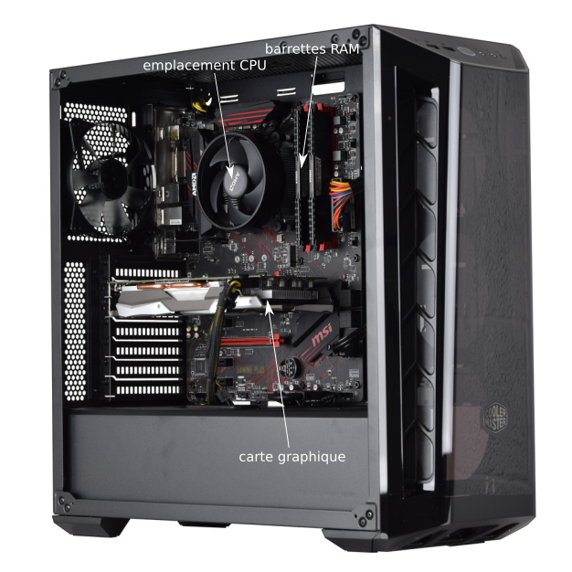
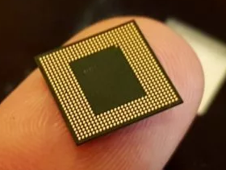

Voici l'intérieur d'un PC :

Principalement on remarque la carte mère qui accueille tous les éléments fondamentaux au bon fonctionnement d'un ordinateur : microprocesseur (CPU) (caché sous un système de refroidissement), barrettes de mémoire RAM, carte graphique (qui permet de gérer l'affichage). On trouve aussi sur la carte mère les puces qui gèrent les interfaces réseau (Wifi et Ethernet) et bien d'autres choses...

On entend souvent dire que les téléphones portables (smartphones) sont de véritable ordinateur, ce qui est vrai. On peut s'interroger sur la taille d'un smartphone par rapport à la taille d'un PC (la carte mère d'un PC mesure environ 25 cm sur 30 cm, soit bien plus qu'un smartphone). Pourtant on doit obligatoirement trouver dans un smartphone les mêmes composants que dans un PC : CPU, RAM, carte graphique et interfaces réseau (Wifi et Bluetooth dans le cas d'un smartphone) !

La solution ? Placer tous ces composants dans une puce unique d'une centaine de mm2 :

Ces puces accueillant CPU, RAM, circuit graphique (GPU) (équivalent à la carte graphique dans un PC) et circuits radio (Wifi et Bluetooth), sont souvent appelées "système sur puce", "system on a chip" en anglais (abréviation "SoC").

Voici le schéma de circuit d'un SoC :

Vous pouvez remarquer que l'on retrouve bien sur ce schéma un CPU et de la mémoire (on a différents types de mémoires, mais ce sujet ne sera pas abordé ici).

Outre leur taille, les Soc ont d'autres avantages par rapport aux systèmes "classiques" (carte mère + CPU + carte graphique...) :

- les SoC sont conçus pour consommer beaucoup moins d'énergie qu'un système classique (à puissance de calcul équivalente)

- cette consommation réduite permet dans la plupart des cas de s'affranchir de la présence de système de refroidissement actif comme les ventilateurs (voir l'image du PC ci-dessus). Un système équipé de SoC est donc silencieux

- vu les distances réduites entre, par exemple, le CPU et la mémoire, les données circulent beaucoup plus vites, ce qui permet d'améliorer les performances. En effet, dans les systèmes "classiques" les bus (si nécessaire revoir le cours de première : Modèle d'architecture de von Neumann à propos des bus) sont souvent des "goulots d'étranglement" en termes de performances à cause de la vitesse de circulation des données.

On trouve aussi ce système de SoC sur des nano-ordinateurs comme le Raspberry Pi :

Dans sa version 5, le Raspberry Pi est équipé du SoC BCM2712 de la société Broadcom

Voici les noms des SoC utilisés par quelques produits succès :

- Apple iPhone 15 : SoC A16 Bionic

- Samsung Galaxy S21 : SoC Exynos 2100

- Nintendo Switch : SoC Nvidia Tegra

- Apple MacBook (ordinateur portable) : SoC M3
 
Rien qu'à l'évocation des noms cités ci-dessus, vous vous doutez bien que le marché des SoC a aujourd'hui un poids économique très important. On commence même à trouver des ordinateurs portables équipés de SoC à la place des cartes mères "classiques". Les SoC commencent doucement, mais sûrement à rattraper les systèmes "classiques" en termes de puissance (pour les systèmes "classiques" d'entrées et de moyennes gammes, mais aussi haut de gamme avec les nouveaux MacBook d'Apple équipé de Soc M3).

