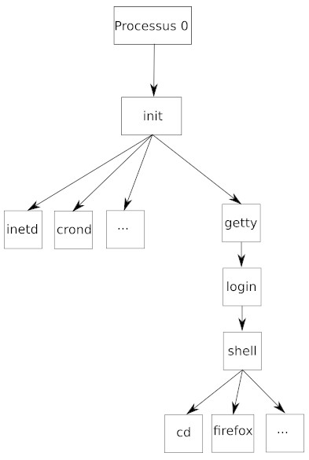
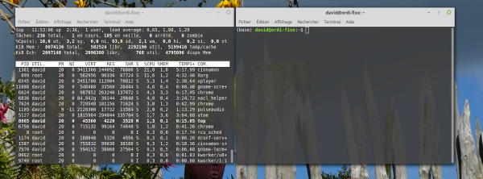

### activité 19.1

En vous basant sur le schéma ci-dessous, donnez le PID (en partant du principe qu'il est créé juste après init) et le PPID du processus "getty".

### activité 19.2

Après avoir ouvert un terminal, tapez la commande suivante : ps -aef

Vous devriez avoir plusieurs informations sur les processus en cours sur votre ordinateur, notamment les PID et les PPID de ces processus. Prenez une capture d'écran  du  terminal.

### activité 19.3

Ouvrez 2 terminaux, placez-les l'un à côté de l'autre. Dans l'un des 2 terminaux, exécutez la commande top (pour en savoir plus sur la l'utilisation de la commande top, consultez la page [http://debian-facile.org/doc:systeme:top](http://debian-facile.org/doc:systeme:top)
)

Vous devriez obtenir quelque chose qui ressemble à ceci :

Fermez votre navigateur Web et observez le résultat dans le terminal exécutant top.

Ouvrez votre navigateur Web et observez le résultat dans le terminal exécutant top. Selon le navigateur que vous utilisez, il se peut que le fonctionnement du navigateur soit associé à plusieurs processus.

Notez le PID des processus liés au fonctionnement du navigateur.

Utilisez la commande kill afin de supprimer le (ou les) processus lié(s) au fonctionnement du navigateur. Que se passe-t-il ?

### activité 19.4

Imaginez une situation pouvant entrainer un interblocage.

