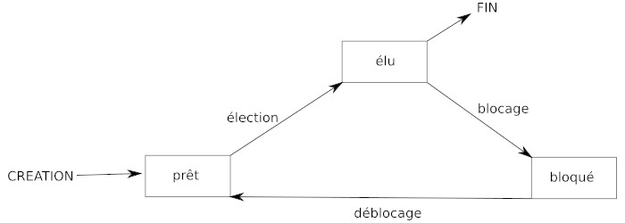

### Ce qu’il faut savoir

- on appelle processus un programme en cours d'exécution.

- 2 processus P1 et P2 peuvent être amenés à partager une même ressource R
(fichiers…)

- tous les systèmes d'exploitation modernes (Linux, Windows, macOS, Android,
iOS...) sont capables de gérer l'exécution de plusieurs processus en même temps.
Mais pour être précis, cela n'est pas en véritable "en même temps", mais plutôt un
"chacun son tour". Pour gérer ce "chacun son tour", les systèmes d'exploitation
attribuent des "états" au processus.

- Les processus peuvent se trouver dans 3 états différents :
	- prêt (prêt à être exécuté)
	- élu (en cours d’exécution)
	- bloqué (attente d’une ressource)
	

- le système d’exploitation gère l'ordonnancement des processus (priorité d'exécution...)

- chaque processus est créé par un autre processus (sauf le tout premier qui est créé
au démarrage du système d’exploitation). Si un processus P crée un processus P’,
on dira que P est le père de P’.

- chaque processus possède un identifiant : le PID (Process Identification)

- chaque processus possède aussi un PPID (Parent Process Identification), le PPID
permet de connaître le processus parent d'un processus

- dans certaines conditions, 2 processus (ou plus) peuvent se trouver en situation
d’interblocage (deadlock en anglais)

### Ce qu’il faut savoir faire

vous devez savoir utiliser les commandes Unix qui permettent de :

- visualiser les processus en cours (ps -aef, top…)
- supprimer un processus (kill)