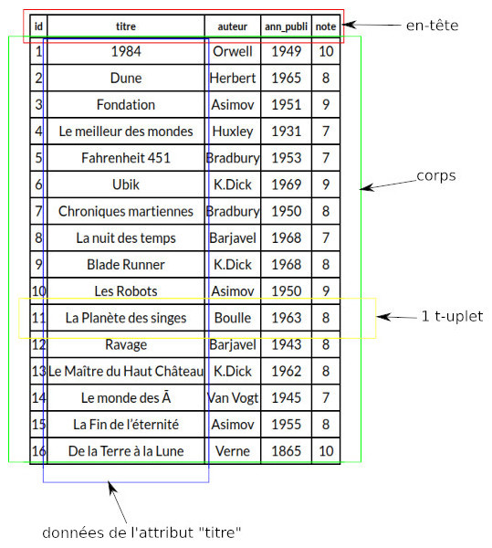

## 1) introduction
Il existe différents types de bases de données, par exemple, les bases de données hiérarchiques, les bases de données objet, les bases de données nosql ou bien encore les bases de données relationnelles. Les bases de données relationnelles sont le plus utilisées au monde, c'est ce type de base de données que nous allons étudier.

Les bases de données relationnelles ont été mises au point en 1970 par Edgar Franck Codd, informaticien britannique (1923-2003). Ces bases de données sont basées sur la théorie mathématique des ensembles.

## 2) relation
La notion de relation est au coeur des bases de données relationnelles. Une relation peut être vue comme un tableau à 2 dimensions, composé d'un en-tête et d'un corps. Le corps est lui-même composé de t-uplets (lignes) et d'attributs (colonnes). L'en-tête contient les intitulés des attributs, le corps contient les données proprement dites. À noter que l'on emploie aussi le terme "table" à la place de "relation".

Voici un exemple de relation :

Le t-uplet encadré en jaune sur le schéma ci-dessus contient les éléments suivant : 11, La Planète des singes, Boulle, 1963 et 8. L'attribut "titre" est composé des éléments suivants : 1984, Dune, Fondation, Le meilleur des mondes, Fahrenheit 451, Ubik, Chroniques martiennes, La nuit des temps, Blade Runner, Les Robots, La Planète des singes, Ravage, Le Maître du Haut Château, Le monde des Ā, La Fin de l’éternité et De la Terre à la Lune.

## 3) domaine
Pour chaque attribut d'une relation, il est nécessaire de définir un domaine : Le domaine d'un attribut donné correspond à un ensemble fini ou infini de valeurs admissibles. Par exemple, le domaine de l'attribut "id" correspond à l'ensemble des entiers (noté INT) : la colonne "id" devra obligatoirement contenir des entiers. Autre exemple, le domaine de l'attribut "titre" correspond à l'ensemble des chaînes de caractères (noté TEXT). Dernier exemple, le domaine de l'attribut "note" correspond à l'ensemble des entiers positifs.

Au moment de la création d'une relation, il est nécessaire de renseigner le domaine de chaque attribut. Le SGBD s'assure qu'un élément ajouté à une relation respecte bien le domaine de l'attribut correspondant : si par exemple vous essayez d'ajouter une note non entière (par exemple 8.5), le SGBD signalera cette erreur et n'autorisera pas l'écriture de cette nouvelle donnée.

## 4) clé primaire
Autre contrainte très importante dans les bases de données relationnelles, une relation ne peut pas contenir 2 t-uplets identiques. Par exemple, la situation ci-dessous n'est pas autorisée (ici aussi c'est le SGBD qui veille au grain) :

|id|titre|auteur|ann_publi|note|
|--- |--- |--- |--- |--- |
|1|1984|Orwell|1949|10|
|2|Dune|Herbert|1965|8|
|2|Dune|Herbert|1965|8|
|3|Fondation|Asimov|1951|9|

Afin d'être sûr de respecter cette contrainte des t-uplets identiques, on définit la notion de "clé primaire".

Une clé primaire est un attribut dont la valeur permet d'identifier de manière unique un t-uplet de la relation. Autrement dit, si un attribut est considéré comme clé primaire, on ne doit pas trouver dans toute la relation 2 fois la même valeur pour cet attribut.

Si on se réfère à l'exemple de la relation ci-dessous :

|id|titre|auteur|ann_publi|note|
|--- |--- |--- |--- |--- |
|1|1984|Orwell|1949|10|
|2|Dune|Herbert|1965|8|
|3|Fondation|Asimov|1951|9|
|4|Le meilleur des mondes|Huxley|1931|7|
|5|Fahrenheit 451|Bradbury|1953|7|
|6|Ubik|K.Dick|1969|9|
|7|Chroniques martiennes|Bradbury|1950|8|
|8|La nuit des temps|Barjavel|1968|7|
|9|Blade Runner|K.Dick|1968|8|
|10|Les Robots|Asimov|1950|9|
|11|La Planète des singes|Boulle|1963|8|
|12|Ravage|Barjavel|1943|8|
|13|Le Maître du Haut Château|K.Dick|1962|8|
|14|Le monde des Ā|Van Vogt|1945|7|
|15|La Fin de l’éternité|Asimov|1955|8|
|16|De la Terre à la Lune|Verne|1865|10|

L'attribut "note" peut-il jouer le rôle de clé primaire ? Non, car il est possible de trouver 2 fois la même note.

L'attribut "ann_publi" peut-il jouer le rôle de clé primaire ? Non, car il est possible de trouver 2 fois la même année.

L'attribut "auteur" peut-il jouer le rôle de clé primaire ? Non, car il est possible de trouver 2 fois le même auteur.

L'attribut "titre" peut-il jouer le rôle de clé primaire ? A priori oui, car l'attribut "titre" ne comporte pas 2 fois le même titre de roman. Mais, ce n'est pas forcément une bonne idée, car il est tout à fait possible d'avoir un même titre pour 2 romans différents. Par exemple, en 2013, l’Américaine Jill McCorkle et l’Anglaise Kate Atkison publiaient avec seulement six jours d’écart un livre intitulé "Life After Life" !

Il nous reste donc l'attribut "id". En fait, l'attribut "id" ("id" comme "identifiant") a été placé là pour jouer le rôle de clé primaire. En effet, à chaque fois qu'un roman est ajouté à la relation, son "id" correspond à l'incrémentation de l'id (id du nouveau=id de l'ancien+1) du roman précédemment ajouté. Il est donc impossible d'avoir deux romans avec le même id. Ajouter un attribut "id" afin qu'il puisse jouer le rôle de clé primaire est une pratique courante (mais non obligatoire) dans les bases de données relationnelles. Dans le cas précis qui nous intéresse, il aurait été possible de ne pas utiliser d'attribut "id", car chaque livre édité possède un numéro qui lui est propre : l'ISBN, cet ISBN aurait donc pu jouer le rôle de clé primaire.

À noter qu'en toute rigueur, une clé primaire peut être constituée de plusieurs attributs, par exemple le couple "auteur" + "titre" pourrait jouer le rôle de clé primaire (à moins qu'un auteur écrive 2 romans différents, mais portant tous les deux le même titre), mais nous n'étudierons pas cet aspect des choses ici.

## 5) clé étrangère

### a) duplication des données
Nous désirons maintenant un peu enrichir la relation LIVRES en ajoutant des informations supplémentaires sur les auteurs, nous obtenons alors :

|id|titre|nom_auteur|prenom_auteur|date_nai_auteur|langue_ecriture_auteur|ann_publi|note|
|--- |--- |--- |--- |--- |--- |--- |--- |
|1|1984|Orwell|George|1903|anglais|1949|10|
|2|Dune|Herbert|Frank|1920|anglais|1965|8|
|3|Fondation|Asimov|Isaac|1920|anglais|1951|9|
|4|Le meilleur des mondes|Huxley|Aldous|1894|anglais|1931|7|
|5|Fahrenheit 451|Bradbury|Ray|1920|anglais|1953|7|
|6|Ubik|K.Dick|Philip|1928|anglais|1969|9|
|7|Chroniques martiennes|Bradbury|Ray|1920|anglais|1950|8|
|8|La nuit des temps|Barjavel|René|1911|français|1968|7|
|9|Blade Runner|K.Dick|Philip|1928|anglais|1968|8|
|10|Les Robots|Asimov|Isaac|1920|anglais|1950|9|
|11|La Planète des singes|Boulle|Pierre|1912|français|1963|8|
|12|Ravage|Barjavel|René|1911|français|1943|8|
|13|Le Maître du Haut Château|K.Dick|Philip|1928|anglais|1962|8|
|14|Le monde des Ā|Van Vogt|Alfred Elton|1912|anglais|1945|7|
|15|La Fin de l’éternité|Asimov|Isaac|1920|anglais|1955|8|
|16|De la Terre à la Lune|Verne|Jules|1828|français|1865|10|

Nous avons ajouté 3 attributs ("prenom_auteur", "date_nai_auteur" et "langue_ecriture_auteur"). Nous avons aussi renommé l'attribut "auteur" en "nom_auteur".

Comme vous l'avez peut-être remarqué, il y a pas mal d'informations dupliquées, par exemple, on retrouve 3 fois "K.Dick Philip 1928 anglais", même chose pour "Asimov Isaac 1920 anglais"...Cette duplication est-elle indispensable ? Non ! Est-elle souhaitable ? Non plus ! En effet, dans une base de données, on évite autant que possible de dupliquer l'information (sauf à des fins de sauvegarde, mais ici c'est toute autre chose). Si nous dupliquons autant de données inutilement c'est que notre structure ne doit pas être la bonne ! Mais alors, comment faire pour avoir aussi des informations sur les auteurs des livres ?

### b) notion de clé étrangère
La solution est relativement simple : travailler avec 2 relations au lieu d'une seule et créer un "lien" entre ces 2 relations :

Table: Relation AUTEURS

|id|nom|prenom|ann_naissance|langue_ecriture|
|--- |--- |--- |--- |--- |
|1|Orwell|George|1903|anglais|
|2|Herbert|Frank|1920|anglais|
|3|Asimov|Isaac|1920|anglais|
|4|Huxley|Aldous|1894|anglais|
|5|Bradbury|Ray|1920|anglais|
|6|K.Dick|Philip|1928|anglais|
|7|Barjavel|René|1911|français|
|8|Boulle|Pierre|1912|français|
|9|Van Vogt|Alfred Elton|1912|anglais|
|10|Verne|Jules|1828|français|

Table: Relation LIVRES

|id|titre|id_auteur|ann_publi|note|
|--- |--- |--- |--- |--- |
|1|1984|1|1949|10|
|2|Dune|2|1965|8|
|3|Fondation|3|1951|9|
|4|Le meilleur des mondes|4|1931|7|
|5|Fahrenheit 451|5|1953|7|
|6|Ubik|6|1969|9|
|7|Chroniques martiennes|5|1950|8|
|8|La nuit des temps|7|1968|7|
|9|Blade Runner|6|1968|8|
|10|Les Robots|3|1950|9|
|11|La Planète des singes|8|1963|8|
|12|Ravage|7|1943|8|
|13|Le Maître du Haut Château|6|1962|8|
|14|Le monde des Ā|9|1945|7|
|15|La Fin de l’éternité|3|1955|8|
|16|De la Terre à la Lune|10|1865|10|

Nous avons créé une relation AUTEURS et nous avons modifié la relation LIVRES : nous avons remplacé l'attribut "auteur" par un attribut "id_auteur".

Comme vous l'avez sans doute remarqué, l'attribut "id_auteur" de la relation LIVRES permet de créer un lien avec la relation AUTEURS. "id_auteur" correspond à l'attribut "id" de la relation AUTEURS. L'introduction d'une relation AUTEURS et la mise en place de liens entre cette relation et la relation LIVRES permettent d'éviter la redondance d'informations.

Pour établir un lien entre 2 relations RA et RB, on ajoute à RA un attribut x qui prendra les valeurs de la clé primaire de RB. Cet attribut x est appelé clé étrangère (l'attribut correspond à la clé primaire d'une autre table, d'où le nom).

Dans l'exemple ci-dessus, l'attribut "id_auteur" de la relation LIVRES permet bien d'établir un lien entre la relation LIVRES et la relation AUTEURS, "id_auteur" correspond bien à la clé primaire de la relation AUTEURS, conclusion : "id_auteur" est une clé étrangère.

Pour préserver l'intégrité d'une base de données, il est important de bien vérifier que toutes les valeurs de la clé étrangère correspondent bien à des valeurs présentes dans la clé primaire (nous aurions un problème d'intégrité de la base de données si une valeur de l'attribut "id_auteur" de la relation LIVRES ne correspondait à aucune valeur de la clé primaire de la relation AUTEURS). Certains SGBD ne vérifient pas cette contrainte (ne renvoient aucune erreur en cas de problème), ce qui peut provoquer des comportements erratiques.

## 6) schéma relationnel 

Dernière définition, on appelle schéma relationnel l'ensemble des relations présentes dans une base de données. Quand on vous demande le schéma relationnel d'une base de données, il est nécessaire de fournir les informations suivantes :

- Les noms des différentes relations
- pour chaque relation, la liste des attributs avec leur domaine respectif
- pour chaque relation, la clé primaire et éventuellement les clés étrangères

Voici un exemple pour les relations LIVRES et AUTEURS :

AUTEURS(<u>id</u> : INT, nom : TEXT, prenom : TEXT, ann_naissance : INT, langue_ecriture : TEXT)

LIVRES(<u>id</u>  : INT, titre : TEXT, #id_auteur : INT, ann_publi : INT, note : INT)

Les attributs soulignés sont des clés primaires, le # signifie que l'on a une clé étrangère.