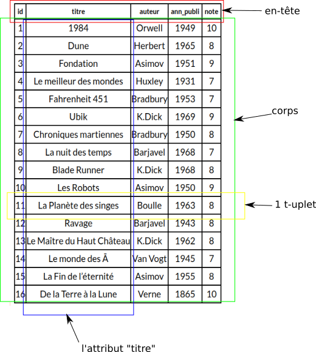

### Ce qu’il faut savoir

- Il existe différents types de bases de données, par exemple, les bases de données
  hiérarchiques, les bases de données objet, les bases de données nosql ou bien
  encore les bases de données relationnelles

- La notion de relation est au coeur des bases de données relationnelles. Une relation peut être vue comme un tableau à 2 dimensions, composé d'un en-tête et d'un corps. Le corps est lui-même composé de t-uplets (lignes) et d'attributs (colonnes). L'en-tête contient les intitulés des attributs, le corps contient les données proprement dites.

- Pour chaque attribut d'une relation, il est nécessaire de définir un domaine : Le domaine d'un attribut donné correspond à un ensemble fini ou infini de valeurs
  admissibles.

- Une clé primaire est un attribut dont la valeur permet d'identifier de manière unique un t-uplet de la relation. Autrement dit, si un attribut est considéré comme clé primaire, on ne doit pas trouver dans toute la relation 2 fois la même valeur pour cet attribut.

- Une clé étrangère est un attribut d'une relation A devant apparaître comme clé
  primaire dans une relation B afin d’établir un lien entre A et B (une clé étrangère d'un tuple référence une clé primaire d'un autre tuple). La notion de clé étrangère permet de préserver l'intégrité d'une base de données lorsque l’on travail sur plusieurs relations en même temps

- on appelle schéma relationnel l'ensemble des relations présentes
  dans une base de données. Dans le schéma relationnel on doit
  trouver :
  
  - Les noms des différentes relations
  
  - pour chaque relation, la liste des attributs avec leur domaine
    respectif
  
  - pour chaque relation, la clé primaire (soulignée) et
    éventuellement les clés étrangères (précédées d’un #)
  
exemple :
  
AUTEURS(<u>id</u> : INT, nom : TEXT, prenom : TEXT, ann_naissance : INT, langue_ecriture : TEXT)
  
LIVRES(<u>id</u> : INT, titre : TEXT, #id_auteur : INT, ann_publi : INT, note : INT)

