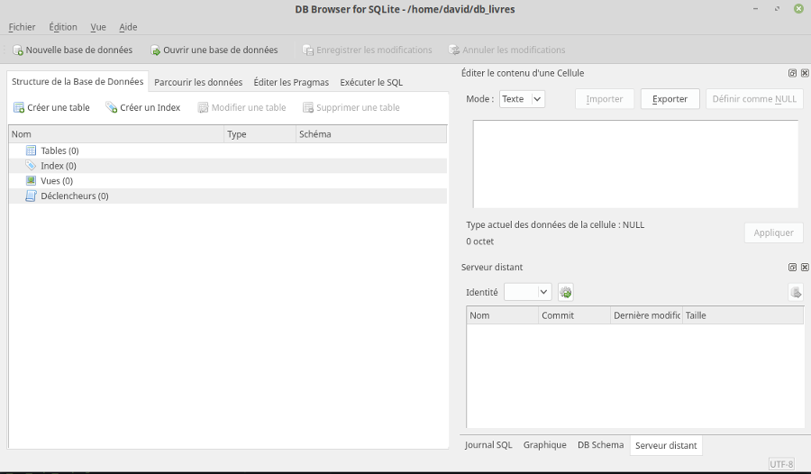
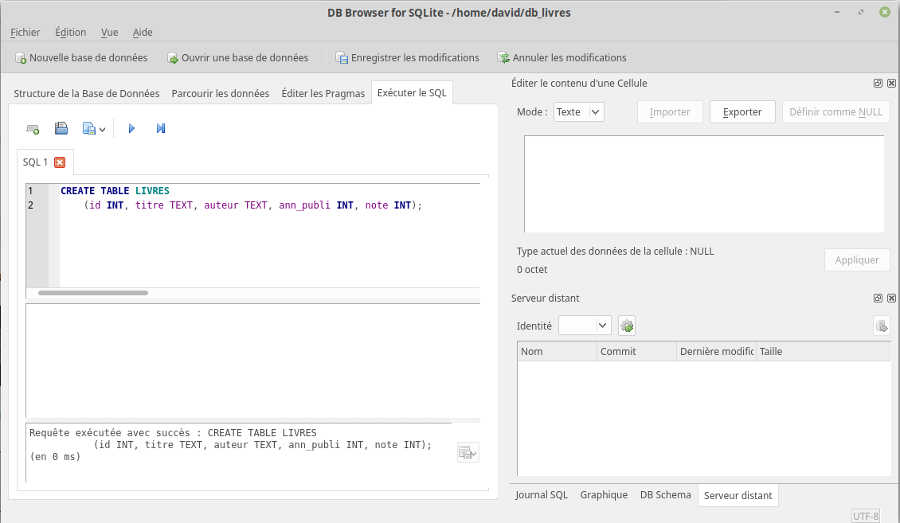

Pour créer une base de données et effectuer des requêtes sur cette dernière, nous allons utiliser le logiciel "DB Browser for SQLite" : [https://sqlitebrowser.org/](https://sqlitebrowser.org/)

### activité 3.1

Après avoir lancé le logiciel "DB Browser for SQLite", vous devriez obtenir ceci :


Cliquez sur Nouvelle base de données. Après avoir choisi un nom pour votre base de données (par exemple "db_livres.db"), vous devriez avoir la fenêtre suivante :


Cliquez alors sur Annuler

Notre base de données a été créée :



mais pour l'instant elle ne contient aucune table (aucune relation), pour créer une table, cliquez sur l'onglet "Exécuter le SQL". On obtient alors :


Copiez-collez le texte ci-dessous dans la fenêtre "SQL 1"

```sql
CREATE TABLE LIVRES
	(id INT, titre TEXT, auteur TEXT, ann_publi INT, note INT, PRIMARY KEY (id));
```

Cliquez ensuite sur le petit triangle situé au-dessus de la fenêtre SQL 1 (ou appuyez sur F5), vous devriez avoir ceci :



Comme indiqué dans la fenêtre, "Requête exécutée avec succès" !

Vous venez de créer votre première table.

Revenons sur cette première requête :

Le *CREATE TABLE LIVRES* ne devrait pas vous poser de problème : nous créons une nouvelle table nommée "LIVRES".

La suite est à peine plus complexe :

nous créons ensuite les attributs :

- id
- titre
- auteur
- ann_publi
- note

Nous avons pour chaque attribut précisé son domaine : id : entier (INT), titre : chaîne de caractères (TEXT), auteur : chaîne de caractères, ann_publi : entier et note : entier

L'attribut "id" va jouer ici le rôle de clé primaire, nous avons donc précisé dans notre requête que id jouera le rôle de clé primaire (PRIMARY KEY (id)). Notre système de gestion de base de données nous avertira si l'on tente d'attribuer 2 fois la même valeur à l'attribut"id".

### activité 3.2

Nous allons maintenant ajouter des données à notre table.

Toujours dans l'onglet "Exécuter le SQL", après avoir effacé la fenêtre SQL 1, copiez-collez dans cette même fenêtre la requête ci-dessous :

```sql
INSERT INTO LIVRES
	(id,titre,auteur,ann_publi,note)
	VALUES
	(1,'1984','Orwell',1949,10),
	(2,'Dune','Herbert',1965,8),
	(3,'Fondation','Asimov',1951,9),
	(4,'Le meilleur des mondes','Huxley',1931,7),
	(5,'Fahrenheit 451','Bradbury',1953,7),
	(6,'Ubik','K.Dick',1969,9),
	(7,'Chroniques martiennes','Bradbury',1950,8),
	(8,'La nuit des temps','Barjavel',1968,7),
	(9,'Blade Runner','K.Dick',1968,8),
	(10,'Les Robots','Asimov',1950,9),
	(11,'La Planète des singes','Boulle',1963,8),
	(12,'Ravage','Barjavel',1943,8),
	(13,'Le Maître du Haut Château','K.Dick',1962,8),
	(14,'Le monde des Ā','Van Vogt',1945,7),
	(15,'La Fin de l’éternité','Asimov',1955,8),
	(16,'De la Terre à la Lune','Verne',1865,10);
```

Un message devrait vous préciser que votre requête a été exécutée avec succès :


La table LIVRES contient bien les données souhaitées (onglet "Parcourir les données") :


### activité 3.3

Saisissez la requête SQL suivante :

```sql
SELECT id, titre, auteur, ann_publi, note
FROM LIVRES
```

puis appuyez sur le triangle (ou la touche F5)

Après un temps plus ou moins long, vous devriez voir s'afficher ceci :


### activité 3.4

Effectuez une requête qui permettra d'obtenir le titre et l'auteur de tous les livres présents dans la table LIVRES.

### activité 3.5

Saisissez et testez la requête SQL suivante :

```sql
SELECT titre, ann_publi
FROM LIVRES
WHERE auteur='Asimov'
```

Vérifiez que vous obtenez bien uniquement les livres écrits par Isaac Asimov.

### activité 3.6

Écrivez et testez une requête permettant d'obtenir uniquement les titres des livres écrits par Philip K.Dick.

### activité 3.7

Saisissez et testez la requête SQL suivante :

```sql
SELECT titre, ann_publi
FROM LIVRES
WHERE auteur='Asimov' AND ann_publi>1953
```

Vérifiez que nous obtenons bien le livre écrit par Asimov publié après 1953.

### activité 3.8

Écrivez une requête permettant d'obtenir les titres des livres publiés après 1945 qui ont une note supérieure ou égale à 9.

### activité 3.9

Écrivez une requête SQL permettant d'obtenir les livres de K.Dick classés du plus ancien au plus récent.

### activité 3.10

Créez une nouvelle base de données que vous nommerez par exemple db_livres_auteurs.db, puis créez une table AUTEURS à l'aide de la requête SQL suivante :

```sql
CREATE TABLE AUTEURS
(id INT, nom TEXT, prenom TEXT, ann_naissance INT, langue_ecriture TEXT, PRIMARY KEY (id));
```

Créez ensuite une deuxième table (LIVRES) :

```sql
CREATE TABLE LIVRES
(id INT, titre TEXT, id_auteur INT, ann_publi INT, note INT, PRIMARY KEY (id), FOREIGN KEY (id_auteur) REFERENCES AUTEURS(id));
```

Comme vous l'avez sans doute remarqué nous avons précisé dans notre requête que l'attribut "id_auteur" jouera le rôle de clé étrangère : liaison entre "id_auteur" de la table  LIVRES et "id" de la table AUTEURS (FOREIGN KEY (id_auteur) REFERENCES AUTEURS(id)).

Ajoutez des données à la table AUTEURS à l'aide de la requête SQL suivante :

```sql
INSERT INTO AUTEURS
(id,nom,prenom,ann_naissance,langue_ecriture)
VALUES
(1,'Orwell','George',1903,'anglais'),
(2,'Herbert','Frank',1920,'anglais'),
(3,'Asimov','Isaac',1920,'anglais'),
(4,'Huxley','Aldous',1894,'anglais'),
(5,'Bradbury','Ray',1920,'anglais'),
(6,'K.Dick','Philip',1928,'anglais'),
(7,'Barjavel','René',1911,'français'),
(8,'Boulle','Pierre',1912,'français'),
(9,'Van Vogt','Alfred Elton',1912,'anglais'),
(10,'Verne','Jules',1828,'français');
```

Ajoutez des données à la table LIVRES à l'aide de la requête SQL suivante :

```sql
INSERT INTO LIVRES
(id,titre,id_auteur,ann_publi,note)
VALUES
(1,'1984',1,1949,10),
(2,'Dune',2,1965,8),
(3,'Fondation',3,1951,9),
(4,'Le meilleur des mondes',4,1931,7),
(5,'Fahrenheit 451',5,1953,7),
(6,'Ubik',6,1969,9),
(7,'Chroniques martiennes',5,1950,8),
(8,'La nuit des temps',7,1968,7),
(9,'Blade Runner',6,1968,8),
(10,'Les Robots',3,1950,9),
(11,'La Planète des singes',8,1963,8),
(12,'Ravage',7,1943,8),
(13,'Le Maître du Haut Château',6,1962,8),
(14,'Le monde des Ā',9,1945,7),
(15,'La Fin de l’éternité',3,1955,8),
(16,'De la Terre à la Lune',10,1865,10);
```

### activité 3.11

Saisissez et testez la requête SQL suivante :

```sql
SELECT titre,nom, prenom
FROM LIVRES
INNER JOIN AUTEURS ON LIVRES.id_auteur = AUTEURS.id
```

Rappel : attention, si un même nom d'attribut est présent dans les 2 tables (par exemple ici l'attribut id), il est nécessaire d'ajouter le nom de la table devant afin de pouvoir les distinguer (AUTEURS.id et LIVRES.id).

### activité 3.12

Écrivez une requête SQL permettant d'obtenir les titres des livres publiés après 1945 ainsi que le nom de leurs auteurs.

### activité 3.13

Nous allons repartir avec une nouvelle base de données. Créez une nouvelle base de données nommée "db_livres.db".

Créez ensuite une table LIVRES à l'aide de la requête suivante :

```sql
CREATE TABLE LIVRES
(id INT, titre TEXT, auteur TEXT, ann_publi INT, note INT, PRIMARY KEY (id));
```

Ajoutez des données à la table LIVRES à l'aide de la requête SQL suivante :

```sql
INSERT INTO LIVRES
(id,titre,auteur,ann_publi,note)
VALUES
(1,'1984','Orwell',1949,10),
(2,'Dune','Herbert',1965,8),
(3,'Fondation','Asimov',1951,9),
(4,'Le meilleur des mondes','Huxley',1931,7),
(5,'Fahrenheit 451','Bradbury',1953,7),
(6,'Ubik','K.Dick',1969,9),
(7,'Chroniques martiennes','Bradbury',1950,8),
(8,'La nuit des temps','Barjavel',1968,7),
(9,'Blade Runner','K.Dick',1968,8),
(10,'Les Robots','Asimov',1950,9),
(11,'La Planète des singes','Boulle',1963,8),
(12,'Ravage','Barjavel',1943,8),
(13,'Le Maître du Haut Château','K.Dick',1962,8),
(14,'Le monde des Ā','Van Vogt',1945,7),
(15,'La Fin de l’éternité','Asimov',1955,8),
(16,'De la Terre à la Lune','Verne',1865,10);
```

### activité 3.14

 À l'aide d'une requête SQL, ajoutez à la table LIVRES le livre suivant :

- id : 17
- titre : "2001 : L'Odyssée de l'espace"
- auteur : "Clarcke"
- année de publication : 1968
- note : 7

### activité 3.15

Écrivez une requête permettant d'attribuer la note de 10 à tous les livres écrits par Asimov publiés après 1950. Testez cette requête.

### activité 3.16

Écrivez une requête permettant de supprimer les livres publiés avant 1945. Testez cette requête.

