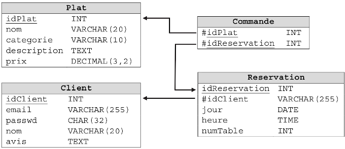

### exercice 3.1

Un ski-club utilise une base de données constituée de 2 tables :

- une table ADHERENTS
- une table STATIONS 

Dans la table ADHERENTS  on trouve un attribut “ref_station” qui permet de connaître les stations de ski préférées des adhérents.

Table ADHERENTS

| num_licence | nom    | prenom  | annee_naissance | ref_station |
| ----------- | ------ | ------- | --------------- | ----------- |
| 12558       | Doe    | John    | 1988            | 5           |
| 13668       | Vect   | Alice   | 1974            | 6           |
| 1777        | Dect   | Bob     | 1967            | 3           |
| 13447       | Beau   | Tristan | 1999            | 4           |
| 1141        | Pabeau | John    | 1975            | 3           |

table STATIONS

| ref | nom              | altitude_max |
| --- | ---------------- | ------------ |
| 3   | Le grand Bornand | 2050         |
| 4   | La clusaz        | 2616         |
| 5   | Flaine           | 2510         |
| 6   | Avoriaz          | 2466         |

1. Comment appelle-t-on l’attribut ref_station de la table ADHERENTS ?
2. Écrire la requête SQL permettant d’obtenir le nom des stations ayant une altitude maxi strictement supérieure à 2500 m.
3. Écrire une requête SQL permettant d’obtenir le numéro de licence des adhérents nés après 1980 et ayant pour prénom John.
4. Donnez le résultat de la requête SQL suivante :

```sql
SELECT nom 
FROM ADHERENTS 
WHERE num_licence > 2000 OR  ref_station = 3
```
5. Donnez le résultat de la requête SQL suivante :

```sql
SELECT STATIONS.nom
FROM STATIONS
INNER JOIN ADHERENTS ON ADHERENTS.ref_station = STATIONS.ref
WHERE annee_naissance > 1975
```

### exercice 3.2

Exercice tiré du bac 2021

L’énoncé de cet exercice utilise les mots du langage SQL suivants :

SELECT FROM, WHERE, JOIN ON, INSERT INTO VALUES, UPDATE, SET, DELETE, COUNT, AND,OR.

Pour la gestion des réservations clients, on dispose d’une base de données nommée « gare » dont le schéma relationnel est le suivant :


Train (<u>numT</u>, provenance, destination, horaireArrivee, horaireDepart)

Reservation (<u>numR</u>, nomClient, prenomClient, prix, #numT)


Les attributs soulignés sont des clés primaires. L’attribut précédé de # est une clé étrangère.
La clé étrangère Reservation.numT fait référence à la clé primaire Train.numT.

Les attributs horaireDepart et horaireArrivee sont de type TIME et s’écrivent selon le format "hh:mm", où "hh" représente les heures et "mm" les minutes.

1) Quel nom générique donne-t-on aux logiciels qui assurent, entre autres, la persistance des données, l’efficacité de traitement des requêtes et la sécurisation des accès pour les bases de données ?

2)

a) On considère les requêtes SQL suivantes :

```sql
DELETE FROM Train WHERE numT = 1241 ;
DELETE FROM Reservation WHERE numT = 1241 ;
```

Sachant que le train n°1241 a été enregistré dans la table Train et que des réservations pour ce train ont été enregistrées dans la table Reservation, expliquer pourquoi cette suite d’instructions renvoie une erreur.

b) Citer un cas pour lequel l’insertion d’un enregistrement dans la table Reservation n’est pas possible.

3) Écrire des requêtes SQL correspondant à chacune des instructions suivantes :

a. Donner tous les numéros des trains dont la destination est « Lyon ».

b. Ajouter une réservation n°1307 de 33 € pour M. Alan Turing dans le train n°654.

c. Suite à un changement, l’horaire d’arrivée du train n°7869 est programmé à 08 h 11.
Mettre à jour la base de données en conséquence.

4) Que permet de déterminer la requête suivante ?

```sql
SELECT COUNT(*) FROM Reservation 
WHERE nomClient = "Hopper" AND prenomClient = "Grace";
```

5) Écrire la requête qui renvoie les destinations et les prix des réservations effectuées par Grace Hopper.

### exercice 3.3

Exercice tiré du bac 2021

Une restauratrice a mis en place un site Web pour gérer ses réservations en ligne. Chaque client peut s’inscrire en saisissant ses identifiants. Une fois connecté, il peut effectuer une réservation en renseignant le jour et l’heure. Il peut également commander son menu en ligne et écrire un avis sur le restaurant.
Le gestionnaire du site Web a créé une base de données associée au site nommée restaurant, contenant les quatre relations du schéma relationnel ci-dessous :



Dans le schéma relationnel précédent, un attribut souligné indique qu’il s’agit d’une clé primaire. Un attibut précédé du symbole # indique qu’il s’agit d’une clé étrangère et la flèche associée indique l’attribut référencé. Ainsi, par exemple, l'attribut idPlat de la relation Commande est une clé étrangère qui fait référence à l'attribut idPlat de la relation Plat.
Dans la suite, les mots clés suivants du langage SQL pourront être utilisés dans les requêtes : 
SELECT, FROM, WHERE, JOIN, ON, DELETE, UPDATE, SET, INSERT INTO, AND, OR.

1) Parmi les trois requêtes suivantes, écrites dans le langage SQL, laquelle renvoie les valeurs de tous les attributs des plats de la catégorie 'entrée' :

```
R1
SELECT nom, prix
FROM Plat
WHERE categorie  = 'entrée';

R2
SELECT *
FROM Plat
WHERE categorie  = 'entrée';

R3
UPDATE Plat
SET categorie  = 'entrée'
WHERE 1;
```

2) Écrire, dans le langage SQL, des requêtes d’interrogation sur la base de données restaurant permettant de réaliser les tâches suivantes :

a) Afficher les noms et les avis des clients ayant effectué une réservation pour la date du '2021-06-05' à l’heure '19:30:00'.

b) Afficher le nom des plats des catégories 'plat principal' et 'dessert', correspondant aux commandes de la date '2021-04-12'.

3) Que réalise la requête SQL suivante ?

```sql
INSERT INTO Plat
VALUES(58,'Pêche Melba', 'dessert', 'Pêches et glace vanille', 6.5);
```

4) Écrire des requêtes SQL permettant de réaliser les tâches suivantes :

a) Supprimer les commandes ayant comme idReservation la valeur 2047.

b) Augmenter de 5% tous les prix de la relation plat strictement inférieurs à 20.00.