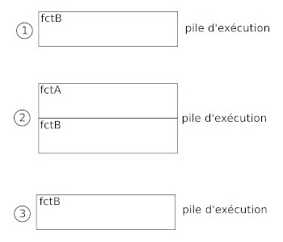
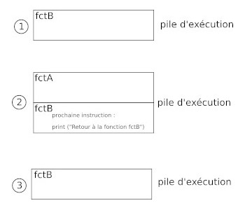
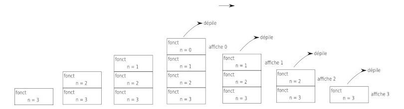
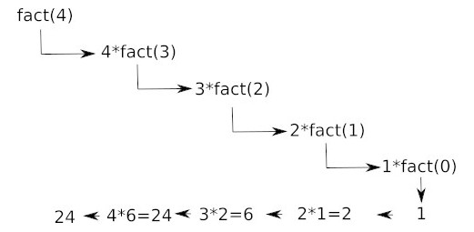

Considérons le programme suivant :

```python
def fctA():
    print ("Début fonction fctA")
    i=0
    while i<5:
        print(f"fctA {i}")
        i = i + 1
    print ("Fin fonction fctA")

def fctB():
    print ("Début fonction fctB")
    i=0
    while i<5:
        if i==3:
            fctA()
            print("Retour à la fonction fctB")
        print(f"fctB {i}")
        i = i + 1
    print ("Fin fonction fctB")

fctB()
```

l'exécution de ce programme donne le résultat suivant :

```
Début fonction fctB
fctB 0
fctB 1
fctB 2
Début fonction fctA
fctA 0
fctA 1
fctA 2
fctA 3
fctA 4
Fin fonction fctA
Retour à la fonction fctB
fctB 3
fctB 4
Fin fonction fctB
```

Dans l'exemple ci-dessus, nous avons une fonction (fctB) qui appelle une autre fonction (fctA). La principale chose à retenir de cet exemple est que l'exécution de fctB est interrompue pendant l'exécution de fctA. Une fois l'exécution de fctA terminée, l'exécution de fctB reprendra là où elle avait été interrompue.

Pour gérer ces fonctions qui appellent d'autres fonctions, le système utilise une "pile d'exécution". Une pile d'exécution permet d'enregistrer des informations sur les fonctions en cours d'exécution dans un programme. On parle de pile, car les exécutions successives "s'empilent" les unes sur les autres. Si nous nous intéressons à la pile d'exécution du programme étudié ci-dessus, nous obtenons le schéma suivant :



Nous pouvons "découper" l'exécution de ce programme en 3 parties :

1. la fonction fctB s'exécute jusqu'à l'appel de la fonction fctA
2. l'exécution de la fctB est mise en "pause" pendant l'exécution de la fonction fctA
3. une fois que l'exécution de fctA est terminée, on termine l'exécution de la fonction fctB

Il est important de bien comprendre que la fonction située au sommet de la pile d'exécution est en cours d'exécution. Toutes les fonctions situées "en dessous" sont mises en pause jusqu'au moment où elles se retrouveront au sommet de la pile. Quand une fonction termine son exécution, elle est automatiquement retirée du sommet de la pile (on dit que la fonction est dépilée).

La pile d'exécution permet de retenir la prochaine instruction à exécuter au moment où une fonction sera sortie de son ""état de pause" (qu'elle se retrouvera au sommet de la pile d'exécution) :



Évidemment l'explication donnée ci-dessus est quelque peu simpliste : c'est l'adresse mémoire de la prochaine instruction machine à exécuter qui est conservée dans la pile d'exécution

Dans l'exemple ci-dessus, on retrouve une variable i dans les deux fonctions : fctA et fctB. La variable i présente dans la fonction fctA n'a rien à voir avec la variable i présente dans la fonction fctB (elles portent le même nom, mais elles représentent 2 adresses mémoires différentes). Il est très important de bien comprendre que les variables créées dans une fonction ne "sortent" pas de la fonction : chaque fonction possède sa propre liste de variable, comme déjà dit ci-dessus la variable i de la fonction fctB est différente de la variable i de la fonction fctA.

La pile d'exécution conserve une "trace" des valeurs des variables lorsqu'une autre fonction est exécutée. Par exemple la valeur de i (fctB) est conservée au moment de l'exécution de fctA. Quand l'exécution de fctA se termine est que l'exécution de fctB "reprend", la valeur référencée par i (fctB) a été "conservée" (voilà pourquoi on reprend l'exécution de fctB avec un "fctB 3").

Une fonction peut s'appeler elle-même, on parle alors de fonction récursive.

Considérons de  programme suivant :

```python
def fctA():
    print ("Hello")
    fctA()
fctA()
```

Si nous exécutons ce programme, nous allons obtenir une erreur :

```
RecursionError: maximum recursion depth exceeded while calling a Python object
```

Dans le cas où une fonction s'appelle elle-même (fonction récursive), on retrouve le même système de pile d'exécution. Dans l'exemple traité ci-dessus, les appels s'enchainent sans rien pour mettre un terme à cet enchainement, la taille de la pile d'exécution augmente sans cesse (aucune fonction ne termine son exécution, nous n'avons pas de "dépilement" juste des "empilements"). Le système interrompt le programme en générant une erreur quand la pile d'exécution dépasse une certaine taille.

Quand on écrit une fonction récursive, il est donc nécessaire de bien penser à mettre en place une structure qui à un moment ou à un autre mettra fin à ces appels récursifs.

Dans le cas de fonctions récursives, il est, comme pour n'importe quelle fonction, possible d'utiliser des paramètres :

Soit le programme suivant :

```python
def fonct(n):
    if n>0:
        fonct(n-1)
    print(n)

fonct(3)
```

Analysons en détail le fonctionnement de ce programme :

- 1er appel de la fonction fonct avec le paramètre n = 3 ; n > 0 donc appel de la fonction fonct avec le paramètre n = 2

- 2e appel de la fonction fonct avec le paramètre n = 2 ; n > 0 donc appel de la fonction fonct avec le paramètre n = 1

- 3e appel de la fonction fonct avec le paramètre n = 1 ; n > 0 donc appel de la fonction fonct avec le paramètre n = 0

- 4e appel de la fonction fonct avec le paramètre n = 0 ; n = 0 donc on exécute l'instruction print(n) => affichage : 0

- on "dépile" (3e appel, n = 1) : on exécute l'instruction print(n) => affichage : 1

- on "dépile" (2e appel, n = 2) : on exécute l'instruction print(n) => affichage : 2

- on "dépile" (1er appel, n = 3) : on exécute l'instruction print(n) => affichage : 3

Voici un schéma expliquant le processus en termes de pile d'exécution :



Il ne faut jamais perdre de vu qu'à chaque nouvel appel de la fonction fonct le paramètre n est différent.

Nous allons étudier le calcul de la factorielle grâce à une fonction récursive. D'après Wikipédia : "En mathématiques, la factorielle d'un entier naturel n est le produit des nombres entiers strictement positifs inférieurs ou égaux à n". Par exemple : la factorielle de 3 est : 3 x 2 x 1 = 6 ; la factorielle de 4 est 4 x 3 x 2 x 1 = 24 ; la factorielle de 5 est 5 x 4 x 3 x 2 x 1 = 120 ...

Si on note la factorielle de n par n!, on a :

- 0! = 1 (par définition

- Pour tout entier n > 0, n! = n x (n – 1)!

Nous allons utiliser cette définition de la factorielle pour définir notre fonction récursive (nous allons utiliser le fait que la factorielle de n dépend de la factorielle de n-1 et que 0! = 1)

Analysons le programme suivant :

```python
def fact(n) :
    if n > 0 :
        return n*fact(n-1)
    else :
        return 1
```

Comme vous pouvez le constater, la fonction fact est structurée de la même manière que la définition mathématique vu ci-dessus :

- dans le cas où n = 0 la fonction renvoie 1 (0! = 1)
- dans le cas où n > 0 la fonction renvoie n*fact(n-1) (n! = n x (n – 1)!)

On peut essayer de comprendre le fonctionnement du programme ci-dessus à l'aide du schéma suivant :



On a fact(4) = 4 * fact(3) avec fact(3) = 3 * fact(2) avec fact(2) =  2 * fact(1) avec fact(1) = 1 * fact(0) avec fact(0) = 1 (par définition) donc fact(1) = 1 donc fact(2) = 2 donc fact(3) = 6 donc fact(4) = 24 

L'utilisation des fonctions récursives est souvent liée à la notion de récurrence en mathématiques :

En mathématiques une suite définie par récurrence est une suite définie par son premier terme et par une relation de récurrence, qui définit chaque terme à partir du précédent ou des précédents lorsqu'ils existent.

Prenons l'exemple de la suite de Fibonacci qui est définie par :

- u<sub>0</sub> = 0 et u<sub>1</sub> = 1

- et par la relation de récurrence suivante avec n entier et n > 1 : u<sub>n</sub> = u<sub>n-1</sub> + u<sub>n-2</sub>

Ce qui nous donne pour les 6 premiers termes de la suite de Fibonacci :

- u<sub>0</sub> = 0
- u<sub>1</sub> = 1
- u<sub>2</sub> = u<sub>1</sub> + u<sub>0</sub> = 1 + 0 = 1
- u<sub>3</sub> = u<sub>2</sub> + u<sub>1</sub> = 1 + 1 = 2
- u<sub>4</sub> = u<sub>3</sub> + u<sub>2</sub> = 2 + 1 = 3
- u<sub>5</sub> = u<sub>4</sub> + u<sub>3</sub> = 3 + 2 = 5

