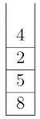
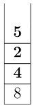
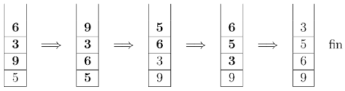
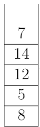
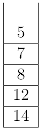

### exercice 5.1

Soit la suite d'instructions suivantes :

```
L = vide()
L = cons(2, cons(15, cons (23, L)))
L1 = cdr(L)
a = car(L1)
L1 = cons(4, cons(3, L1))
```
Donnez le contenu des listes L et L1 et la valeur de a.

### exercice 5.2

Soit une pile P initialement vide. Soit les instructions suivantes :

```
push(P,4)
push(P,7)
a = pop(P)
b = taille(P)
c = pop(P)
push(P,3)
push(P,2)
d = taille(P)
```
Donnez le contenu de la pile P, la valeur de a, la valeur de b, la valeur de c et la valeur de d.

### exercice 5.3

Soit une file F initialement vide. Soit les instructions suivantes :

```
enqueue(F,6)
enqueue(F,3)
a = dequeue(F)
enqueue(F,9)
b = taille(F)
enqueue(F,17)
c = dequeue(F)
enqueue(F,2)
d = taille(F)
```
Donnez le contenu de la file F, la valeur de a, la valeur de b, la valeur de c et la valeur de d.


### exercice 5.4

Soit le programme Python suivant :

```	
pile = []
tab = [5,8,6,1,3,7]
pile.append(5)
pile.append(10)
pile.append(8)
pile.append(15)
for i in tab:
    if i > 5:
        pile.pop()
```

Donnez l’état de la pile pile après l’exécution de ce programme.

### exercice 5.5

Soit le programme Python suivant :

```
from collections import deque
file = deque([])
tab = [2,78,6,89,3,17]
file.append(5)
file.append(10)
file.append(8)
file.append(15)
for i in tab:
    if i > 50:
        file.popleft()
```

Donnez l’état de la file *file* après l’exécution de ce programme


### exercice 5.6
Cet exercice est tiré du sujet 0 du bac NSI.

Dans cet exercice nous avons à notre disposition 4 fonctions :

- pileVide() qui permet de créer une pile vide
- estVide(P) qui renvoie True si la pile P est vide et False dans le cas contraire
- empiler(P,val) qui ajoute la valeur val à la pile P
- depiler(P) qui renvoie l'élément au sommet de la pile P et qui supprime cet élément de la pile. 

1) On suppose dans cette question que le contenu de la pile P est le suivant (les éléments étant
empilés par le haut) :



Quel sera le contenu de la pile Q après exécution de la suite d’instructions suivante ?

```
Q = pileVide ()
while not estVide ( P ):
	empiler (Q , depiler ( P ))
```
2) a) On appelle hauteur d’une pile le nombre d’éléments qu’elle contient. La fonction *hauteur_pile* prend en paramètre une pile P et renvoie sa hauteur. Après appel de cette fonction, la pile P doit avoir retrouvé son état d’origine.

Exemple : si P est la pile de la question 1 : hauteur_pile(P) = 4.

Recopier et compléter sur votre feuille le programme Python suivant implémentant la fonction
*hauteur_pile* en remplaçant les ??? par les bonnes instructions.

```
def hauteur_pile ( P ):
Q = pileVide ()
n = 0
while not ( estVide ( P )):
	???
	x = depiler ( P )
	empiler (Q , x )
while not ( estVide ( Q )):
	???
	empiler (P , x )
return ???
```
2) b) Créer une fonction *max_pile* ayant pour paramètres une pile P et un entier i. Cette fonction
renvoie la position j de l’élément maximum parmi les i derniers éléments empilés de la pile P.
Après appel de cette fonction, la pile P devra avoir retrouvé son état d’origine. La position du
sommet de la pile est 1.

Exemple : si P est la pile de la question 1 : max_pile(P, 2) = 1

3) Créer une fonction *retourner* ayant pour paramètres une pile P et un entier j. Cette fonction inverse l’ordre des j derniers éléments empilés et ne renvoie rien. On pourra utiliser deux piles auxiliaires.

Exemple : si P est la pile de la question 1, après l’appel de *retourner(P, 3)*, l’état de la pile P sera :



4) L’objectif de cette question est de trier une pile de crêpes.

On modélise une pile de crêpes par une pile d’entiers représentant le diamètre de chaque crêpe. On souhaite réordonner les crêpes de la plus grande (placée en bas de la pile) à la plus petite (placée en haut de la pile).

On dispose uniquement d’une spatule que l’on peut insérer dans la pile de crêpes de façon à retourner l’ensemble des crêpes qui lui sont au-dessus.

Le principe est le suivant :

- On recherche la plus grande crêpe.
- On retourne la pile à partir de cette crêpe de façon à mettre cette plus grande crêpe tout en haut de la pile.
- On retourne l’ensemble de la pile de façon à ce que cette plus grande crêpe se retrouve tout en
bas.
- La plus grande crêpe étant à sa place, on recommence le principe avec le reste de la pile.

Exemple :



Créer la fonction *tri_crepes* ayant pour paramètre une pile P. Cette fonction trie la pile P selon la méthode du tri crêpes et ne renvoie rien. On utilisera les fonctions créées dans les questions précédentes.


Exemple : Si la pile P est :



après l’appel de *tri_crepes(P)*, la pile P devient :


 
