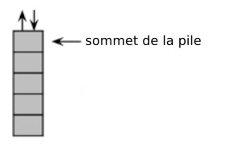
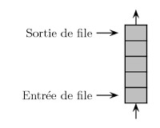

### Ce qu’il faut savoir

#### Les listes
Une liste est une structure de données permettant de regrouper des données. Une liste L est composée de 2 parties : sa tête (souvent notée car), qui correspond au dernier élément ajouté à la liste, et sa queue (souvent notée cdr) qui correspond au reste de la liste.
Voici les opérations qui peuvent être effectuées sur une liste :

- obtenir une liste vide (vide)
- tester si une liste est vide (estVide)
- obtenir le dernier élément ajouté à la liste (car)
- obtenir une liste contenant tous les éléments d'une liste à l'exception du dernier élément ajouté (cdr)
- construire une liste à partir d'un élément et d'un autre liste (cons)

#### Les piles
On retrouve dans les piles une partie des propriétés vues sur les listes.
Dans les piles, il est uniquement possible de manipuler le dernier élément introduit dans la pile. Les piles sont basées sur le principe LIFO

Voici les opérations que l'on peut réaliser sur une pile :

- on peut savoir si une pile est vide (estVide)
- on peut empiler un nouvel élément sur la pile (empiler en français, push en anglais)
- on peut récupérer l'élément au sommet de la pile tout en le supprimant. On dit que l'on dépile (dépiler en français, pop en anglais)
- on peut connaitre le nombre d'éléments présents dans la pile (taille)

#### Les files
Comme les piles, les files ont des points communs avec les listes. Différences majeures :
dans une file on ajoute des éléments à une extrémité de la file et on supprime des éléments
à l'autre extrémité. Les files sont basées sur le principe FIFO.

Voici les opérations que l'on peut réaliser sur une file :

- on peut savoir si une file est vide (estVide)
- on peut ajouter un nouvel élément à la file (enfiler en français, enqueue en anglais)
- on peut récupérer l'élément situé en bout de file tout en le supprimant (défiler en français, dequeue en anglais)
- on peut connaitre le nombre d'éléments présents dans la file (taille)

### Ce qu’il faut savoir faire
Implémenter les structures abstraites liste, pile et file en Python

