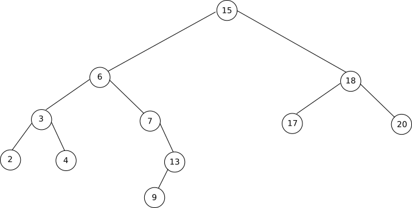

## 1) La notion d'arbre 

Un organisateur de tournoi de rugby recherche la meilleure solution pour afficher les potentiels quarts de final, demi-finales et finale :

Au départ nous avons 4 poules de 4 équipes. Les 4 équipes d'une poule s'affrontent dans un mini championnat (3 matchs par équipe). À l'issue de cette phase de poule, les 2 premières équipes de chaque poule sont qualifiées pour les quarts de finale.

Dans ce qui suit, on désigne les 2 qualifiés par poule par :

- Poule 1 => 1er Eq1 ; 2e Eq8
- Poule 2 => 1er Eq2 ; 2e Eq7
- Poule 3 => 1er Eq3 ; 2e Eq6
- Poule 4 => 1er Eq4 ; 2e Eq5

En quart de final, on va avoir :

- quart de finale 1 => Eq1 contre Eq5
- quart de finale 2 => Eq2 contre Eq6
- quart de finale 3 => Eq3 contre Eq7
- quart de finale 4 => Eq4 contre Eq8

Pour les demi-finales on aura :

- demi-finale 1 => vainqueur quart de finale 1 contre vainqueur quart de finale 3
- demi-finale 2 => vainqueur quart de finale 2 contre vainqueur quart de finale 4

L'organisateur du tournoi affiche les informations ci-dessus le jour du tournoi. Malheureusement, la plupart des spectateurs se perdent quand ils cherchent à déterminer les potentielles demi-finales (et ne parlons pas de la finale !)

Pourtant, un simple graphique aurait grandement simplifié les choses :

Les spectateurs peuvent alors recopier sur un bout de papier ce schéma et ensuite se livrer au jeu des pronostics.

Nous avons ci-dessous ce que l'on appelle une structure en arbre. On peut aussi retrouver cette même structure dans un arbre "père/mère" :

Dernier exemple, les systèmes de fichiers dans les systèmes de type UNIX ont aussi une structure en arbre (notion vue l'année dernière)

Les arbres sont des types abstraits très utilisés en informatique. On les utilise notamment quand on a besoin d'une structure hiérarchique des données : dans l'exemple ci-dessous le fichier grub.cfg ne se trouve pas au même niveau que le fichier rapport.odt (le fichier grub.cfg se trouve "plus proche" de la racine / que le fichier rapport.odt). On ne pourrait pas avec une simple liste qui contiendrait les noms des fichiers et des répertoires, rendre compte de cette hiérarchie (plus ou moins "proche" de la racine). On trouve souvent dans cette hiérarchie une notion de temps (les quarts de finale sont avant les demi-finales ou encore votre grand-mère paternelle est née avant votre père), mais ce n'est pas une obligation (voir l'arborescence du système de fichiers).

## 2) les arbres binaires
### a) introduction

Les arbres binaires sont des cas particuliers d'arbres : l'arbre du tournoi de rugby et l'arbre "père, mère..." sont des arbres binaires, en revanche, l'arbre représentant la structure du système de fichier n'est pas un arbre binaire (même chose pour un véritable arbre généalogique). Dans un arbre binaire, on a au maximum 2 branches qui partent d'un élément (pour le système de fichiers, on a 7 branches qui partent de la racine : ce n'est donc pas un arbre binaire). Dans la suite nous allons uniquement travailler sur les arbres binaires.

Soit l'arbre binaire suivant :

### b) un peu de vocabulaire

- chaque élément de l'arbre est appelé noeud (par exemple : A, B, C, D,...,P et Q sont des noeuds)
- le noeud initial (ici A) est appelé noeud racine ou plus simplement racine
- On dira que le noeud E et le noeud D sont les fils du noeud B. On dira que le noeud B est le père des noeuds E et D
- Dans un arbre binaire, un noeud possède au plus 2 fils
- Un noeud n'ayant aucun fils est appelé feuille (exemples : D, H, N, O, J, K, L, P et Q sont des feuilles)
- À chaque noeud d'un arbre binaire, on associe une clé (on peut aussi utiliser le terme "valeur" à la place de clé), un "sous-arbre gauche" et un "sous-arbre droit" (exemple : à partir du noeud ayant pour clé C on va trouver un sous-arbre gauche composé des noeuds F, J et K et un sous-arbre droit composé des noeuds G, L, M, P et Q)
- Un arbre (ou un sous-arbre) vide est noté NIL (NIL est une abréviation du latin nihil qui veut dire "rien"). Par exemple, le sous-arbre gauche du noeud D est NIL (même chose pour son sous-arbre droit d'ailleurs puisque D est une feuille).
- On appelle arête le segment qui relie 2 noeuds.
- On appelle taille d'un arbre le nombre de noeuds présents dans cet arbre
- On appelle profondeur d'un nœud ou d'une feuille dans un arbre binaire le nombre de nœuds du chemin qui va de la racine à ce nœud. La racine d'un arbre est à une profondeur 1, et la profondeur d'un nœud est égale à la profondeur de son prédécesseur plus 1. Si un noeud est à une profondeur p, tous ses successeurs sont à une profondeur p+1. Exemples : profondeur de B = 2 ; profondeur de I = 4 ; profondeur de P = 5
ATTENTION : on trouve aussi dans certains livres la profondeur de la racine égale à 0 (on trouve alors : profondeur de B = 1 ; profondeur de I = 3 ; profondeur de P = 4). Les 2 définitions sont valables, il faut juste préciser si vous considérez que la profondeur de la racine est de 1 ou de 0.
- On appelle hauteur d'un arbre la profondeur maximale des nœuds de l'arbre. Exemple : la profondeur de P = 5, c'est un des noeuds les plus profond, donc la hauteur de l'arbre est de 5.
ATTENTION : comme on trouve 2 définitions pour la profondeur, on peut trouver 2 résultats différents pour la hauteur : si on considère la profondeur de la racine égale à 1, on aura bien une hauteur de 5, mais si l'on considère que la profondeur de la racine est de 0, on aura alors une hauteur de 4.

### c) structure récursive

Il est important de bien noter que l'on peut aussi voir les arbres comme des structures récursives : les fils d'un noeud sont des arbres (sous-arbre gauche et un sous-arbre droite dans le cas d'un arbre binaire), ces arbres sont eux-mêmes constitués d'arbres...

### d) encadrement de la hauteur d'un arbre

Il est possible d'avoir des arbres binaires de même taille, mais de "forme" très différente :

Sur le schéma ci-dessus l'arbre 1 est dit " filiforme" alors que l'arbre 2 est dit "complet" (on dira qu'un arbre binaire est complet si tous les noeuds possèdent 2 fils et que toutes les feuilles se situent à la même profondeur). On pourra aussi dire que l'arbre 1 est déséquilibré alors que l'arbre 2 est équilibré.

Si on prend un arbre filiforme de taille n, on peut dire que la hauteur de cet arbre est égale à $n−1$ (si on prend la définition de la hauteur d'un arbre où la racine a une profondeur 0)

Si on prend un arbre complet de taille n, on peut démontrer que la hauteur de cet arbre est égale à la partie entière de $log_2(n)$ (on arrondit à l'entier immédiatement inférieur le $log_2(n)$). Dans le cas de l'arbre 2, nous avons $log_2(7)=2,8$ donc en prenant la partie entière on a bien la hauteur de l'arbre 2 égale à 2.

Un arbre filiforme et un arbre complet étant deux cas extrêmes, on peut affirmer que pour un arbre binaire quelconque :

$\lfloor log_2(n) \rfloor  \leq h \leq n-1$
				
avec n la taille de l'arbre et h la hauteur de l'arbre ($\lfloor log_2(n) \rfloor$ permet de prendre la partie entière du logarithme base 2 de n)

### e) les arbres binaires en Python

Python ne propose pas de façon native l'implémentation des arbres binaires. Mais nous aurons, plus tard dans l'année, l'occasion d'implémenter des arbres binaires en Python en utilisant la programmation orientée objet.

## 3) les arbres binaires de recherche 

Un arbre binaire de recherche est un cas particulier d'arbre binaire. Pour avoir un arbre binaire de recherche :

- il faut avoir un arbre binaire
- il faut que les clés de noeuds composant l'arbre soient ordonnables (on doit pouvoir classer les noeuds, par exemple, de la plus petite clé à la plus grande)
- soit x un noeud d'un arbre binaire de recherche. Si y est un noeud du sous-arbre gauche de x, alors il faut que y.clé ⩽ x.clé. Si y est un noeud du sous-arbre droit de x, il faut alors que x.clé ⩽ y.clé

exemple d'arbre binaire de recherche :

Vous pouvez vérifier que le fils gauche d'un noeud a une valeur plus petite que son père (par exemple 3 < 6) et que le fils droit d'un noeud a une valeur plus grande que son père (par exemple 7 > 6)

Attention : pour un noeud donné A, tous les noeuds de l'arbre gauche de A auront des valeurs plus petites que la valeur du noeud A et tous les noeuds de l'arbre droit de A auront des valeurs plus grandes que la valeur du noeud A. 
