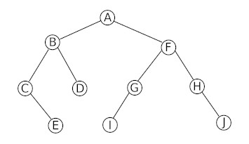
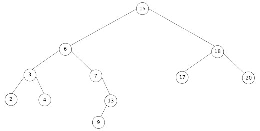
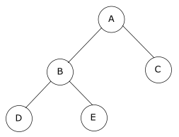

### activité 8.1
Soit l'arbre suivant :



Appliquez l'algorithme qui permet de calculer le hauteur d'un arbre binaire à l'arbre ci-dessus. Quel résultat obtenez-vous ?

### activité 8.2
Soit l'arbre suivant :


Appliquez l'algorithme qui permet de calculer la taille d'un arbre binaire à l'arbre ci-dessus. Quel résultat obtenez-vous ?

### activité 8.3
Soit l'arbre suivant :


Appliquez l'algorithme qui permet de trouver un parcours dans l'ordre préfixe à l'arbre ci-dessus. Quel résultat obtenez-vous ?

### activité 8.4
Soit l'arbre suivant :


Appliquez l'algorithme qui permet de trouver un parcours dans l'ordre suffixe à l'arbre ci-dessus. Quel résultat obtenez-vous ?

### activité 8.5
Soit l'arbre suivant :


Appliquez l'algorithme qui permet de trouver un parcours dans l'ordre infixe à l'arbre ci-dessus. Quel résultat obtenez-vous ?

### activité 8.6
Soit l'arbre suivant :


Appliquez l'algorithme qui permet de trouver un parcours en largeur d'abord à l'arbre ci-dessus. Quel résultat obtenez-vous ?

### activité 8.7
Soit l'arbre suivant :



Appliquez l'algorithme qui permet de trouver un parcours dans l'ordre infixe à l'arbre ci-dessus. Quel résultat obtenez-vous ?

### activité 8.8
Appliquez l'algorithme de recherche d'une clé dans un arbre binaire de recherche sur l'arbre ci-dessous. On prendra k = 13. Quel résultat obtenez-vous ?


### activité 8.9
Appliquez l'algorithme de recherche d'une clé dans un arbre binaire de recherche sur l'arbre ci-dessous. On prendra k = 16. Quel résultat obtenez-vous ?


### activité 8.10

Dans cette activité, nous allons implémenter des arbres binaires en Python en utilisant (nous verrons un peu plus tard dans l'année une autre façon de procéder). L'idée est relativement simple : chaque noeud est modélisé à l'aide d'un dictionnaire, ces dictionnaires seront composés de 3 clés (et donc 3 valeurs) : une clé "valeur", une clé "arbre_gauche", une clé "arbre_droit". La valeur associée à la clé "valeur" sera tout simplement la valeur du noeud. La valeur associé à la clé "arbre_gauche" sera un noeud (donc un autre dictionnaire) si l'arbre gauche existe et None dans le cas contraire. La valeur associé à la clé "arbre_droit" sera un noeud (donc un autre dictionnaire) si l'arbre droit existe et None dans le cas contraire.

L'arbre binaire suivant :



sera implémenté en Python avec le dictionnaire suivant :

```
arbre_1 = {"valeur" : "A", "arbre_gauche" : {"valeur" : "B", "arbre_gauche": {"valeur" : "D", "arbre_gauche": None, "arbre_droit": None}, "arbre_droit": {"valeur" : "E", "arbre_gauche": None, "arbre_droit": None}}, "arbre_droit" : {"valeur" : "C", "arbre_gauche": None, "arbre_droit": None}}
```

que l'on peut aussi représenter comme ceci afin d'améliorer la visibilité : 

```
arbre_1 = {"valeur":"A",
            "arbre_gauche":
                            {"valeur" : "B",
                            "arbre_gauche": 
                                            {"valeur" : "D", 
                                            "arbre_gauche": None, 
                                            "arbre_droit": None}, 
                            "arbre_droit": {"valeur" : "E",
                                            "arbre_gauche": None, 
                                            "arbre_droit": None}}, 
            "arbre_droit" : {"valeur" : "C", 
                            "arbre_gauche": None, 
                            "arbre_droit": None}}
```

1. Écrire en Python une fonction `taille` qui prend en paramètre une arbre `arb`(arbre implémenté sous forme de dictionnaire) et qui renvoie la taille de l'arbre `arb`.
2. Écrire en Python une fonction `hauteur` qui prend en paramètre une arbre `arb`(arbre implémenté sous forme de dictionnaire) et qui renvoie la hauteur de l'arbre `arb`.
3. Écrire en Python une fonction `parcours_prefixe` qui prend en paramètre une arbre `arb`(arbre implémenté sous forme de dictionnaire) et qui affiche les noeuds de l'arbre `arb` dans l'ordre préfixe.
4. Écrire en Python une fonction `parcours_infixe` qui prend en paramètre une arbre `arb`(arbre implémenté sous forme de dictionnaire) et qui affiche les noeuds de l'arbre `arb` dans l'ordre infixe.
5. Écrire en Python une fonction `parcours_sufixe` qui prend en paramètre une arbre `arb`(arbre implémenté sous forme de dictionnaire) et qui affiche les noeuds de l'arbre `arb` dans l'ordre sufixe.
6. Écrire en Python une fonction `parcours_largeur` qui prend en paramètre une arbre `arb`(arbre implémenté sous forme de dictionnaire) et qui affiche les noeuds de l'arbre `arb` en respectant le parcours en largeur.
7. Implémenter en Python un arbre binaire de recherche 'arbre_2' constitué des nombres suivants : 30, 0, 10, 40 et 20
8. Écrire en Python une fonction récursive `arbre_recherche_rec` qui prend en paramètre une arbre binaire de recherche `arb`(arbre implémenté sous forme de dictionnaire) et un entier `k` et qui renvoie `True`si k est bien présent dans l'arbre et False dans le cas contraire.
9. Écrire en Python une fonction non récursive `arbre_recherche_it` qui prend en paramètre une arbre binaire de recherche `arb`(arbre implémenté sous forme de dictionnaire) et un entier `k` et qui renvoie `True`si k est bien présent dans l'arbre et False dans le cas contraire.
10. Écrire en Python une fonction non récursive `insertion` qui prend en paramètre une arbre binaire de recherche `arb`(arbre implémenté sous forme de dictionnaire) et un entier `k`et qui place l'entier `k`dans l'arbre binaire de recherche `arb`.