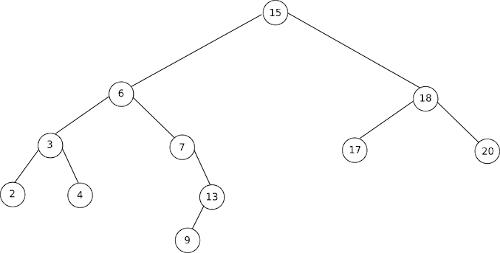

### activité 8.1
Soit l'arbre suivant :

Appliquez l'algorithme qui permet de calculer le hauteur d'un arbre binaire à l'arbre ci-dessus. Quel résultat obtenez-vous ?

### activité 8.2
Soit l'arbre suivant :

Appliquez l'algorithme qui permet de calculer la taille d'un arbre binaire à l'arbre ci-dessus. Quel résultat obtenez-vous ?

### activité 8.3
Soit l'arbre suivant :

Appliquez l'algorithme qui permet de trouver un parcours dans l'ordre préfixe à l'arbre ci-dessus. Quel résultat obtenez-vous ?

### activité 8.4
Soit l'arbre suivant :

Appliquez l'algorithme qui permet de trouver un parcours dans l'ordre suffixe à l'arbre ci-dessus. Quel résultat obtenez-vous ?

### activité 8.5
Soit l'arbre suivant :

Appliquez l'algorithme qui permet de trouver un parcours dans l'ordre infixe à l'arbre ci-dessus. Quel résultat obtenez-vous ?

### activité 8.6
Soit l'arbre suivant :

Appliquez l'algorithme qui permet de trouver un parcours en largeur d'abord à l'arbre ci-dessus. Quel résultat obtenez-vous ?

### activité 8.7
Soit l'arbre suivant :

Appliquez l'algorithme qui permet de trouver un parcours dans l'ordre infixe à l'arbre ci-dessus. Quel résultat obtenez-vous ?

### activité 8.8
Appliquez l'algorithme de recherche d'une clé dans un arbre binaire de recherche sur l'arbre ci-dessous. On prendra k = 13. Quel résultat obtenez-vous ?

### activité 8.9
Appliquez l'algorithme de recherche d'une clé dans un arbre binaire de recherche sur l'arbre ci-dessous. On prendra k = 16. Quel résultat obtenez-vous ?

