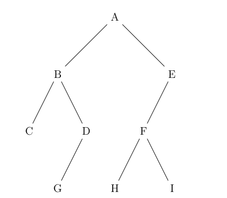
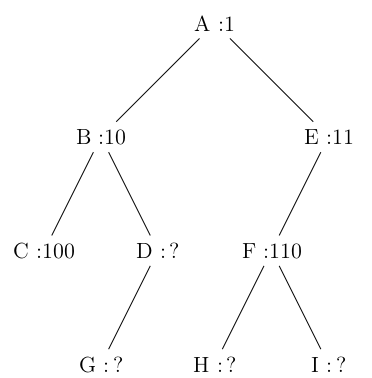
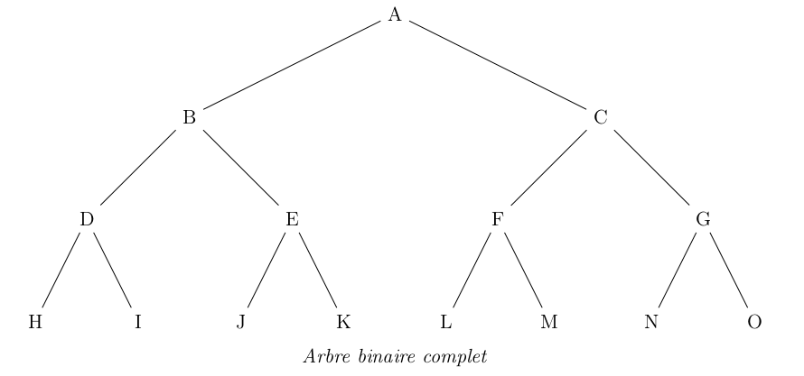
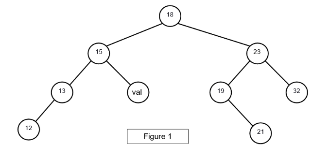

### exercice 8.1

Soit l’arbre binaire A suivant :


1) A propos de l’arbre A :

- Déterminez la profondeur du noeud 6
- Déterminez la hauteur de l’arbre

2) Parcourir l’arbre A dans l’ordre suffixe 

3)

- Expliquez pourquoi l’arbre binaire A n’est pas un arbre binaire de recherche
- Modifiez l’arbre binaire A pour qu’il devienne un arbre binaire de recherche (on gardera les mêmes noeuds). On appellera l’arbre binaire obtenu “arbre B”

4) Parcourir l’arbre B dans l’ordre infixe


### exercice 8.2
Cet exercice est tiré du sujet 0 du bac NSI.

Dans cet exercice, on utilisera la convention suivante : la hauteur d’un arbre binaire ne comportant qu’un
nœud est 1.

#### Question 1

Déterminer la taille et la hauteur de l’arbre binaire suivant :



#### Question 2

On décide de numéroter en binaire les nœuds d’un arbre binaire de la façon suivante :
- la racine correspond à 1 ;
- la numérotation pour un fils gauche s’obtient en ajoutant le chiffre 0 à droite au numéro de son
père ;
- la numérotation pour un fils droit s’obtient en ajoutant le chiffre 1 à droite au numéro de son
père;

Par exemple, dans l’arbre ci-dessous, on a utilisé ce procédé pour numéroter les nœuds A, B, C, E et
F .



1) Dans l’exemple précédent, quel est le numéro en binaire associé au nœud G ?

2) Quel est le nœud dont le numéro en binaire vaut 13 en décimal ?

3) En notant h la hauteur de l’arbre, sur combien de bits seront numérotés les nœuds les plus en
bas ?

4) Justifier que pour tout arbre de hauteur h et de taille n ≥ 2, on a :

h ≤ n ≤  2<sup>h</sup> − 1

#### Question 3

Un arbre binaire est dit complet si tous les niveaux de l’arbre sont remplis.



On décide de représenter un arbre binaire complet par un tableau de taille n + 1, où n est la taille de l’arbre, de la façon suivante :
- La racine a pour indice 1 ;
- Le fils gauche du nœud d’indice i a pour indice 2 × i ;
- Le fils droit du nœud d’indice i a pour indice 2 × i + 1 ;
- On place la taille n de l’arbre dans la case d’indice 0.

1. Déterminer le tableau qui représente l’arbre binaire complet de l’exemple précédent.
2. On considère le père du nœud d’indice i avec i ≥ 2. Quel est son indice dans le tableau ?

#### Question 4 
On se place dans le cas particulier d’un arbre binaire de recherche complet où les nœuds
contiennent des entiers et pour lequel la valeur de chaque noeud est supérieure à celles des
noeuds de son fils gauche, et inférieure à celles des noeuds de son fils droit.

Écrire une fonction recherche ayant pour paramètres un arbre arbre et un élément element. Cette
fonction renvoie True si element est dans l’arbre et False sinon. L’arbre sera représenté par un tableau comme dans la question précédente.

### exercice 8.3
Cet exercice est tiré du sujet 2021 du bac NSI.

Dans cet exercice, les arbres binaires de recherche ne peuvent pas comporter plusieurs fois la même clé. De plus, un arbre binaire de recherche limité à un nœud a une hauteur de 1.
On considère l’arbre binaire de recherche représenté ci-dessous (figure 1), où val représente un entier :

 

1)

a) Donner le nombre de feuilles de cet arbre et préciser leur valeur (étiquette).

b) Donner le sous arbre-gauche du nœud 23.

c) Donner la hauteur et la taille de l’arbre.

d) Donner les valeurs entières possibles de val pour cet arbre binaire de recherche.

On suppose, pour la suite de cet exercice, que val est égal à 16.

2)  On rappelle qu’un parcours infixe depuis un nœud consiste, dans l’ordre, à faire un parcours infixe sur le sous arbre-gauche, afficher le nœud puis faire un parcours infixe sur le sous-arbre droit.

Dans le cas d’un parcours suffixe, on fait un parcours suffixe sur le sous-arbre gauche puis un parcours suffixe sur le sous-arbre droit, avant d’afficher le nœud.

a) Donner les valeurs d’affichage des nœuds dans le cas du parcours infixe de l’arbre.

b) Donner les valeurs d’affichage des nœuds dans le cas du parcours suffixe de l’arbre.

3) On considère la classe Noeud définie de la façon suivante en Python :

```
class Noeud():
    def __init__(self, v):
        self.ag = None
        self.ad = None
        self.v = v

    def insere(self, v):
        n = self
        est_insere = False
        while not est_insere :
            if v == n.v:
                est_insere = True
            elif v < n.v:
                if n.ag != None:
                    n = n.ag
                else:
                    n.ag = Noeud(v)
                    est_insere = True
            else:
                if n.ad != None:
                    n = n.ad
                else:
                    n.ad = Noeud(v)
                    est_insere = True

    def insere_tout(self, vals):
        for v in vals:
            self.insere(v)
```
			
a) Représenter l’arbre construit suite à l’exécution de l’instruction suivante :

```
racine = Noeud(18)
racine.insere_tout([12, 13, 15, 16, 19, 21, 32, 23])
```

b) Écrire les deux instructions permettant de construire l’arbre de la figure 1. On rappelle que le nombre val est égal à 16.
 
4) Écrire une méthode recherche(self, v) qui prend en argument un entier v et renvoie la valeur True si cet entier est une étiquette de l’arbre, False sinon.
