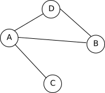
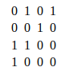

### activité 9.1

Construisez un graphe de réseau social à partir des informations suivantes :

A est ami avec B et E
B est ami avec A et C
C est ami avec B,F et D
D est ami avec C,F et E
E est ami avec A,D et F
F est ami avec C, D et E

### activité 9.2

Soit le graphe suivant :



Déterminez sa matrice d'adjacence.

### activité 9.3

Établissez la liste d'adjacence du graphe ci-dessous.


### activité 9.4

Soit la matrice d'adjacence d'un graphe G composé des sommets A, B, C, D  :



- le graphe G est-il orienté ou non-orienté ? Justifiez votre réponse.

- représentez ce graphe G

### activité 9.5

Soit G un graphe non-orienté implémenté en Python comme suit :

```python
G = {'A':['B', 'C', 'E'], 'B':['A', 'E'], 'C':['A','D'], 'D':['C'], 'E':['A','B']}
```
Représentez le graphe G.